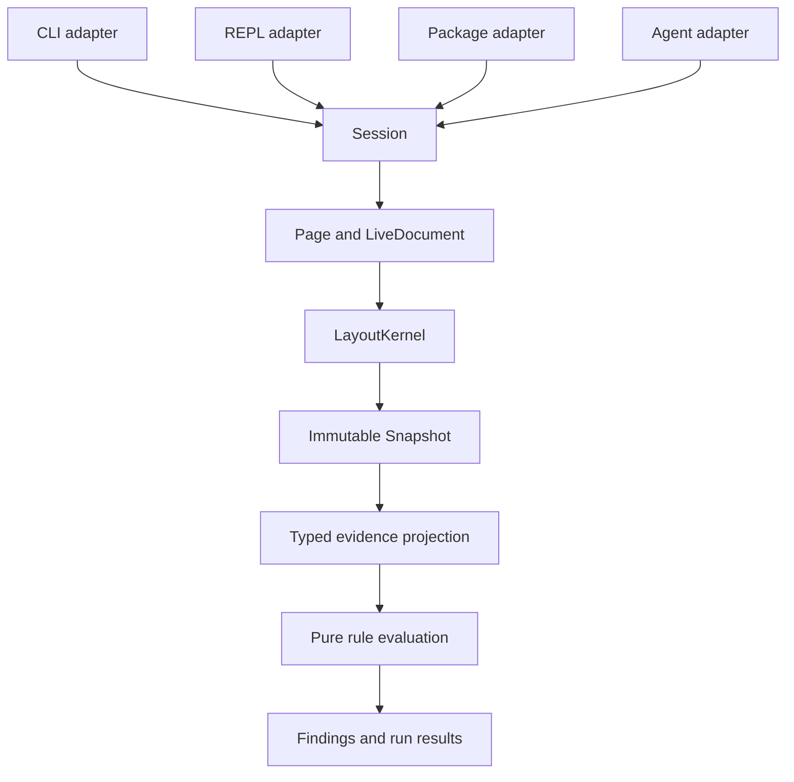

# Architecture draft

Status: proposed internal architecture, 28 August 2026. Implementation evidence updated 31 August 2026.

The current source loads loopback HTML and computes a horizontal layout subset. It evaluates two rules and supports transactional `x` and `width` mutation batches. A session retains one static page and its URL and title. It reloads that page and navigates same-context links. It captures interactive semantics and resolves strict role locators at each action. It inspects supported static visibility. It changes text, native checkbox, and native single-select state. The CLI session adapter keeps that state across stdin commands. Many Rust types below remain design sketches. They do not define the package API.

This document owns internal responsibilities and data flow. The [product description](README.md) owns user-visible scope. The [research note](research/browser-engine-and-design-lint-papers.md) records external evidence.

## Problem

browser.jr must give each adapter the same layout evidence. The engine supports a stated CSS subset instead of claiming full visual-browser compatibility. It reports unsupported behavior instead of turning missing evidence into a pass.

Watch mode adds a second constraint. Spineless Traversal needs field-level dependencies, legal recomputation order, dirty state, and stable layout identity. Those decisions must remain private to the layout engine.

Mutable page state produces an immutable snapshot. Observations and rules read selected evidence from that snapshot.

## Caller experience

The CLI command is the primary workflow.

```text
browser.jr lint <url>
```

The CLI parses external input into a typed request. The REPL, package adapter, and agent adapter do the same. Each adapter calls one `Session` model.

The proposed internal shape associates every request with its reply type.

```rust
pub(crate) trait SessionRequest: sealed::Sealed {
	type Reply;
}

impl Session {
	pub(crate) async fn execute<R>(
		&mut self,
		request: R,
	) -> Result<R::Reply, SessionError>
	where
		R: SessionRequest;
}
```

A lint request can only return a lint reply.

```rust
let report: RunReport = session.execute(lint_request).await?;
```

An observation request can only return an observation reply.

```rust
let observation: Observation = session.execute(observe_request).await?;
```

Transport adapters may decode a closed wire command. They must convert it into a typed core request before execution. Wire types never enter the engine model.

The implemented `cli_session` adapter stores typed references from the latest interactive snapshot. It resolves a displayed `@eN` only from that set. A successful open or navigation clears the set. A new snapshot replaces it.

The implemented `locator` module validates role tokens and owns accessible-name match modes. `FindByRole` resolves one strict `RoleMatch` from the current semantic index.

Each typed role action resolves again when it executes. Fill and checked-state requests mutate only after supported actionability checks pass.

Supported link clicks install a new document only after loading succeeds. Failed actions preserve the current document and snapshot references.

The implemented `page::interactive` module owns title normalization, the semantic index, interactive snapshot sources, descendant text, actions, and controls.

The implemented `page::visibility` module owns supported static visibility evidence. `page` keeps tokenization and layout extraction.

## System shape



The engine stops after it creates structured fragments and evidence. Paint, compositing, rasterization, screenshots, and a browser window stay outside the first architecture.

## Ownership

`Engine` owns process resources and creates sessions.

`Session` owns capability policy, pages, runs, and snapshot retention. The first implementation uses one mutable session owner. It does not add an actor or lock before a caller needs concurrent commands.

`Page` owns one user-agent profile, one viewport, and one current `LiveDocument`. Navigation replaces the current document.

`LiveDocument` owns the DOM, cascade state, box state, fragment state, and `LayoutKernel`.

`Run` owns one fixed target matrix, cancellation state, and completed target results. Each target owns separate mutable page and layout state. A run merges immutable snapshots and results.

```rust
pub(crate) struct Engine {
	resources: EngineResources,
}

pub(crate) struct Session {
	policy: CapabilityPolicy,
	pages: BTreeMap<PageId, Page>,
	runs: BTreeMap<RunId, Run>,
	snapshots: SnapshotStore,
}

pub(crate) struct Page {
	id: PageId,
	profile: UserAgentProfileId,
	viewport: Viewport,
	document: Option<LiveDocument>,
}

pub(crate) struct LiveDocument {
	epoch: DocumentEpoch,
	revision: DocumentRevision,
	dom: Dom,
	cascade: CascadeState,
	layout: LayoutKernel,
}
```

The design does not fix the number of pages in one session. That value remains a product decision.

## Identity and stale data

Each identity uses a distinct Rust newtype.

```rust
pub(crate) struct SessionId(u64);
pub(crate) struct PageId(u64);
pub(crate) struct RunId(u64);
pub(crate) struct TargetId(u64);
pub(crate) struct SnapshotId(u64);
pub(crate) struct DocumentEpoch(u64);
pub(crate) struct DocumentRevision(u64);
pub(crate) struct NodeId(GenerationalId);
pub(crate) struct SemanticElementId(u64);
pub(crate) struct BoxId(GenerationalId);
pub(crate) struct FragmentId(GenerationalId);
pub(crate) struct FieldGroupId(u16);
```

A live target binds a durable semantic element identifier to its page and document generation. `NodeId` remains an internal generational DOM identity.

```rust
pub(crate) struct TargetRef {
	page: PageId,
	document: DocumentEpoch,
	element: SemanticElementId,
}
```

A historical evidence reference binds data to one immutable snapshot.

```rust
pub(crate) struct EvidenceRef {
	snapshot: SnapshotId,
	item: EvidenceItemId,
}
```

The implemented interactive reference stores a document epoch, snapshot identity, and document-order ordinal. Every capture refreshes its identity.

Another capture changes the snapshot identity. Opening another document also increments the epoch.

Navigation creates a new `DocumentEpoch`. Deleted or replaced nodes invalidate their generational identifiers. The session returns a stale-target error instead of silently retargeting an action or observation.

## Layout is a browser.jr-owned program

Spineless Traversal is not a dirty-node queue. It requires a static dependency program and a legal order for every recomputed field group.

`LayoutProgram` is the source of truth for field groups, dependencies, and recomputation order.

```rust
pub(crate) struct LayoutProgram {
	groups: NonEmpty<FieldSpec>,
	dependents: DependencyGraph,
	order: RecomputeOrder,
}

pub(crate) struct FieldSpec {
	id: FieldGroupId,
	owner: LayoutObjectKind,
	dependencies: NonEmpty<DependencySpec>,
	compute: ComputeField,
}

impl LayoutProgram {
	pub(crate) fn compile(
		fields: NonEmpty<FieldSpec>,
	) -> Result<Self, LayoutProgramError>;
}
```

`LayoutProgram::compile` rejects missing fields, duplicate outputs, dependency cycles, and illegal orders. Internal layout code trusts the compiled program.

The first vertical slice uses an explicit static field table. Code generation or a macro must wait until repeated declarations prove that generation removes duplication.

## LayoutKernel owns Spineless Traversal

`LayoutKernel` owns every value that incremental layout must keep consistent.

```rust
pub(crate) struct LayoutKernel {
	program: Arc<LayoutProgram>,
	boxes: BoxStore,
	fragments: FragmentStore,
	fields: FieldStore,
	dirty: DirtyIndex,
	order: OrderMaintenanceLabels,
	pending: MinPriorityQueue<PendingWork>,
}

impl LayoutKernel {
	pub(crate) fn clean_layout(
		&mut self,
		input: CleanLayoutInput<'_>,
	) -> Result<LayoutSnapshot, LayoutError>;

	pub(crate) fn apply_mutations(
		&mut self,
		input: IncrementalLayoutInput<'_>,
		batch: MutationBatch,
	) -> Result<LayoutSnapshot, LayoutError>;
}
```

The clean path and incremental path use the same `LayoutProgram`. Clean layout evaluates every field group in legal order. Incremental layout evaluates only dirty field groups.

The incremental loop follows these rules:

1. Mark each directly affected field group dirty.
2. Queue a field only when it changes from clean to dirty.
3. Pop the minimum item by field rank and order-maintenance label.
4. Skip work for a deleted object generation.
5. Recompute the field from its declared dependencies.
6. Propagate dirtiness only when the complete observed value changes.
7. Continue until the queue is empty.

Inserted subtrees enter as ordered bulk work. Deleted objects invalidate their generations, so stale queue entries become no-ops.

Repeated invalidation converges on one dirty bit and one pending entry. That rule makes invalidation idempotent.

The current fixed-element slice implements rules 1, 2, 3, 5, 6, and 7. A packed field store keeps `x`, `width`, and derived `right` values. The element index supplies the stable order label because insertion and removal do not exist yet.

`ApplyMutations` changes the candidate input and runs one ordered queue. It commits the candidate only after all fields succeed. Repeated writes to one field converge on one queue entry. An unchanged complete field value does not dirty its dependents.

Generational identity, rule 4, ordered subtree insertion, deletion, and live watch integration remain unimplemented.

## Boxes and fragments have separate identities

One DOM node can produce zero, one, or many boxes. One box can produce zero, one, or many fragments.

```rust
pub(crate) struct BoxStore {
	rows: GenerationalArena<BoxId, BoxRecord>,
	tree: TreeIndex<BoxId>,
	by_node: MultiIndex<NodeId, BoxId>,
}

pub(crate) struct FragmentStore {
	rows: GenerationalArena<FragmentId, FragmentRecord>,
	tree: TreeIndex<FragmentId>,
	by_box: MultiIndex<BoxId, FragmentId>,
}
```

No core type offers one element rectangle. Rules select fragments and relationships. This preserves line wrapping, generated boxes, and later fragmentation.

## Taffy remains a prototype dependency

`Taffy` may help with early Block, Flexbox, and Grid experiments. Its types cannot cross the layout boundary.

Cached whole-node layout does not provide the field dependencies, fragment identity, or legal recomputation order that Spineless Traversal needs. Production integration requires browser.jr-owned evidence and field-level contracts.

If `Taffy` cannot expose those contracts, browser.jr uses it only for clean-layout comparison and prototypes.

## Snapshot is the evidence boundary

A `Snapshot` is immutable after construction. It records one page, document epoch, revision, viewport, and user-agent profile.

```rust
#[derive(Clone)]
pub(crate) struct Snapshot(Arc<SnapshotData>);

pub(crate) struct SnapshotMeta {
	id: SnapshotId,
	page: PageId,
	document: DocumentEpoch,
	revision: DocumentRevision,
	target: TargetId,
	viewport: Viewport,
	profile: UserAgentProfileId,
}

struct SnapshotData {
	meta: SnapshotMeta,
	semantic: SemanticIndex,
	fragments: FragmentIndex,
	grids: GridIndex,
	support: SupportIndex,
	provenance: ProvenanceIndex,
}
```

The public observation is a selected projection. The full DOM, layout stores, dirty bits, dependency graph, and priority queue remain internal.

Support state travels beside each observation.

```rust
pub(crate) enum ObservationCell<T> {
	Available(Evidenced<T>),
	Unsupported(UnsupportedEvidence),
	Indeterminate(IndeterminateEvidence),
	Unstable(UnstableEvidence),
}

pub(crate) struct Evidenced<T> {
	value: T,
	evidence: NonEmpty<EvidenceRef>,
}
```

An unavailable observation cannot disappear as `None`. A rule must preserve its reason.

## Rules declare typed evidence requirements

A rule declares the observations that form its input. The projector returns that typed input or a non-empty list of constraints.

```rust
pub(crate) struct Requirements<I> {
	keys: NonEmpty<RequirementKey>,
	project: fn(&SnapshotSet) -> Projection<I>,
}

pub(crate) enum Projection<I> {
	Ready(Evidenced<I>),
	Blocked(NonEmpty<RuleConstraint>),
}

pub(crate) trait RuleDefinition {
	type Input;

	fn id(&self) -> &RuleId;
	fn requirements(&self, matrix: &TargetMatrix) -> NonEmpty<RuleInstance<Self::Input>>;
	fn evaluate(&self, input: Evidenced<Self::Input>) -> Comparison;
}
```

The first implementation uses one built-in typed rule. A heterogeneous type-erased catalog must wait for a second rule input shape that requires it.

Rules are pure. They cannot reach a `Session`, `Page`, `LiveDocument`, or mutable snapshot.

## Rule outcomes and target outcomes remain separate

A rule either compares its input or explains why comparison was impossible.

```rust
pub(crate) enum RuleResult {
	Compared {
		rule: RuleId,
		comparison: Comparison,
	},
	Blocked {
		rule: RuleId,
		causes: NonEmpty<RuleConstraint>,
	},
}

pub(crate) enum Comparison {
	Pass(PassEvidence),
	Fail(NonEmpty<Finding>),
}
```

A target is blocked only when no valid comparison finishes.

```rust
pub(crate) enum TargetResult {
	Compared {
		completed: NonEmpty<ComparedRule>,
		blocked: Vec<BlockedRule>,
	},
	Blocked {
		attempts: NonEmpty<BlockedRule>,
	},
	Cancelled,
}
```

`Unsupported`, `Indeterminate`, and `Unstable` explain why a check is `Blocked`. A target result is also `Blocked` when no valid comparison finishes. The shared term matches the product glossary without hiding the underlying cause.

Every finding carries non-empty evidence.

```rust
pub(crate) struct Finding {
	rule: RuleId,
	severity: Severity,
	affected_element: TargetRef,
	target: TargetId,
	viewport: Viewport,
	profile: UserAgentProfileId,
	expectation: Expectation,
	observation: ObservedValue,
	evidence: NonEmpty<EvidenceRef>,
}
```

## Agent and capability boundary

The agent adapter receives or emits transport data. It does not own prompt policy, permission policy, document state, or layout state.

Design lint starts with selected read-only observations, viewport changes, rule execution, and evidence retrieval. The first action set remains open.

Raw JavaScript and externally visible actions require explicit session-owned grants. A client-selected command or filter cannot create authority.

Semantic identifiers are the normal action target. Coordinates are evidence or a fallback. An action result proves dispatch and the resulting state change. It does not prove task success.

## Module map

The initial implementation can keep these modules in one Rust crate.

```text
src/
  engine.rs
  session.rs
  page.rs
  document/
    dom.rs
    cascade.rs
    mutation.rs
  layout/
    program.rs
    kernel.rs
    clean.rs
    spineless.rs
    order.rs
    boxes.rs
    fragments.rs
    verify.rs
    taffy_probe.rs
  snapshot.rs
  projection.rs
  rules/
    requirement.rs
    outcome.rs
    finding.rs
  adapters/
    cli.rs
    repl.rs
    package.rs
    agent.rs
```

The modules follow ownership instead of execution order.

`session` owns lifecycle and capabilities. `document` owns DOM, cascade, and mutation meaning. `layout` owns clean and incremental layout. `snapshot` owns immutable evidence. `rules` owns pure comparisons. Each adapter parses external input and presents domain output.

Layout requests follow this ownership path.

```text
adapter -> Session -> LiveDocument -> LayoutKernel -> Snapshot
```

Rule requests follow a separate immutable path.

```text
adapter -> Session -> Snapshot -> evidence projection -> rule evaluation
```

No repository layer, layout-backend trait, generic service stack, mailbox, or session actor exists in the first slice.

## Verification order

The implementation must grow through verifiable units.

1. Compile one field schedule. Reject a cycle, missing dependency, duplicate output, and illegal order.
2. Run one clean layout fixture. Freeze a canonical structured snapshot.
3. Apply one mutation class through Spineless Traversal.
4. Compare the incremental snapshot with a new clean snapshot.
5. Delete queued work. Prove that the dead generation does not execute.
6. Insert one subtree. Prove that ordered bulk work matches clean layout.
7. Evaluate one typed rule. Prove that unavailable observations cannot become a pass.
8. Replace a document. Prove that its previous target references become stale.
9. Send equivalent requests through each adapter. Compare domain results before presentation.
10. Run WPT-derived cases for every declared CSS behavior.

Compilation alone cannot prove geometry, provenance, or incremental equivalence.

## Synthesis decision

The [architecture arena](research/architecture-synthesis.md) compared three complete shapes.

The evidence-first candidate became the base. Its `ObservationCell<T>`, `Requirements<I>`, and result model make missing evidence explicit.

The layout-kernel candidate supplied `LayoutProgram`, `LayoutKernel`, normalized box and fragment stores, generation checks, and ordered subtree work.

The session candidate supplied page-scoped snapshot identity and session-owned capabilities.

The synthesis replaced every unpaired `Command -> Reply` enum with typed requests and associated replies. It also removed first-slice infrastructure without current evidence.

## Tradeoffs accepted

- We accept immutable snapshot indexes in exchange for deterministic rule evaluation.
- We accept duplicate clean-layout work in tests in exchange for an independent incremental oracle.
- We accept browser.jr-owned layout stores in exchange for field-level invalidation and provenance.
- We accept per-target mutable state in exchange for avoiding shared layout locks.
- We accept explicit semantic identifiers in exchange for rejecting stale targets.
- We accept one built-in typed rule first in exchange for avoiding premature catalog erasure.
- We accept a static field table first in exchange for avoiding premature code generation.

## Alternatives rejected

`Command -> Reply` enums lost because they permit invalid command and reply pairs. Typed requests remove that runtime state.

A `Taffy`-centered engine lost because cached whole-node layout cannot supply the required field program or fragment provenance.

A session actor and mailbox lost because no current caller requires concurrent commands inside one session.

A macro-generated field table lost as the first step. An explicit table reveals the real repetition before generation.

Rules that query `LiveDocument` lost because they would inherit timing, mutation, and support checks.

A generic string-keyed snapshot lost because casts and missing keys could hide unsupported evidence.

A staged service pipeline lost because it would repeat one document representation through shallow modules.

## Open decisions and risks

- Which HTML, selector, CSS, text, and font behaviors define the first field table?
- Which page events define readiness and change settling?
- Which numeric representation makes clean and incremental comparisons canonical?
- Which compatible mutations preserve a `TargetRef`?
- How long does a session retain snapshots and identifiers?
- Which observation queries belong in the first agent adapter?
- Which actions and capabilities belong in the first release?
- Does a real caller need concurrent session commands?
- Which external schema represents rule constraints without discarding evidence?
- Which size, latency, memory, and resource budgets constrain the stores?
- How does cancellation interrupt a field computation that does not yield?

## Next implementation decision

The clean-layout, typed overflow, field store, dirty index, priority queue, and transactional `x` and `width` batch now exist.

The next Spineless Traversal layer needs generational layout identities and ordered insertion or removal. A live mutation adapter can follow after those invariants have differential tests.

The next locator layer needs auto-waiting, pointer dispatch, more locator types, and broader accessibility computation.
