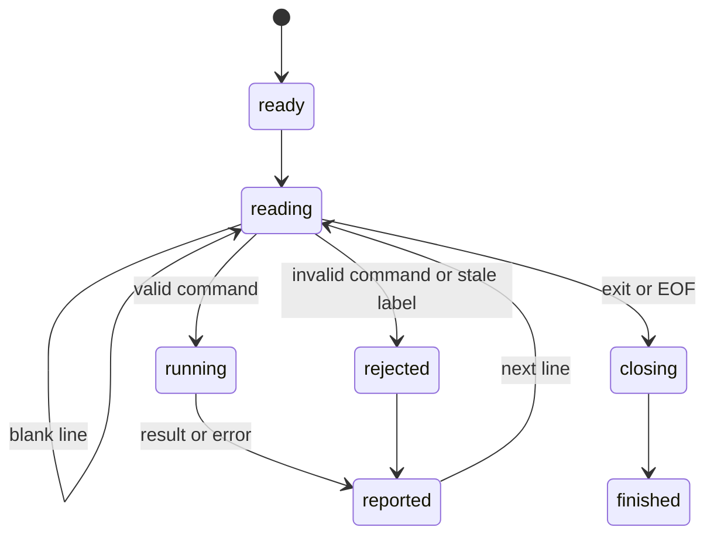

# Control one page through session mode

## Summary

`browser.jr session` keeps one engine session alive while it reads line commands from stdin.

The implemented commands cover pages, role locators, snapshots, links, text values, selects, checkboxes, visibility, URLs, and titles. They include `help` and `exit`.

This text protocol lets an AI agent reuse page and snapshot state. It is separate from the planned JavaScript REPL.

## The simple case

The caller starts one process. It writes these commands to stdin:

```text
open http://localhost:3000
snapshot --interactive
click @e1
snapshot --interactive
exit
```

browser.jr opens the page and reports a snapshot. The caller selects a current reference from that output.

A supported link click navigates the same page. The caller captures again before another click.

## The interaction, event by event



### Invoke

The caller runs `browser.jr session`. Extra invocation arguments cause exit status two.

The process writes `session ready` and flushes stdout before it reads the first command.

### Exit immediately

The invocation parser rejects extra arguments before creating an engine session.

Inside session mode, malformed commands report an error. The process then reads the next line.

### Begin running

`open` loads one loopback HTTP page through the size-limited loader.

`reload` loads the current URL again and installs a fresh document after success.

`snapshot --interactive` captures supported semantic elements from the current page.

`find role` resolves one supported semantic role locator. It composes click, fill, check, uncheck, hover, and text operations.

Role commands default to click. [`inspection/query-elements.md`](../inspection/query-elements.md) owns their matching and action behavior.

`click` resolves its label only through the latest reported snapshot.

`fill` resolves the same label and replaces a supported text-control value.

`select` resolves the same label and selects one exact native option value.

`get value` reads that current value without creating another snapshot.

`get text` reads normalized descendant text from a current interactive reference.

`get attr` reads one static attribute. Missing values report `null`.

`get url` reads the current page URL without requiring a snapshot.

`get title` reads the current normalized page title without requiring a snapshot.

`check` and `uncheck` replace supported native checkbox state.

`is checked` reads that current state without another snapshot.

`is enabled` reads supported native disabled state without another snapshot.

`is visible` reads supported static box and visibility state without another snapshot.

### While running

The adapter owns one `Session`. It keeps the current page and latest reference set in memory.

Each successful snapshot replaces the previous reference set. Human labels may repeat, but their typed identities do not.

Role text, fill, check, and uncheck preserve the current reference set. Failed role actions also preserve it.

A successful role link click installs a fresh document and clears the current reference set.

Each role action resolves the current document when it runs. It does not reuse a prior role match.

A successful open, reload, or navigation clears the reference set. The caller must capture before another reference command.

Failed opens, reloads, navigation, and unsupported clicks preserve the latest usable state.

Successful and unsupported fills also preserve the current reference set.

Successful and rejected selects preserve the current reference set.

Value reads never change the reference set.

Text reads never change the reference set.

Attribute reads never change the reference set.

URL reads never change the page or reference set.

Title reads never change the page or reference set.

Checkbox actions and reads preserve the current reference set.

Enabled-state reads preserve the current reference set.

Visibility reads preserve the current reference set, including unsupported reads.

browser.jr flushes stdout and stderr after each command.

### Finish

`exit` stops reading commands. End of input has the same effect.

The process writes `session closed`, flushes output, and exits. All session state then disappears.

Any command error affects the final exit status even when later commands succeed.

## Variants

| Modifier | Set at invocation | Changed while running |
| --- | --- | --- |
| Flags and options | `session` accepts no flags. | `snapshot -i` equals `snapshot --interactive`. Find, fill, and select parse their documented remaining text. |
| Project configuration | No session configuration exists. | Commands cannot reload configuration. |
| Target matrix | The first successful `open` selects one page. | Another successful `open` or link click replaces its document. |
| Output channel | Results use stdout. Errors use stderr. | Both streams flush after each command. |

## Cancel and interrupt

| Event | Before running | While running |
| --- | --- | --- |
| Ctrl+C once | The operating system may stop the process. | No graceful cancellation handler exists. In-memory state disappears. |
| Ctrl+C again before the evaluation stops | The process may already be gone. | No second-stage handler exists. |
| The process receives SIGTERM | The process exits. | In-memory state disappears. |
| The terminal closes | The process may receive a signal or output failure. | Complete output is not guaranteed. |
| stdin or stdout closes | Closed stdin causes a normal close. Closed stdout causes status three. | Input failure or output failure ends useful processing. |
| The network fails or a request times out | No page opens. | The current page and references survive a failed replacement. |
| The inspected page changes | Static response content does not mutate itself. | A successful open or link click installs a new document. |
| Another lint run targets the same page | It uses another process and session. | The two sessions do not share state. |
| The process exits outright | No state survives. | The caller cannot recover references from that process. |

## Interactions with other systems

**Configuration precedence.** No configuration source changes session commands.

**Output and exit status.** Status zero means every command succeeded. Invalid input produces status two. Unavailable work produces status three.

Status three takes priority over status two. Session mode does not run a finding-producing command yet.

**Resource limits.** The body limit is one MiB. A wall-clock request timeout is not implemented yet.

**Network and storage.** Pages must use loopback HTTP. Session mode writes no files or retained state.

**Rendering compatibility.** Commands use the documented static semantics, attributes, navigation, and control-state subsets.

**Isolation.** Each process owns one session. A displayed reference never crosses process boundaries.

**Accessibility inspection.** Interactive snapshots and role locators expose the current supported role and name subset.

## Edge cases

- Blank input lines have no effect.
- Commands use ASCII whitespace between tokens.
- A URL with whitespace must encode that whitespace.
- `snapshot` before `open` reports an error and keeps the process alive.
- A snapshot header gives the number of following element lines.
- An empty snapshot installs an empty reference set.
- A role action does not require an earlier snapshot.
- A role command without an action defaults to click.
- Role text, fill, check, and uncheck preserve the current reference set.
- Failed or unsupported role actions preserve the current reference set.
- A successful role link click clears the current reference set.
- `find role <role> text` prints normalized descendant text without a snapshot.
- Role fill values may contain spaces before locator options.
- Role hover reports unsupported behavior after strict resolution.
- `@e0`, padded labels, missing labels, and old labels are invalid.
- Fill text may contain spaces. It cannot contain a line break.
- Fill trims delimiter whitespace before the value. It preserves trailing whitespace.
- Select values may contain spaces. They cannot contain line breaks.
- Select trims delimiter whitespace before the value. It preserves trailing whitespace.
- A trailing delimiter lets select request an empty value.
- A failed open keeps the current page and reference set.
- A failed reload keeps the current page and reference set.
- A successful reload clears the current reference set.
- A failed or unsupported click keeps the current reference set.
- A successful or unsupported fill keeps the current reference set.
- A successful or rejected select keeps the current reference set.
- A value read keeps the current reference set.
- A text read keeps the current reference set.
- Elements without descendant text return an empty quoted string.
- Missing attributes report `null`.
- Password input `value` attributes remain blocked.
- `get url` before a successful open reports that no page is open.
- `get title` before a successful open reports that no page is open.
- A missing HTML title produces `title=""`.
- Check and uncheck are idempotent.
- Disabled and unsupported controls reject checked-state changes.
- Checked-state reads reject controls without supported native state.
- Enabled-state reads reject explicit roles without supported native behavior.
- Visibility reads reject unavailable stylesheet or box evidence.
- Multiple selects and disabled options reject selection changes.
- A successful click clears references before the next command.
- `exit` ignores later input lines.

## Open questions and verification

- Define machine-readable output and command identifiers.
- Define command cancellation without losing a healthy session.
- Define input length limits and backpressure.
- Add label, placeholder, text, test-id, CSS, and index locators through typed request fields.
- Add auto-waiting, pointer dispatch, and complete actionability evidence.

Drafted from the Rust implementation and compiled-process tests on 2026-08-31.
