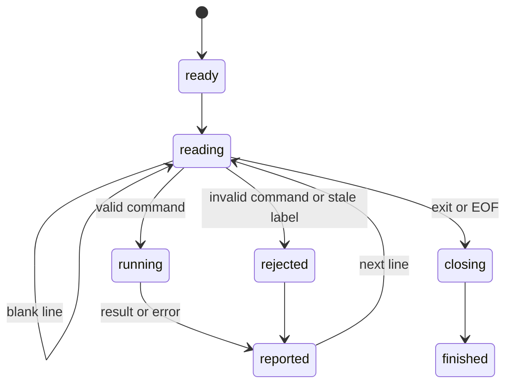

# Control one page through session mode

## Summary

`browser.jr session` keeps one engine session alive while it reads line commands from stdin.

The commands cover pages, locators, snapshots, screenshots, native actions, event records, text entry, focus, hover, scrolling, HTML, state, URLs, and titles.

They include `events`, `help`, and `exit`.

This text protocol lets an AI agent reuse page and snapshot state. It is separate from the planned JavaScript REPL.

`browser.jr --json session` emits one JSON envelope for each lifecycle event and input line.

## The simple case

The caller starts one process. It writes these commands to stdin:

```text
open http://localhost:3000
snapshot --interactive
click @e1
snapshot --interactive
exit
```

browser.jr opens the page and reports a snapshot. The caller selects a current reference from that output.

A supported link or GET submitter click navigates the same page.

Other native control clicks preserve the document.

The caller can add `--json` before or after `session`. Command sequence identifiers start at one.

## The interaction, event by event



### Invoke

The caller runs `browser.jr session`. It may add one `--json` flag before or after `session`.

Other invocation arguments cause exit status two.

The process writes `session ready` and flushes stdout before it reads the first command.

JSON mode writes a successful `ready` lifecycle envelope instead.

### Exit immediately

The invocation parser rejects extra arguments before creating an engine session.

Inside session mode, malformed commands report an error. The process then reads the next line.

### Begin running

`open` loads one loopback HTTP page through the size-limited loader.

`read` prints normalized static text from the current page. `read <url>` opens and reads one page.

`back` and `forward` load adjacent successful navigation-history entries.

`reload` loads the current URL again and installs a fresh document after success.

`set viewport` changes the current session width and height. `get viewport` reads them.

Viewport sizing works before open and reflows a current static page without replacing references.

`scroll` moves the current page in one direction. Its optional distance defaults to 300 CSS pixels.

`snapshot` captures the supported accessibility tree from the current page.

`snapshot --interactive` selects agent-oriented reference targets.

`snapshot -s <css>` limits either projection to one strict CSS subtree.

`snapshot --urls` adds resolved targets for semantic links.

Full snapshots accept compact pruning and non-negative depth limits.

Interactive snapshots accept those options without changing their projection.

`screenshot [path.png]` writes the current viewport. An omitted path uses the system temporary directory.

`screenshot --full [path.png]` writes the supported full-page extent.

`screenshot <selector> <path.png>` resolves, scrolls, and captures one strict locator.

`find` supports role, text, label, placeholder, alt, title, test ID, CSS, XPath, and positioned CSS locators.

Each locator kind composes click, fill, focus, hover, scroll, state reads, press, check, uncheck, and text operations.

Locator commands default to click. [`inspection/query-elements.md`](../inspection/query-elements.md) owns their matching and action behavior.

`click` resolves a current reference or direct selector.

It navigates supported links and GET forms. It also applies other native button, checkbox, and radio effects.

`fill` resolves a current reference or direct selector and replaces a supported text-control value.

A successful fill stores that control as focus for a later `press` command.

`type` resolves a current reference or direct selector. It appends to a supported text-control value without clearing it.

`keyboard inserttext <text>` replaces the current supported text selection once.

Non-empty editable insertion records `beforeinput`, then `input`. Read-only insertion records only `beforeinput`.

`keyboard type <text>` applies each scalar and records its supported portable event sequence.

It does not model typing delay.

Keyboard text on the body or a focused non-text target reports an ignored result.

`keydown <key>` applies one supported immediate effect and keeps its normalized key down.

Native-control `Space` records its down phase and defers its effect.

`keyup <key>` releases that exact normalized key. Matching native `Space` applies its deferred effect.

Repeated down reports repeat state. Repeated native `Space` still applies one key-up effect.

Complete `press` records portable text and same-target native-control events.

Supported key-down records its portable down phase before storing held state.

Its matching key-up records against the current focused target.

Native-control `Space` records portable phases. Another focused target at key-up cancels activation.

Enter navigation, radio movement, modified, and non-ASCII held phases record nothing.

`focus` resolves a current reference or direct selector. `find ... focus` uses every implemented locator kind.

`hover` resolves a current reference or direct selector. It stores one visible source element as the pointer target.

Supported local click, hover, changed check, and changed uncheck targets auto-scroll after actionability checks.

`scrollintoview` and `scrollinto` resolve a current reference or direct selector.

They adjust page offsets to reveal one supported box when possible.

`press` applies bounded text editing, focus traversal, native activation, or link and GET form navigation.

`find ... press <key>` resolves and focuses one strict locator before applying the key.

`Tab` and `Shift+Tab` can start at the document body. Locator variants start at their resolved target.

`select` resolves a current reference or direct selector. An unquoted remainder selects one exact value.

Quoted values select a non-empty value list: `select @e1 "b" "a"`.

`get value` reads a current reference or direct selector without creating another snapshot.

`get box` reads one complete supported bounding box. Hidden targets print `null`.

Supported fixed and normal-flow boxes use the same output. Fixed boxes do not move later normal siblings.

Normal-flow box coordinates reflect current page offsets. Fixed boxes remain viewport anchored.

`get html` reads normalized static child markup from a current reference or direct selector.

`get text` reads normalized descendant text from a current reference or direct selector.

`get attr` reads one static attribute from a current reference or direct selector. Missing values report `null`.

`get count` prints the number of current direct-selector matches.

`get url` reads the current page URL without requiring a snapshot.

`get title` reads the current normalized page title without requiring a snapshot.

`check` and `uncheck` change supported native checkbox or radio state through a reference or direct selector.

`events` drains the session's native event transcript.

It prints one count, then each event's type, source document, target, ordinal, bubbling metadata, and ancestor path.

Event records never contain filled text or selected option values.

`is checked` reads that current state through a reference or direct selector.

`is editable` reads supported native or inherited HTML editable state through a reference or direct selector.

`is enabled` reads supported native disabled state through a reference or direct selector.

`is focused` compares a reference or direct selector with current page focus.

`find ... focused` performs the same read through every implemented locator kind.

`is hovered` compares a reference or direct selector with the current pointer target.

`find ... hovered` performs the same read through every implemented locator kind.

`is visible` reads supported static box and visibility state through a reference or direct selector.

`events` drains recorded native events. It accepts no arguments.

### While running

The adapter owns one `Session`. It keeps the current page and latest reference set in memory.

Each successful snapshot replaces the previous reference set. Human labels may repeat, but their typed identities do not.

Failed scoped captures preserve the previous reference set.

Successful and failed screenshots preserve the current reference set.

Locator screenshot capture may change page scroll before paint support is checked.

Locator reads, collections, non-navigation actions, fill, type, focus, hover, scroll, select, check, and uncheck preserve references.

Bounding-box reads also preserve references, including unsupported reads.

Failed locator actions also preserve them.

A successful locator link or form click installs a fresh document. It clears current references and focus.

A non-submitting native click preserves references. It stores focus and may change checked state.

Supported local pointer actions reveal off-screen target boxes before mutation.

Rejected pointer actions and unchanged checked-state actions preserve page offsets.

Each locator action resolves the current document when it runs. It does not reuse a prior match.

A successful open, reload, or navigation clears references, focus, and page offsets.

The caller must capture before another reference command.

Successful back and forward moves clear the reference set and focus. History bounds preserve both.

Failed opens, reloads, navigation, and unsupported clicks preserve the latest usable state and focus.

Failed back and forward loads preserve the current page, history position, and references.

Successful and unsupported fills preserve the current reference set.

Successful fill replaces current focus. Unsupported fill preserves previous focus.

Successful and rejected type requests preserve the current reference set.

Focused keyboard text preserves focus and the current reference set.

Successful modifier key down and every key up preserve focus and the current reference set.

Successful non-modifier key down has the same reference and navigation rules as its effective press.

Failed non-modifier key down does not add that key to held state.

Successful and rejected focus requests preserve the current reference set.

Successful and rejected hover requests preserve the current reference set.

A successful hover replaces the pointer target. A rejected hover preserves it.

Successful page and element scrolling preserve references, focus, pointer state, and controls.

Rejected element scrolling preserves current offsets and references.

Successful viewport reflow preserves references, focus, pointer state, and controls.

Every non-navigation press preserves the current reference set. Text press and rejected press preserve focus.

Successful link or form keyboard navigation clears references and focus. Failed navigation preserves the page and references.

Implicit `Enter` with no default effect reports `ignored=true` and preserves state.

Successful `Tab` and `Shift+Tab` replace focus with a target or the document body.

Successful and rejected selects preserve the current reference set.

Value reads never change the reference set.

HTML reads never change the reference set.

Text reads never change the reference set.

Attribute reads never change the reference set.

URL reads never change the page or reference set.

Title reads never change the page or reference set.

A current-page read preserves references and focus. A successful URL read replaces the page and clears both.

Checkbox actions and reads preserve the current reference set.

Successful fill records `beforeinput` and `input`.

Non-empty focused `keyboard inserttext` records `beforeinput` and optional `input`.

Focused `keyboard type` records supported per-scalar keyboard and input events.

Complete supported press records portable text and same-target native-control events.

Supported held-key phases record key-down details and one matching key-up.

Successful select records `input` and `change`, including repeated selection.

Successful click records `click`. Changed checked controls add `input` and `change`.

Changed `check` and `uncheck` record `click`, `input`, and `change`. Idempotent requests record nothing.

Navigation preserves queued records with their source document epoch.

The `events` command drains the queue. A second drain reports `events=0`.

The transcript does not deliver events to page scripts.

Enabled-state reads preserve the current reference set.

Focused-state and hovered-state reads preserve the current reference set and page state.

Visibility reads preserve the current reference set, including unsupported reads.

Human mode flushes stdout and stderr after each command.

JSON mode writes one physical stdout line for each input line.

Each command envelope uses `success`, `data`, and `error`.

`data.event` is `command`. `data.sequence` identifies input order, including blank and `exit` lines.

The sequence is the command identifier. The envelope never echoes raw command input.

`data.output` contains the human result without its transport newline.

Multiline results remain one JSON record because the serializer escapes embedded newlines.

A failed command sets `success` to false. Its diagnostic appears in `error`.

Command failures do not write diagnostics to stderr in JSON mode.

JSON mode flushes stdout after each command envelope.

### Finish

`exit` stops reading commands. End of input has the same effect.

`events` removes its batch before writing output. An output failure can lose that drained batch.

The process writes `session closed`, flushes output, and exits. All session state then disappears.

JSON mode writes a successful `closed` lifecycle envelope. An `exit` command receives its command envelope first.

Any command error affects the final exit status even when later commands succeed.

`events` first prints `events=<count>`. Each following line reports type, document, target, bubbling, path, and ordinal.

The queue exists only for the current process. Navigation preserves already recorded events until the next drain.

## Variants

| Modifier | Set at invocation | Changed while running |
| --- | --- | --- |
| Flags and options | `--json` may appear before or after `session`. | Snapshot scopes accept CSS. Screenshot accepts a path, `--full`, `-f`, or selector and path. |
| Project configuration | No session configuration exists. | Commands cannot reload configuration. |
| Target matrix | The first successful `open` selects one page. | Another successful open, link, or GET form navigation replaces it. |
| Output channel | Human results use stdout and errors use stderr. JSON mode uses stdout envelopes. | Selected output flushes after each command. |

## Cancel and interrupt

| Event | Before running | While running |
| --- | --- | --- |
| Ctrl+C once | The operating system may stop the process. | No graceful cancellation handler exists. In-memory state disappears. |
| Ctrl+C again before the evaluation stops | The process may already be gone. | No second-stage handler exists. |
| The process receives SIGTERM | The process exits. | In-memory state disappears. |
| The terminal closes | The process may receive a signal or output failure. | Complete output is not guaranteed. |
| stdin or stdout closes | Closed stdin causes a normal close. Closed stdout causes status three. | Input failure or output failure ends useful processing. |
| The network fails or a request times out | No page opens. | The current page and references survive a failed replacement. |
| The inspected page changes | Static response content does not mutate itself. | Successful open, link, form, or history navigation installs a document. |
| Another lint run targets the same page | It uses another process and session. | The two sessions do not share state. |
| The process exits outright | No state survives. | The caller cannot recover references from that process. |

## Interactions with other systems

**Configuration precedence.** No configuration source changes session commands.

**Output and exit status.** Status zero means every command succeeded. Invalid input produces status two. Unavailable work produces status three.

JSON mode preserves that final status. A later success does not erase an earlier failure.

JSON lifecycle envelopes use `data.event` values `ready` and `closed`. They have no command sequence.

Status three takes priority over status two. Session mode does not run a finding-producing command yet.

**Resource limits.** The body limit is one MiB. Screenshots cap image pixels and clipped paint work.

The native event queue has no cap yet. Long sessions should drain it.

**Network and storage.** Pages must use loopback HTTP. Screenshot commands write PNG files. History remains in memory.

**Rendering compatibility.** Commands use the documented static semantics, attributes, navigation, and control-state subsets.

Focus stores one supported target.

Supported press and held-key phases append records without page dispatch.

The transcript covers documented fill, focused text input, press, held-key, select, click, check, and uncheck sequences.

**Isolation.** Each process owns one session. A displayed reference never crosses process boundaries.

**Accessibility inspection.** Full snapshots expose the supported static tree.

Interactive snapshots and locators expose agent-oriented targets.

## Edge cases

- Blank input lines have no effect.
- JSON mode assigns a command sequence to blank input lines and returns an empty output string.
- Every parsed JSON output line is one complete envelope.
- JSON command sequences start at one and increase by one for every consumed input line.
- JSON `exit` ignores later input and still precedes the `closed` event.
- Commands use ASCII whitespace between tokens.
- A URL with whitespace must encode that whitespace.
- `snapshot` before `open` reports an error and keeps the process alive.
- A snapshot header gives the number of following node or element lines.
- An empty snapshot installs an empty reference set.
- A scoped snapshot reports only nodes from its resolved subtree.
- Scoped labels keep document-wide ordinals and resolve through the snapshot's source map.
- A failed scoped snapshot preserves the current reference set.
- `screenshot` before `open` reports an error and keeps the process alive.
- Screenshot paths must end in `.png`.
- Viewport, full-page, and locator screenshots preserve references.
- Locator screenshots may change scroll. Full-page screenshots preserve scroll.
- Unsupported screenshot paint writes no new file.
- A locator action does not require an earlier snapshot.
- A locator command without an action defaults to click.
- Locator text, non-navigation actions, fill, type, focus, hover, state reads, check, and uncheck preserve references.
- Page and element scrolling preserve current references.
- Page scrolling defaults to 300 CSS pixels and clamps at document edges.
- Element scrolling accepts `scrollintoview`, `scrollinto`, and `find ... scroll`.
- Local click, hover, changed check, and changed uncheck auto-scroll supported target boxes.
- Unsupported target geometry leaves action offsets unchanged without blocking a valid action.
- Viewport size starts at 1280 by 720 and accepts `set viewport <width> <height>`.
- Failed or unsupported locator actions preserve the current reference set.
- A successful locator link or form click clears the current reference set and focus.
- A successful non-submitting native click preserves references and changes focus.
- `find role <role> text` prints normalized descendant text without a snapshot.
- Role finds accept name, description, Boolean state, level, and hidden-inclusion options.
- Default role finds exclude accessibility-hidden candidates.
- Unknown stylesheet visibility blocks default role matching.
- Role fill values may contain spaces before locator options.
- Multiword non-role locator values require matching quotes.
- Single-token text-backed locator values do not require quotes.
- Test ID values match `data-testid` exactly and do not accept `--exact`.
- First and last choose document-order CSS matches. Combinators traverse normalized HTML ancestry.
- `events` accepts no arguments and drains the process-owned event queue.
- Empty event queues report `events=0`.
- Nth uses a zero-based unsigned index.
- Unsupported CSS syntax, including invalid compound selectors, reports invalid input and preserves current references.
- Role hover resolves strictly, checks supported visibility, and stores one current pointer target.
- Hovered-state reads compare exact source identity without applying CSS `:hover`.
- `@e0`, padded labels, missing labels, and old labels are invalid.
- Fill text may contain spaces. It cannot contain a line break.
- Fill trims delimiter whitespace before the value. It preserves trailing whitespace.
- Successful fill stores focus. A following `press Enter` can submit a supported form.
- Type text may contain spaces. It cannot contain a line break.
- Type trims delimiter whitespace before the text. It preserves trailing whitespace.
- A trailing delimiter lets type append an empty string.
- Type appends stored text without focus, keyboard events, or input events.
- Keyboard text uses current focus and replaces the supported selection.
- Keyboard text preserves trailing whitespace and cannot contain a session line break.
- Keyboard text output reports counts and selection without echoing input.
- Keyboard text preserves read-only values and ignores body or non-text targets.
- Empty or ignored `keyboard inserttext` records nothing.
- Non-empty read-only `keyboard inserttext` records only `beforeinput`.
- `keyboard type` applies each scalar in order.
- Single-line type ignores carriage returns and line feeds.
- Textarea type normalizes either line-break scalar to one line feed.
- Editable type records portable per-scalar keyboard and input events.
- Read-only type records only the sequence shared by measured Playwright engines.
- Complete printable text press records portable keyboard and input events.
- Changed editing press records `keydown`, `beforeinput`, `input`, then `keyup`.
- Native button and checked-control press records measured activation order.
- Focus-changing, navigating, modified, and non-ASCII press records nothing.
- Keydown and keyup accept one unmodified key or one normalized modifier.
- Left and right modifier aliases share one held identity.
- Held Shift changes supported character, movement, and Tab presses.
- Held control or meta changes `a` into select-all.
- Other control, meta, and Alt default effects reject without adding the base key to held state.
- Repeated keydown reapplies immediate effects and reports `repeat=true`.
- Repeated native-control `Space` preserves one deferred key-up effect.
- Keyup reports whether its normalized key was held. A repeated keyup is a successful no-op.
- Supported keydown records its portable down phase.
- Its matching keyup records against the current focused target.
- Modifier down and up record when an interactive target owns focus.
- Tab down records the old target. Its matching up records the new target.
- Native-control `Space` records portable phases and applies one same-target key-up effect.
- Native-control `Space` cancels activation when another target owns focus at key-up.
- Held keys survive document replacement within the same session.
- Keyboard type ignores held modifiers.
- Focus accepts supported native targets and interactive elements with an integer `tabindex`.
- A rejected focus keeps the previous target.
- Press accepts the bounded key set documented in [`interaction/press-key.md`](../interaction/press-key.md).
- On text controls, `Enter` inserts one line feed only into a focused textarea.
- Text controls own UTF-16 selection offsets. Focus preserves each control's selection.
- Press supports horizontal movement, Home, End, shifted selection, deletion, and select-all.
- Enter activates links and native buttons. Space activates buttons and changes native checked state.
- Enter and Space submit supported GET forms through native submit buttons.
- Enter on a supported single-line input follows bounded implicit submission.
- Plain arrows move within native radio groups. They wrap and skip disabled or hidden peers.
- Read-only controls accept supported keys without stored value mutation.
- Text press rejects missing focus, other targets, unsupported modifiers, and unsupported named keys.
- Sequential traversal rejects unsupported focus-order evidence without changing focus.
- Every non-navigation press preserves references. Successful traversal changes focus.
- Successful link or form navigation clears references. Failed navigation preserves them.
- Select values may contain spaces. They cannot contain line breaks.
- Select trims delimiter whitespace before the value. It preserves trailing whitespace.
- A trailing delimiter lets select request an empty value.
- An unquoted select remainder is one value, including spaces.
- Quoted select values form one non-empty list. Every list value must use quotes.
- A failed open keeps the current page, reference set, and focus.
- `read` before a successful open reports that no page is open.
- Current-page read preserves the current reference set and focus.
- A successful `read <url>` replaces the page and clears the current reference set and focus.
- A failed `read <url>` preserves the current page, reference set, and focus.
- Back and forward before a successful open report that no page is open.
- Back at the first history entry preserves the current page, reference set, and focus.
- Forward at the last history entry preserves the current page, reference set, and focus.
- A successful history move clears the current reference set and focus.
- A new open, link, or form navigation after back removes forward entries.
- Reload replaces the current document without adding a history entry.
- A failed reload keeps the current page, reference set, and focus.
- A successful reload clears the current reference set and focus.
- A failed or unsupported click keeps the current reference set.
- A native checkbox click toggles state. Checkbox `check` and `uncheck` remain idempotent.
- A radio click or `Space` selects one group member. Radio `check` selects without moving focus.
- Radio arrows select and focus one adjacent eligible group member.
- Unchecking a selected radio rejects. Unchecking an unselected radio returns false.
- A successful or unsupported fill keeps the current reference set.
- Successful fill replaces focus. Unsupported fill preserves it.
- A successful or rejected type keeps the current reference set.
- A successful or rejected focus keeps the current reference set.
- Every non-navigation or rejected press keeps the current reference set.
- A successful or rejected select keeps the current reference set.
- `events` before any recorded action reports `events=0`.
- Event output contains target structure and metadata, not action values.
- Navigation does not erase pending source-document event records.
- A value read keeps the current reference set.
- A bounding-box read keeps the current reference set.
- An HTML read keeps the current reference set.
- A text read keeps the current reference set.
- Elements without descendant text return an empty quoted string.
- Missing attributes report `null`.
- Password input `value` attributes remain blocked.
- HTML reads block when child markup contains a password input source value.
- `get url` before a successful open reports that no page is open.
- `get title` before a successful open reports that no page is open.
- A missing HTML title produces `title=""`.
- Check and uncheck are idempotent.
- Disabled and unsupported controls reject checked-state changes.
- Checked-state reads reject controls without supported native state.
- Editable-state reads support native inputs, textareas, selects, and inherited contenteditable hosts.
- Enabled-state reads reject explicit roles without supported native behavior.
- Focused-state reads return false for resolved structural targets.
- Visibility reads reject unavailable stylesheet or box evidence.
- Bounding-box reads reject partial geometry instead of printing partial fields.
- Normal-flow box reads preserve stacked coordinates across references and direct selectors.
- Single and multiple native selects accept exact values.
- A missing or disabled option rejects the complete selection without mutation.
- A successful link or form click clears references before the next command.
- `exit` ignores later input lines.

## Open questions and verification

- Add typed JSON result fields for individual commands. Current command output remains a string.
- Define a native event queue cap and explicit truncation reporting.
- Define command cancellation without losing a healthy session.
- Define input length limits and backpressure.
- Expand CSS selector grammar and add XPath locators through typed request fields.
- Define configurable test ID attributes.
- Add auto-waiting, pointer dispatch, dynamic `:hover`, and complete actionability evidence.
- Add vertical movement, broader keys, remaining modified defaults, keyboard event dispatch, and keyboard typing delay.
- Add page-script event delivery after JavaScript exists.
- Extend normal flow with intrinsic lines and margins. Add scrolling and geometry waiting.
- Add complete screenshot paint and move the selected renderer into a helper process.

Drafted from the Rust implementation and compiled-process tests on 2026-08-31.
