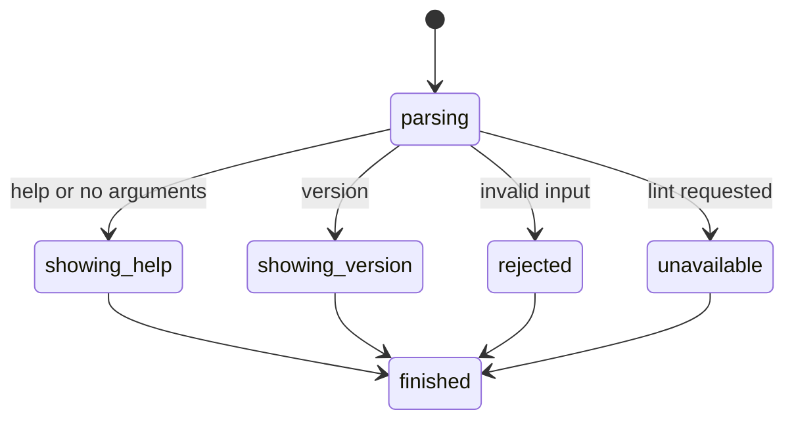

# CLI help

## Summary

CLI help shows the available browser.jr invocation shape without loading a page. Run `./browser.jr help` or `./browser.jr --help` from the repository.

The output names the planned lint command and states which behavior remains unavailable.

## The simple case

The developer runs `./browser.jr help`. browser.jr writes help to stdout and exits with status zero.

The command does not create a session, page, snapshot, or finding.

## The interaction, event by event

### Invoke

The shell starts `browser.jr`. The CLI reads all arguments before selecting a local result.

### Exit immediately

Help and version write to stdout. Invalid arguments and unavailable lint execution write to stderr.

### Begin running

Help never begins page-loading work.

### While running

No long-running work occurs.

### Finish

Help and version exit with status zero. Invalid input exits with status two. Unavailable lint execution exits with status three.

## Variants

| Modifier | Set at invocation | Changed while running |
| --- | --- | --- |
| Flags and options | `help`, `-h`, and `--help` select help. `-V` and `--version` select version. | Nothing can change. The command exits immediately. |
| Project configuration | Help does not read project configuration. | Nothing can change. |
| Target matrix | Help does not create a target matrix. | Nothing can change. |
| Output channel | Help and version use stdout. Errors use stderr. | A write failure prevents successful delivery. |

## Cancel and interrupt

| Event | Before running | While running |
| --- | --- | --- |
| Ctrl+C once | The process may exit before writing complete output. | No long-running phase exists. |
| Ctrl+C again before the evaluation stops | The process may exit before writing complete output. | No long-running phase exists. |
| The process receives SIGTERM | The process may exit before writing complete output. | No long-running phase exists. |
| The terminal closes | Output delivery may fail. | No long-running phase exists. |
| stdin or stdout closes | Closed stdin has no effect. Closed stdout prevents help delivery. | No long-running phase exists. |
| The network fails or a request times out | No effect. Help does not use the network. | No long-running phase exists. |
| The inspected page changes | No effect. Help does not load a page. | No long-running phase exists. |
| Another lint run targets the same page | No effect. Help owns no page state. | No long-running phase exists. |
| The process exits outright | No session or page state exists. | No long-running phase exists. |

## Interactions with other systems

**Configuration precedence.** Help does not read project configuration.

**Output and exit status.** Help and version use stdout. Invalid and unavailable commands use stderr.

**Resource limits.** Help allocates only its argument list and fixed output text.

**Network and storage.** Help does not use the network or persistent storage.

**Rendering compatibility.** Help does not parse or render web content.

**Isolation.** Help does not execute page or project code.

**Accessibility inspection.** Help does not inspect a page.

## Edge cases

- No arguments shows help.
- `lint` without a URL reports invalid input.
- `lint <url>` reports that page loading is unavailable.
- Extra or unknown arguments report invalid input.
- A closed stdout prevents successful help delivery.

## Open questions and verification

- Decide whether an installed package exposes the dotted command through a symlink or launcher.
- Decide whether status three remains the unavailable-result contract.
- Add installed-package checks after packaging exists.

Drafted from the local Rust implementation on 2026-08-28. Unit tests and direct command checks cover the current behavior.
