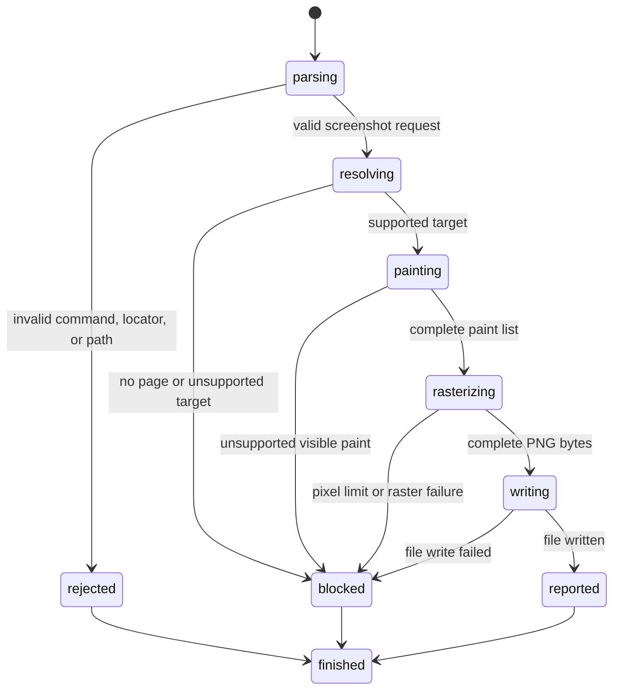

# Capture a screenshot

## Summary

Session mode captures the current viewport, full page, or one strict locator as a PNG file.

Use `screenshot [path.png]` for the viewport.

Use `screenshot --full [path.png]` or `screenshot -f [path.png]` for the full page.

Use `screenshot <selector> <path.png>` for one strict locator.

Package callers use `PrepareScreenshot`. It returns owned paint commands without rasterizing or writing a file.

The implemented paint subset covers solid backgrounds and same-color solid borders.

Unsupported paint blocks capture. browser.jr never returns an incomplete screenshot as a successful result.

## The simple case

The caller opens a controlled page through session mode. They request a viewport screenshot.

```text
open http://localhost:3000
screenshot page.png
exit
```

browser.jr prepares ordered paint commands. It composites RGBA fills and writes one PNG file.

```text
screenshot path="page.png" width=1280 height=720
```

Omit the path to create a generated `.png` file in the system temporary directory.

## The interaction, event by event



### Invoke

The caller first opens one loopback page in `browser.jr session`.

A supplied path must end in `.png`. A locator capture also requires a path.

The package target variants are viewport, full page, locator, and explicit rectangle.

### Exit immediately

Malformed commands, invalid selectors, and non-PNG paths fail before paint or file access.

A request without a current page reports unavailable.

### Begin running

Viewport capture uses the current scroll offsets and viewport dimensions.

Full-page capture uses the complete supported document extent. It starts at page coordinate zero.

Locator capture resolves exactly one current element. Missing or ambiguous locators fail.

The locator target scrolls into view before browser.jr builds its paint list.

Package rectangle coordinates use the page coordinate space. They do not change page scroll.

### While running

The page builds one white canvas fill, then ordered element fills.

A body background fills the captured canvas. Other backgrounds use their supported border boxes.

The color subset covers short and long hexadecimal values, integer `rgb()`, and decimal `rgba()`.

Named colors are `transparent`, black, white, red, green, blue, yellow, gray, and grey.

Painted borders need explicit widths, `solid` styles, and one supported color across painted sides.

The software rasterizer clips each fill to the capture rectangle. It applies source-over alpha compositing.

The rasterizer rejects captures above 16,777,216 pixels before it allocates the image buffer.

It rejects work above 67,108,864 clipped fill pixels before allocation.

PNG output uses one RGBA byte per channel.

Text, native controls, replaced content, linked stylesheets, embedded stylesheets, and unimplemented effects block visible paint.

Unimplemented effects include shadows, clipping, opacity groups, images, transforms, and stacking controls.

The screenshot path starts lazily. Loading, lint, inspection, and ordinary actions do not start it.

### Finish

Success writes one PNG. Output reports its path, width, and height.

An explicit path replaces an existing file after PNG encoding succeeds.

A blocked capture writes no new file. A write failure may leave an incomplete destination file.

Session mode reads the next command after success or failure.

## Variants

| Modifier | Set at command | Changed while running |
| --- | --- | --- |
| Flags and options | `--full` or `-f` selects full-page capture. | The target stays fixed. |
| Project configuration | No screenshot configuration exists. | Nothing reloads. |
| Target matrix | The command captures one viewport, page, or locator. | Locator capture may change page scroll. |
| Output channel | Results use stdout. Failures use stderr. | File bytes go to the selected path. |

## Cancel and interrupt

| Event | Before running | While running |
| --- | --- | --- |
| Ctrl+C once | The process may exit before capture starts. | The process may stop before file completion. |
| Ctrl+C again before the evaluation stops | The process already exits. | No graceful second stage exists. |
| The process receives SIGTERM | The process exits. | File completion is not guaranteed. |
| The terminal closes | The session may lose output. | File writing may still fail or stop. |
| stdin or stdout closes | Closed stdin ends the session. | Closed stdout prevents result delivery. |
| The network fails or a request times out | The current page already exists. | Capture performs no network request. |
| The inspected page changes | No JavaScript changes exist. | The static document remains unchanged. |
| Another capture targets the same path | Both may overwrite the file. | No file lock exists. |
| The process exits outright | No new file exists. | A partial destination may remain. |

## Interactions with other systems

**Configuration precedence.** No project or environment setting changes screenshot behavior.

**Output and exit status.** Success contributes status zero. Invalid input contributes two. Unavailable capture contributes three.

**Resource limits.** One image may contain at most 16,777,216 CSS pixels.

One raster may visit at most 67,108,864 clipped fill pixels.

**Network and storage.** Capture reads the current in-memory page. It writes one caller-selected or temporary PNG path.

**Rendering compatibility.** browser.jr paints only its stated solid-box subset.

**Playwright compatibility.** Playwright supports viewport, full-page, clipped, and locator screenshots.

It returns bytes and may write a path. browser.jr returns a prepared scene to package callers.

browser.jr currently writes PNG only. It omits masks, animation controls, JPEG, WebP, and style injection.

**agent-browser compatibility.** agent-browser 0.32.4 supports viewport, full-page, selector, generated-path, and explicit-path capture.

browser.jr implements those target and path shapes in session mode. It omits annotations, JPEG quality, and JSON output.

**Isolation.** The CLI adapter owns its lazy rasterizer. `Session` owns no renderer state.

**Accessibility inspection.** Screenshot capture uses locators only for target resolution.

## Edge cases

- A missing page blocks capture.
- A missing or ambiguous locator writes no new file.
- Locator capture scrolls before paint support is checked.
- Full-page capture does not change the stored scroll position.
- Fixed boxes use current scroll for viewport, rectangle, and locator capture.
- Fixed boxes use page origin for full-page capture.
- Transparent fills add no paint command.
- Alpha colors blend over earlier commands.
- Empty target boxes block locator capture.
- Unsupported geometry blocks paint when it may affect captured content.
- Content outside the capture rectangle does not add pixels.
- A non-PNG extension fails before the rasterizer starts.
- An oversized capture fails before image allocation.
- Excessive clipped paint work fails before image allocation.
- A generated path includes the process identifier and a session counter.

## Open questions and verification

- Add text shaping, glyph paint, images, clips, transforms, and stacking contexts.
- Move a complete renderer into the planned on-demand helper process.
- Define deterministic font and color behavior across platforms.
- Add annotation, JPEG, WebP, masks, and machine-readable session output.
- Decide whether package callers need encoded bytes as one typed request.
- Verify interruption and overwrite behavior in a real terminal.

Drafted from Rust implementation and automated boundary tests on 2026-08-31.
