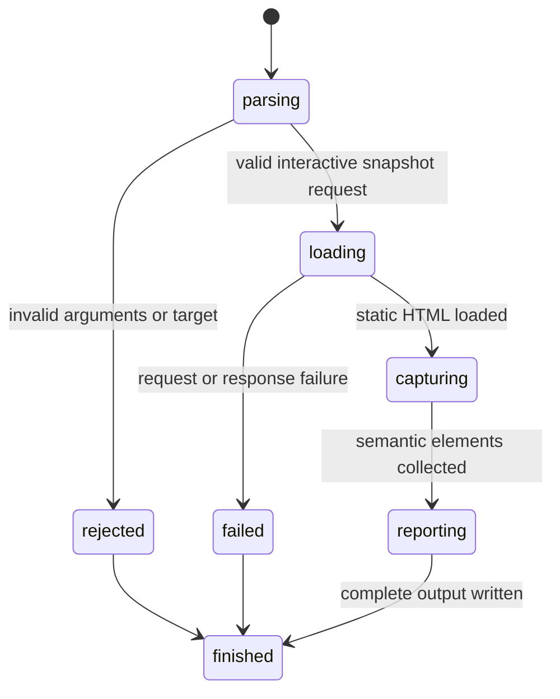

# Capture an interactive snapshot

## Summary

`browser.jr snapshot <url> --interactive` captures interactive semantic elements from one loopback HTTP page.

The output gives each element a reference such as `@e1`. Later action commands remain unimplemented.

Package callers open the page through `OpenPage`. They capture it through `CaptureInteractiveSnapshot` in the same `Session`.

## The simple case

The developer starts a local server. They run `browser.jr snapshot <url> --interactive`.

browser.jr loads the static HTML. It prints one snapshot header and the supported interactive elements in document order.

```text
snapshot=1 url=http://localhost:3000 mode=interactive elements=2
- textbox "Email" [ref=@e1]
- button "Save" [ref=@e2]
```

## The interaction, event by event



### Invoke

The CLI reads the URL and requires `-i` or `--interactive`.

### Exit immediately

Missing, repeated, or unknown arguments exit with status two. Invalid targets fail before network access.

### Begin running

The session opens one page through the bounded loopback loader.

### While running

The static HTML tokenizer collects supported native controls and explicit interactive ARIA roles.

Native controls include links with `href`, buttons, inputs, selects, and textareas. Hidden inputs do not appear.

Supported explicit roles are `button`, `checkbox`, `combobox`, `link`, `listbox`, `menuitem`, `option`, `radio`, `searchbox`, `slider`, `spinbutton`, `switch`, `tab`, `textbox`, and `treeitem`.

The name subset reads `aria-label`, associated labels, wrapping labels, selected native attributes, descendant text, and `title`.

The engine assigns references in document order. Repeated captures of one open document retain equal typed references.

Opening another document creates another document epoch. References from the previous document no longer compare equal.

A successful open also invalidates layout evidence from the previous document.

### Finish

The CLI prints the snapshot identifier, URL, mode, element count, roles, names, and references.

A successful empty snapshot exits zero. Load or output failures exit three.

## Variants

| Modifier | Set at invocation | Changed while running |
| --- | --- | --- |
| Flags and options | `-i` and `--interactive` select the implemented projection. | Flags stay fixed. |
| Project configuration | No snapshot configuration exists. | Nothing reloads. |
| Target matrix | One URL runs. | The target stays fixed. |
| Output channel | Human-readable output uses stdout. Failures use stderr. | A write failure stops delivery. |

## Cancel and interrupt

| Event | Before running | While running |
| --- | --- | --- |
| Ctrl+C once | The process exits. | The operating system stops the process. |
| Ctrl+C again before the evaluation stops | The process already exits. | No graceful second stage exists. |
| The process receives SIGTERM | The process exits. | The operating system stops the process. |
| The terminal closes | Output may fail. | Complete delivery may fail. |
| stdin or stdout closes | Closed stdin has no effect. | Closed stdout stops complete output. |
| The network fails or a request times out | No result exists. | The command exits with status three. |
| The inspected page changes | No effect. | The response already read does not change. |
| Another lint run targets the same page | Both invocations may start. | Their sessions remain separate. |
| The process exits outright | No snapshot exists. | Partial output is not a complete snapshot. |

## Interactions with other systems

**Configuration precedence.** No project or environment configuration affects this command.

**Output and exit status.** Success uses stdout and status zero. Invalid input uses stderr and status two.

**Resource limits.** The shared loader limits the request to five seconds and one MiB.

**Network and storage.** The command permits loopback HTTP only. It writes no snapshot file.

**Rendering compatibility.** The snapshot uses static HTML semantics. It does not apply CSS visibility or JavaScript mutations.

**Isolation.** Each CLI invocation creates one session. Package callers own their session lifetime.

**Accessibility inspection.** This subset is not a complete platform accessibility tree.

## Edge cases

- A page without supported interactive elements returns `elements=0`.
- Hidden inputs do not receive references.
- A link without `href` does not receive a native link role.
- `aria-label` takes precedence over the implemented label and text sources.
- Form values do not become names for selects, textareas, or text inputs.
- Submit and reset inputs use their native default labels when `value` is absent.
- Names collapse HTML whitespace before output.
- Output escapes quotes and line breaks in names.
- Repeated captures receive new snapshot identifiers.
- Human reference labels may restart after another document opens.
- Checks cannot consume layout evidence from the previous document.
- A failed package open preserves the previously open page.

## Open questions and verification

- Define `aria-labelledby`, fieldset, legend, and complete accessible-name behavior.
- Define CSS visibility and disabled-state fields before actionability work.
- Define reference syntax across persistent CLI sessions.
- Define machine-readable snapshot output.
- Add actions only after stale-reference rejection reaches the public boundary.

Drafted from Rust implementation and automated boundary tests on 2026-08-31.
