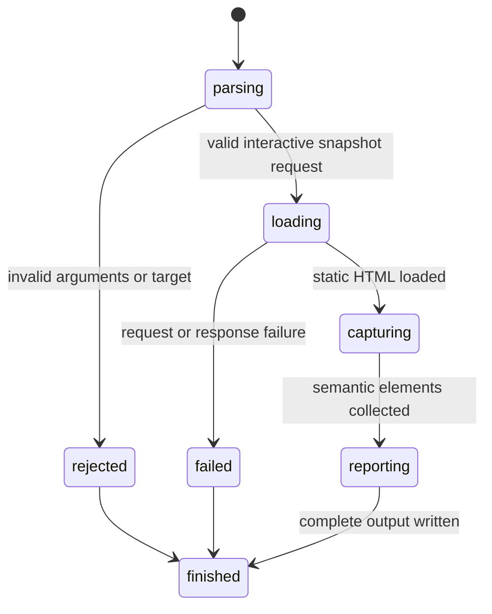

# Capture an interactive snapshot

## Summary

`browser.jr snapshot <url> --interactive` captures interactive semantic elements from one loopback HTTP page.

The output gives each element a reference such as `@e1`. Package callers may use references with typed actions and observations.

Package callers open the page through `OpenPage`. They capture it through `CaptureInteractiveSnapshot` in the same `Session`.

Session-mode callers send `open <url>` and `snapshot --interactive` through one process.

## The simple case

The developer starts a local server. They run `browser.jr snapshot <url> --interactive`.

browser.jr loads the static HTML. It prints one snapshot header and the supported interactive elements in document order.

```text
snapshot=1 url=http://localhost:3000 mode=interactive elements=2
- textbox "Email" [ref=@e1]: ""
- button "Save" [ref=@e2]
```

## The interaction, event by event



### Invoke

The one-shot CLI reads the URL and requires `-i` or `--interactive`.

Session mode reads the same snapshot flags after a successful `open` command.

### Exit immediately

Missing, repeated, or unknown arguments exit with status two. Invalid targets fail before network access.

### Begin running

The session opens one page through the loopback loader.

### While running

The static HTML tokenizer collects supported native controls and explicit interactive ARIA roles.

Native controls include links with `href`, buttons, inputs, selects, and textareas. Hidden inputs do not appear.

Supported explicit roles are `button`, `checkbox`, `combobox`, `link`, `listbox`, `menuitem`, `option`, `radio`, `searchbox`, `slider`, `spinbutton`, `switch`, `tab`, `textbox`, and `treeitem`.

The name subset reads `aria-label`, associated labels, wrapping labels, selected native attributes, descendant text, and `title`.

The engine assigns references in document order. Each capture creates fresh typed reference identities.

[Supported text controls](read-value.md) include their current value. Snapshot values do not become accessible names.

[Native checkboxes](read-checked.md) include their current Boolean state. State does not become an accessible name.

Capturing again makes every reference from the previous snapshot stale.

Opening another document creates another document epoch. References from the previous document no longer compare equal.

A successful open also invalidates layout evidence from the previous document.

### Finish

The CLI prints the snapshot identifier, URL, mode, count, roles, names, references, and supported control state.

Session mode keeps the typed references until another snapshot, open, or successful navigation replaces them.

A successful empty snapshot exits zero. Load or output failures exit three.

## Variants

| Modifier | Set at invocation | Changed while running |
| --- | --- | --- |
| Flags and options | `-i` and `--interactive` select the implemented projection. | Flags stay fixed. |
| Project configuration | No snapshot configuration exists. | Nothing reloads. |
| Target matrix | One-shot mode takes one URL. Session mode uses its current page. | A successful session open or navigation replaces the document. |
| Output channel | Human-readable output uses stdout. Failures use stderr. | Session mode flushes both streams after each command. |

## Cancel and interrupt

| Event | Before running | While running |
| --- | --- | --- |
| Ctrl+C once | The process exits. | The operating system stops the process. |
| Ctrl+C again before the evaluation stops | The process already exits. | No graceful second stage exists. |
| The process receives SIGTERM | The process exits. | The operating system stops the process. |
| The terminal closes | Output may fail. | Complete delivery may fail. |
| stdin or stdout closes | Closed stdin has no effect. | Closed stdout stops complete output. |
| The network fails or a request times out | No result exists. | The command exits with status three. |
| The inspected page changes | No effect. | The response already read does not change. |
| Another lint run targets the same page | Both invocations may start. | Their sessions remain separate. |
| The process exits outright | No snapshot exists. | Partial output is not a complete snapshot. |

## Interactions with other systems

**Configuration precedence.** No project or environment configuration affects this command.

**Output and exit status.** Success uses stdout and status zero. Invalid input uses stderr and status two.

**Resource limits.** The body limit is one MiB. A wall-clock request timeout is not implemented yet.

**Network and storage.** The command permits loopback HTTP only. It writes no snapshot file.

**Rendering compatibility.** The snapshot uses static HTML semantics. It does not apply CSS visibility or JavaScript mutations.

**Isolation.** Each CLI invocation creates one session. Session mode keeps it until exit or EOF. Package callers own their session lifetime.

**Accessibility inspection.** This subset is not a complete platform accessibility tree.

## Edge cases

- A page without supported interactive elements returns `elements=0`.
- Hidden inputs do not receive references.
- A link without `href` does not receive a native link role.
- `aria-label` takes precedence over the implemented label and text sources.
- Form values do not become names for selects, textareas, or text inputs.
- Supported text values use an escaped quoted form after their reference.
- Disabled and read-only text controls expose their value but reject fill.
- Unsupported controls and password fields do not expose a value.
- Native checkboxes expose `[checked=true]` or `[checked=false]` after their reference.
- Disabled native checkboxes expose state but reject [changes](../interaction/set-checked.md).
- Submit and reset inputs use their native default labels when `value` is absent.
- Names collapse HTML whitespace before output.
- Output escapes quotes and line breaks in names.
- Repeated captures receive new snapshot identifiers and fresh typed references.
- Human reference labels may restart after another document opens.
- Checks cannot consume layout evidence from the previous document.
- A failed package open preserves the previously open page.
- Session mode maps labels only to its latest snapshot's typed references.

## Open questions and verification

- Define `aria-labelledby`, fieldset, legend, and complete accessible-name behavior.
- Define CSS visibility and disabled-state fields before actionability work.
- Define password handling before password fields expose or accept values.
- Define machine-readable snapshot output.
- Add visibility and actionability data before non-link actions.

Drafted from Rust implementation and automated boundary tests on 2026-08-31.
