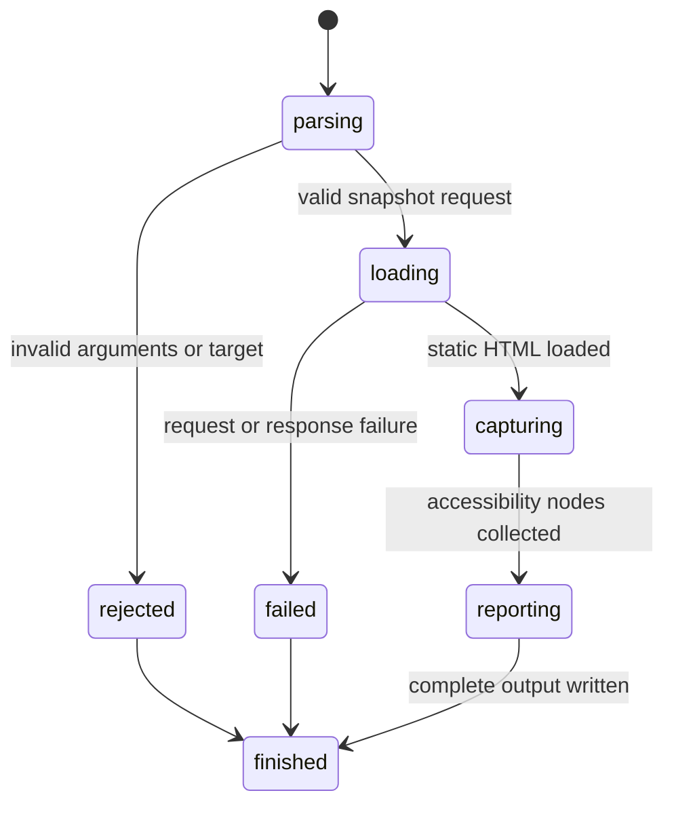

# Capture a snapshot

## Summary

`browser.jr snapshot <url>` captures the supported accessibility tree from one loopback HTTP page.

`-i` or `--interactive` projects that tree to agent-oriented reference targets.

`-s <css>` or `--selector <css>` limits the result to one strict CSS target and its descendants.

`-u` or `--urls` adds each semantic link's resolved target URL to its snapshot line.

`-c` or `--compact` removes empty structural leaves from the full tree.

`-d <n>` or `--depth <n>` limits the full tree. Root nodes have depth zero.

Compact and depth remain neutral for the interactive projection.

`--json` writes one machine-readable result to stdout. It applies to successful snapshots and failures.

Reference targets include supported controls, links, headings, and navigation landmarks.

Human full-tree lines use `e1`. Interactive lines and commands use `@e1`.

Package callers may use references with typed actions and observations.

Package callers capture the full tree through `CaptureAccessibilitySnapshot`.

`CaptureAccessibilitySnapshotWithin` accepts one strict locator and tree options.

Package callers open the page through `OpenPage`.

They capture the agent-oriented projection through `CaptureInteractiveSnapshot`.

`CaptureInteractiveSnapshotWithin` accepts any strict locator and captures its resolved subtree.

Session-mode callers send `open <url>` and `snapshot [options]` through one process.

## The simple case

The developer starts a local server. They run `browser.jr snapshot <url>`.

browser.jr loads the static HTML. It prints supported accessibility nodes in document order.

```text
snapshot=1 url=http://localhost:3000 mode=full nodes=3
- main
  - heading "Account" [ref=e1]
  - textbox "Email" [ref=e2]: ""
```

Interactive mode keeps a compact target projection:

```text
snapshot=1 url=http://localhost:3000 mode=interactive elements=2
- heading "Account" [ref=@e1]
- textbox "Email" [ref=@e2]: ""
```

JSON mode uses the selected projection. Machine keys omit `@`:

```json
{"success":true,"data":{"origin":"http://localhost:3000","refs":{"e1":{"name":"Account","role":"heading"},"e2":{"name":"Email","role":"textbox"}},"snapshot":"- main\n  - heading \"Account\" [ref=e1]\n  - textbox \"Email\" [ref=e2]: \"\""},"error":null}
```

## The interaction, event by event



### Invoke

The one-shot CLI reads the URL. Full-tree output is the default.

`-i` or `--interactive` selects the agent-oriented target projection.

An optional `-s` or `--selector` value must be one valid CSS selector.

The caller may add `-u` or `--urls` once.

One compact flag removes empty structural leaves from the full tree.

One non-negative depth limits full-tree output. Depth zero keeps roots only.

The caller may put `--json` before `snapshot` or among the snapshot options.

Session mode reads the same snapshot flags after a successful `open` command.

### Exit immediately

Missing, repeated, or unknown arguments exit with status two. Invalid targets fail before network access.

Malformed CSS scope selectors fail before the one-shot command loads the page.

When the request selects JSON, these failures write one failure envelope to stdout. Stderr stays empty.

### Begin running

The session opens one page through the loopback loader.

### While running

The static HTML tokenizer builds ordered element and text children.

The semantic pass projects supported roles, names, states, and accessibility-hidden evidence.

[Element queries](query-elements.md) own supported roles, accessible names, descriptions, states, and hidden inclusion.

The engine assigns references to supported controls, links, headings, and navigation landmarks.

References use document order. Each capture creates fresh typed identities.

Each semantic link stores its absolute target URL. Resolution uses the current page URL and parsed `href` value.

A scoped capture first resolves exactly one target. It keeps nodes at or below that element.

Scoped references retain their document-wide labels. Gaps are valid.

Full-tree text nodes do not receive references.

Interactive output omits non-reference ancestors. Reference ancestors preserve indentation.

The full tree omits subtrees proven accessibility-hidden by supported static evidence.

Whole-page full trees append one document-level marker for each visible native list item.

`ul` and `menu` items use `• `. `ol` items use one-based decimal markers per list.

Markers have depth zero and no reference. Scoped and compact captures exclude them.

The interactive projection keeps hidden reference targets for explicit [visible-state](read-visible.md) reads.

[Supported controls](read-value.md) include their current value. Snapshot values do not become accessible names.

[Native checkboxes](read-checked.md) include their current Boolean state. State does not become an accessible name.

Capturing again makes every reference from the previous snapshot stale.

A failed scoped capture preserves the latest successful snapshot and its references.

Opening another document creates another document epoch. References from the previous document no longer compare equal.

A successful open also invalidates layout evidence from the previous document.

### Finish

Human output prints the snapshot identifier, URL, mode, count, roles, names, references, and supported state.

JSON output has top-level `success`, `data`, and `error` fields. Success data has `origin`, `refs`, and `snapshot`.

Each `refs` key maps to its role and name.

The `snapshot` string keeps tree indentation, document order, and supported state.

URL output appears inside the reference brackets. The `refs` map stays unchanged.

JSON failure data is `null`. Its `error` field contains the same diagnostic as human mode.

Session mode keeps the typed references until another snapshot, open, or successful navigation replaces them.

A successful empty snapshot exits zero. Load or output failures exit three.

## Variants

| Modifier | Set at invocation | Changed while running |
| --- | --- | --- |
| Flags and options | Full tree is default. Interactive selects target projection. URLs expose link targets. Compact prunes empty structure. Depth limits full output. Selector scopes. JSON selects the envelope. | Flags stay fixed. |
| Project configuration | No snapshot configuration exists. | Nothing reloads. |
| Target matrix | One-shot mode takes one URL. Session mode uses its current page. | A successful session open or navigation replaces the document. |
| Output channel | Human results use stdout and human failures use stderr. JSON results and failures use stdout. | Session mode flushes both streams after each command. |

## Cancel and interrupt

| Event | Before running | While running |
| --- | --- | --- |
| Ctrl+C once | The process exits. | The operating system stops the process. |
| Ctrl+C again before the evaluation stops | The process already exits. | No graceful second stage exists. |
| The process receives SIGTERM | The process exits. | The operating system stops the process. |
| The terminal closes | Output may fail. | Complete delivery may fail. |
| stdin or stdout closes | Closed stdin has no effect. | Closed stdout stops complete output. |
| The network fails or a request times out | No result exists. | The command exits with status three. |
| The inspected page changes | No effect. | The response already read does not change. |
| Another lint run targets the same page | Both invocations may start. | Their sessions remain separate. |
| The process exits outright | No snapshot exists. | Partial output is not a complete snapshot. |

## Interactions with other systems

**Configuration precedence.** No project or environment configuration affects this command.

**Output and exit status.** Success uses stdout and status zero. Human invalid input uses stderr and status two.

JSON preserves status zero, two, or three. It writes one complete envelope to stdout when output succeeds.

**Resource limits.** The body limit is one MiB. A wall-clock request timeout is not implemented yet.

**Network and storage.** The command permits loopback HTTP only. It writes no snapshot file.

**Rendering compatibility.** The snapshot uses static HTML and supported inline visibility evidence.

It does not apply linked stylesheets or JavaScript mutations.

**Compatibility.** agent-browser also filters scoped membership in document order.

Both tools retain document-wide labels for scoped references.

The JSON envelope and `origin`, `refs`, and `snapshot` fields match agent-browser 0.32.4.

Its `--urls` line format also matches agent-browser 0.32.4.

Full-tree root depth, indentation, role nodes, static text, and URL placement follow measured 0.32.4 behavior.

Native bullet and one-based decimal list-marker roots follow measured 0.32.4 behavior.

Interactive output includes headings and navigation landmarks. Nested reference targets preserve their reference ancestry.

Interactive compact and depth options do not change either output.

browser.jr omits lifecycle metadata. Its snapshot string reports only browser.jr's static semantic and state subset.

Authored marker styles, authored ordered-list ordinals, and complete platform accessibility computation remain unsupported.

**Isolation.** Each CLI invocation creates one session. Session mode keeps it until exit or EOF. Package callers own their session lifetime.

**Accessibility inspection.** This is a deterministic static accessibility-tree subset.

It does not claim complete browser accessibility-tree parity.

## Edge cases

- A page without supported tree nodes returns `nodes=0` in full mode.
- A page without supported reference targets returns `elements=0` in interactive mode.
- An empty JSON snapshot has an empty `refs` object and empty `snapshot` string.
- A matched scope without tree nodes returns `nodes=0` in full mode.
- A matched scope without reference targets returns `elements=0` in interactive mode.
- An interactive scope target includes itself as the first result.
- A missing or ambiguous scope does not replace current references.
- Scoped refs keep document-wide labels and map to their original page elements.
- Full-tree depth counts each emitted root as zero.
- Whole-page native list markers follow tree roots in list-item document order.
- Hidden native list items do not emit list markers.
- Nested and separate ordered lists each start their supported decimal marker sequence at one.
- Scoped and compact full trees omit document-level list markers.
- Compact full-tree output removes empty `generic`, `group`, `listitem`, `region`, `row`, and `rowgroup` leaves.
- Plain headings expose their accessible name without a duplicate static-text child.
- Mixed semantic headings preserve ordered text and semantic children.
- Ignored structural containers flatten without increasing output depth.
- Hidden inputs do not receive references.
- A link without `href` does not receive a native link role.
- `aria-label` takes precedence over the implemented label and text sources.
- Form values do not become names for selects, textareas, or text inputs.
- Supported control values use an escaped quoted form after their reference.
- Disabled and read-only text controls expose their value but reject fill.
- Native selects expose their first selected value in document order.
- A select without a selected option exposes an empty value.
- Disabled selects expose their value but reject [selection](../interaction/select-option.md).
- Unsupported controls and password fields do not expose a value.
- Native checkboxes expose `[checked=true]` or `[checked=false]` after their reference.
- Disabled native checkboxes expose state but reject [changes](../interaction/set-checked.md).
- Submit and reset inputs use their native default labels when `value` is absent.
- Names collapse HTML whitespace before output.
- Output escapes quotes and line breaks in names.
- Repeated captures receive new snapshot identifiers and fresh typed references.
- Human reference labels may restart after another document opens.
- JSON ref keys omit the human `@` prefix.
- A JSON parse, load, or scope failure writes `success=false`, `data=null`, and one error string.
- Repeating `--json` reports invalid input through the JSON envelope.
- Session mode remains line-oriented human text.
- Checks cannot consume layout evidence from the previous document.
- A failed package open preserves the previously open page.
- Session mode maps labels only to its latest snapshot's typed references.
- Hidden semantic elements may retain references for explicit visibility inspection.
- URL output resolves relative paths, queries, network paths, and fragments against the current page.
- URL output applies only to elements whose semantic role is `link`.
- Compact and depth flags do not hide interactive elements or change references.
- Missing, negative, repeated, or non-numeric depth values fail before page loading.

## Open questions and verification

- Define the remaining complete accessible-name behavior.
- Define stylesheet-aware snapshot filtering before visibility changes snapshot membership.
- Define password handling before password fields expose or accept values.
- Define generated list-marker nodes.
- Expand reference ancestry beyond headings and navigation landmarks when runtime evidence requires it.
- Define motion frame sampling and pointer-target evidence before actions claim complete actionability.

Drafted from Rust implementation and automated boundary tests on 2026-08-31.
