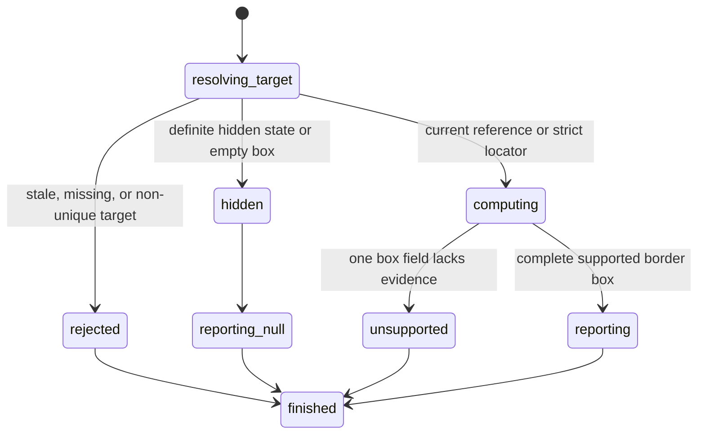

# Inspect element geometry

## Summary

Package callers submit `GetElementBoundingBox` with a reference or `GetBoundingBoxByLocator` with a locator.

Session-mode callers send `get box <ref|selector>`. Direct selectors need no snapshot.

The result is `None` or one viewport-relative `BoundingBox` with `x`, `y`, `width`, and `height`.

browser.jr returns a box only when every field has supported static evidence.

## The simple case

The caller opens a page with fixed and normal-flow boxes.

The fixed box supplies integer pixel `left`, `top`, `width`, and `height` values.

Normal block children stack inside their parent's content box.

browser.jr returns each complete viewport-relative border box. The reads preserve the current page and references.

## The interaction, event by event

### Invoke

The package request contains one typed reference or locator.

Session mode reads `get box` and one reference or selector.

### Exit immediately

A stale package reference returns `SessionError::StaleElementReference`.

Invalid, missing, and ambiguous locators follow [Find elements with locators](query-elements.md).

### Begin running

browser.jr resolves the target against the current static document.

The current session viewport defaults to 1280 by 720 CSS pixels.

[`set viewport`](../interaction/set-viewport.md) can change both dimensions and recompute supported geometry.

The fixed-position subset requires inline integer pixel `left`, `top`, `width`, and `height` values.

Width and height must be non-negative. Coordinates may be negative.

The normal-flow subset supports static block boxes without collapsing vertical margins.

In-flow children stack from their parent's content edge. Fixed children do not move later siblings.

An auto-height block uses its supported in-flow children. An empty auto-height block has zero height.

The body uses an eight-pixel default margin. Inline `margin-top` and `margin-bottom` can replace its vertical margins.

A non-default block needs explicit `display:block`, `box-sizing:border-box`, `width`, and `height`.

### While running

The engine computes one border box from the supported inline box model.

Normal-flow boxes subtract the current horizontal and vertical page offsets.

Fixed boxes keep their viewport coordinates after page scrolling.

Their supported descendants also keep viewport coordinates.

Longhand padding and painted border widths expand a content box.

`box-sizing:border-box` keeps the declared width and height when their edges fit.

A definite hidden state returns `None`. A zero width or height also returns `None`.

`display:none` boxes leave normal flow. Invisible boxes keep their layout space but return `None`.

Stylesheets, transforms, shorthand edges, intrinsic text sizes, and collapsed vertical margins remain unsupported.

An unsupported read returns a typed error. It does not return a partial box.

The read does not scroll, wait, dispatch events, capture a snapshot, or change state.

See [Scroll the page and reveal an element](../interaction/scroll-page.md) for offset changes.

### Finish

Package references return `ElementBoundingBox`. Locators return `LocatorBoundingBox`.

Each reply contains `Option<BoundingBox>`.

Session mode prints `null` for no visible box.

A complete box prints four lines named `x`, `y`, `width`, and `height`.

Unsupported evidence returns `SessionError::UnsupportedBoundingBox` or `UnsupportedLocatorInspection`.

## Variants

| Modifier | Set at invocation | Changed while running |
| --- | --- | --- |
| Flags and options | The package and session commands take one reference or locator. | No geometry-read flags exist. |
| Project configuration | No session viewport configuration exists. | Nothing reloads. |
| Target matrix | The current page uses its configured viewport. | The read does not change it. |
| Output channel | The package returns typed geometry. Session mode uses flushed text. | Output remains stable. |

## Cancel and interrupt

| Event | Before running | While running |
| --- | --- | --- |
| Ctrl+C once | The host or CLI process may exit. | The read has no asynchronous phase. |
| Ctrl+C again before the evaluation stops | The process may already be gone. | No second-stage handler exists. |
| The process receives SIGTERM | The process may exit before the request. | In-memory state disappears. |
| The terminal closes | Package behavior is unchanged. | Session output may fail. |
| stdin or stdout closes | Package behavior is unchanged. | Closed stdin ends session mode. |
| The network fails or times out | The read uses no network. | The page already exists in memory. |
| The inspected page changes | Navigation can stale the reference. | This read does not change state. |
| Another lint run targets the page | It owns another session. | It cannot read this geometry. |
| The process exits outright | No result returns. | No session state survives. |

## Interactions with other systems

**Configuration precedence.** Parsed inline style is the only box source.

**Output and exit status.** Package callers receive typed replies. Session failures use status two or three.

**Resource limits.** Page loading resolves the supported box tree once. A read projects one stored result.

**Network and storage.** The read uses no network and writes no storage.

**Rendering compatibility.** The result follows [Playwright bounding-box](https://playwright.dev/docs/api/class-locator#locator-bounding-box) shape and hidden result.

`agent-browser` uses the same four output names. Lightpanda differences remain in [`bug-triage.md`](../bug-triage.md).

**Isolation.** Geometry and references belong to one session and document.

**Accessibility inspection.** Geometry reads do not change roles, names, text, or state.

## Edge cases

- Negative `left` or `top` values remain negative.
- Page scrolling can make normal-flow `x` or `y` values negative.
- Fixed boxes keep the same coordinates after page scrolling.
- Content-box padding and painted borders expand returned dimensions.
- Border-box dimensions remain declared when their edges fit.
- Border-box edges larger than the declared size report unsupported.
- Hidden targets return no box before unsupported geometry is considered.
- Zero width or height returns no box.
- Supported normal blocks stack in document order.
- Fixed descendants do not move their normal-flow siblings.
- Supported descendants of fixed boxes remain viewport relative while the page scrolls.
- Auto-height containers use supported in-flow child boxes.
- Empty auto-height boxes return no box and consume no flow height.
- `display:none` targets consume no flow height.
- `visibility:hidden` targets consume flow height but return no box.
- Intrinsic text height and non-body vertical margins report unsupported geometry.
- Embedded or linked stylesheets make geometry unsupported.
- Direct CSS and XPath selectors resolve strictly without a snapshot.
- Failed reads preserve the current page, focus, pointer target, and references.
- A later snapshot invalidates earlier interactive references.

## Open questions and verification

- Implement collapsed vertical margins and intrinsic line layout.
- Parse stylesheet geometry before accepting stylesheet-backed boxes.
- Define fractional CSS pixels and transform effects.
- Add child-frame coordinate conversion after frames exist.
- Add waiting and cancellation around dynamic geometry.

Drafted from Rust package, parser, compiled-process tests, Playwright documentation, and controlled Lightpanda evidence on 2026-08-31.
