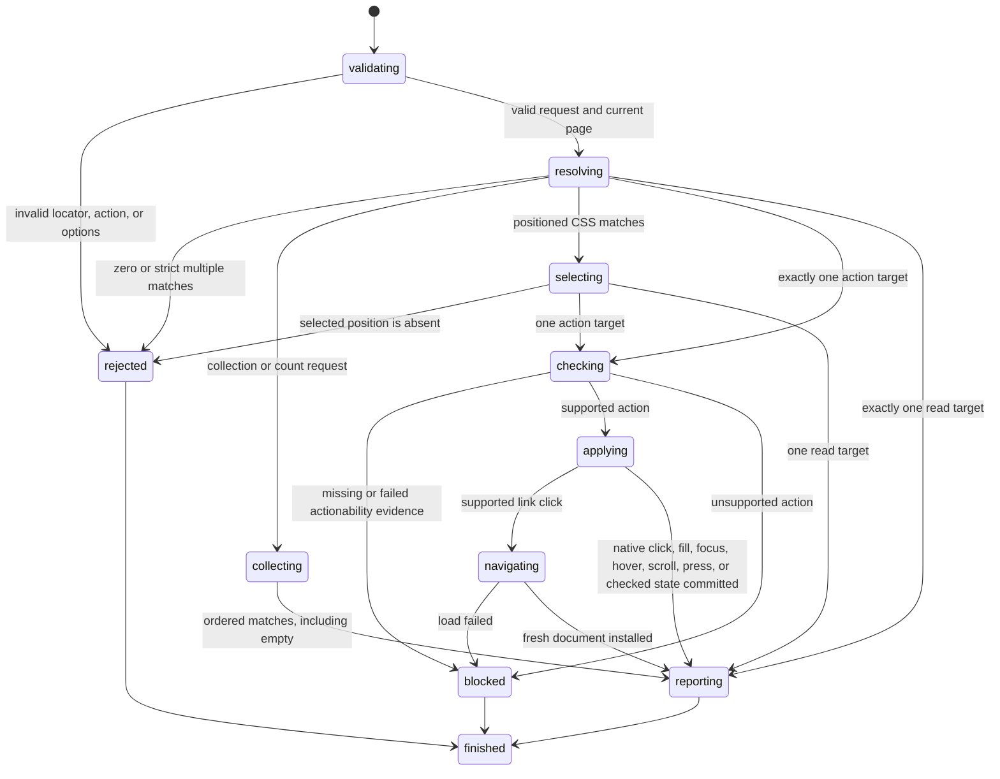

# Find elements with locators

## Summary

Package callers create a `Locator` from a semantic, attribute, CSS, or XPath query.

`FindByLocator` returns one strict current match. `FindAllByLocator` returns an ordered collection, and `CountByLocator` returns its size.

Locator action requests share one strict resolution and action path.

The existing role-specific request types remain available for callers that need a guaranteed semantic role.

Session-mode callers use this form:

```text
find role <role> [action] [role-options]
find text <text> [click|fill <text>|focus|focused|hover|hovered|press <key>|check|uncheck|scroll|text] [--exact]
find label <label> [click|fill <text>|focus|focused|hover|hovered|press <key>|check|uncheck|scroll|text] [--exact]
find placeholder <text> [click|fill <text>|focus|focused|hover|hovered|press <key>|check|uncheck|scroll|text] [--exact]
find alt <text> [click|fill <text>|focus|focused|hover|hovered|press <key>|check|uncheck|scroll|text] [--exact]
find title <text> [click|fill <text>|focus|focused|hover|hovered|press <key>|check|uncheck|scroll|text] [--exact]
find testid <id> [click|fill <text>|focus|focused|hover|hovered|press <key>|check|uncheck|scroll|text]
find css <selector> [click|fill <text>|focus|focused|hover|hovered|press <key>|check|uncheck|scroll|text]
find xpath <expression> [click|fill <text>|focus|focused|hover|hovered|press <key>|check|uncheck|scroll|text]
find first <selector> [click|fill <text>|focus|focused|hover|hovered|press <key>|check|uncheck|scroll|text]
find last <selector> [click|fill <text>|focus|focused|hover|hovered|press <key>|check|uncheck|scroll|text]
find nth <index> <selector> [click|fill <text>|focus|focused|hover|hovered|press <key>|check|uncheck|scroll|text]
click <ref|selector>
fill <ref|selector> <text>
type <ref|selector> <text>
focus <ref|selector>
hover <ref|selector>
scrollintoview <ref|selector>
scrollinto <ref|selector>
select <ref|selector> <value>
select <ref|selector> "<value>" ["<value>" ...]
check <ref|selector>
uncheck <ref|selector>
is checked <ref|selector>
is editable <ref|selector>
is enabled <ref|selector>
is focused <ref|selector>
is hovered <ref|selector>
is visible <ref|selector>
get attr <ref|selector> <name>
get box <ref|selector>
get html <ref|selector>
get text <ref|selector>
get value <ref|selector>
get count <selector>
```

The command defaults to `click`. This matches agent-browser command composition.

Every request resolves the current locator index. Interactive snapshots remain a separate reference mechanism.

## The simple case

The caller opens a page, then sends:

```text
find label Email fill hello --exact
```

browser.jr resolves one currently labeled control. It checks supported visibility and editable evidence before changing the value.

The caller does not need a snapshot. A later snapshot reports the changed value.

## The interaction, event by event



### Invoke

The package request contains one validated `Locator` variant.

Each package action has its own reply type. A fill request cannot return a click result.

Session mode accepts one locator kind and value.

Role options select accessible name, accessible description, exact matching, state, level, or hidden inclusion.

State options are `--checked`, `--disabled`, `--expanded`, `--pressed`, and `--selected`.

Each state option requires `true` or `false`.

`--level` requires a positive integer. `--include-hidden` takes no value.

Non-role values with spaces require matching single or double quotes.

`nth` requires a zero-based unsigned index before its selector.

`fill` requires text before locator options. `press` requires one key token.

### Exit immediately

An empty role is invalid. A role token may contain only ASCII letters, digits, or hyphens.

Empty text-backed and test ID locator values are invalid.

Empty or malformed CSS selectors and XPath expressions are invalid.

A valid XPath expression that returns a scalar, attribute, text, or other non-element result blocks resolution.

Session mode rejects unterminated quotes, missing fill text, missing option values, and unsupported syntax.

It rejects zero levels, non-Boolean state values, and duplicate options.

It rejects `--exact` without `--name` or `--description`.

It rejects checked, expanded, level, pressed, or selected filters on unsupported roles.

Finding or acting before a successful open returns `SessionError::NoPage`.

### Begin running

browser.jr reads the current document's locator index.

The index includes every parsed content element. Each entry records semantic evidence, source attributes, and action identity.

The native subset includes controls, headings, lists, landmarks, common groups, images, and table structure.

It includes HTML roles for captions, definitions, edits, emphasized text, search, time, meters, and related semantic elements.

Text-like inputs with a referenced datalist use `combobox`. File inputs use `button`.

Cells inside an explicit grid or tree grid use `gridcell`.

An empty-alt image uses `presentation` without a title, global ARIA attribute, or tab index.

Explicit role matching accepts the current standard WAI-ARIA role set. The first supported token wins.

`none` and `presentation` yield to an implicit role when focus or global ARIA creates a conflict.

Roles that prohibit naming expose an empty accessible name.

Roles named from content use descendant text and non-presentational image `alt` alternatives in document order.

Role matching ignores ASCII case. The locator stores a normalized lowercase role.

Default accessible-name matching uses a case-insensitive substring.

Default accessible-description matching uses the same rule.

`--exact` requires normalized, case-sensitive equality for supplied names and descriptions.

Accessible descriptions use `aria-describedby` references before `aria-description`.

Referenced descriptions include hidden text. Multiple references follow their token order.

The `title` attribute supplies a description only when it did not supply the accessible name.

Role state filters use current checked state and parsed ARIA state.

Native disabled state and inherited `aria-disabled` supply disabled evidence.

An explicit `aria-disabled="false"` stops inherited ARIA disablement.

Disabled fieldsets preserve controls inside their first legend.

Native headings use levels one through six. Other supported roles use a valid `aria-level`.

Role locators exclude accessibility-hidden matches by default.

`hidden`, inline hidden CSS, `visibility:hidden`, and inherited `aria-hidden="true"` hide role candidates.

`--include-hidden` bypasses this filter.

Unknown stylesheet visibility blocks a matching role query unless `--include-hidden` is set.

Text, label, placeholder, alt, and title queries collapse HTML whitespace before matching.

Their default matching uses a case-insensitive substring. `--exact` uses normalized, case-sensitive equality.

Label queries match supported controls through `aria-labelledby`, `aria-label`, explicit labels, or ancestor labels.

Placeholder queries match non-empty `placeholder` attributes on inputs and textareas.

Alt queries match parsed `alt` attributes. Title queries match parsed `title` attributes.

Test ID queries use case-sensitive equality against `data-testid`. They do not accept `--exact`.

Text queries use normalized descendant text. Button and submit inputs use their `value` attribute.

When a matching descendant also matches, a text query removes its matching ancestor.

CSS locators query the normalized HTML5 document. They support selector groups, combinators, attribute operators, and parsed pseudo-classes.

`CssLocator::new` is strict. First, last, and nth CSS locators select document order instead.

XPath locators evaluate XPath 1.0 expressions against a namespace-free mirror of the same normalized document.

Descendant and child combinators traverse normalized HTML ancestry. Implied structural elements participate but cannot become locator targets.

XPath locators evaluate XPath 1.0 expressions against a namespace-free mirror of the same normalized document.

XPath results must contain only elements. Scalar, attribute, text, comment, and processing-instruction results block resolution.

> Technical note: CSS uses `dom_query` 0.28.0. XPath evaluation uses `sxd-xpath` 0.4.2.

Selector results map back to the existing parsed content index. A mapping failure blocks resolution.

Direct selectors default to CSS. `css=` forces CSS. `xpath=`, `//`, and `..` select XPath.

Direct selectors containing spaces require matching single or double quotes.

`first`, `last`, and `nth` select document order. `nth` uses a zero-based index.

Non-positioned resolution is strict. Generic requests return `LocatorNotFound` for zero matches.

Generic requests return `LocatorAmbiguous` for multiple matches. Role-specific requests keep their role-specific errors.

Positioned CSS queries select one match instead of reporting ambiguity. An absent position returns `LocatorNotFound`.

Strict CSS and XPath queries use the same zero-match and ambiguity errors as semantic locators.

Collection requests keep every match in document order. Zero matches return an empty collection instead of an error.

Positioned CSS locators apply their position before collection. Their collection contains zero or one match.

### While running

Each action resolves again when its request executes. It does not retain a prior match.

Resolution and collection do not fetch, capture a snapshot, run scripts, wait, or retry.

`text` returns normalized descendant text without actionability checks.

`get html` serializes normalized static child markup without actionability checks.

`get box` returns one complete supported border box or no visible box.

A descendant password source value blocks HTML serialization.

`fill` requires supported visible evidence. The target must be an editable text control.

`type` uses the same evidence. It appends to the supported current text-control value.

`focus` performs strict resolution without actionability checks. The target must belong to the supported focus subset.

`focused` compares one strict target with current page focus. It does not require an interactive target.

`press` performs the same strict focus step, then applies one bounded key.

Text keys edit the resolved text control. `Tab` and `Shift+Tab` move from the resolved target.

`Enter` activates links, native buttons, and supported implicit form submission.

`Space` changes supported native checked controls.

Plain arrows move, select, and focus the adjacent eligible member of a native radio group.

Locator press performs no visible, enabled, editable, stable, or receives-events check.

`select` requires supported visible evidence. The target must be an enabled native select.

`check` and `uncheck` require supported visible and static stability evidence.

The target must be an enabled native checkbox or radio.

Checking a radio selects it and unchecks its group peers. Unchecking a selected radio rejects without mutation.

`click` requires supported visible, static stability, and enabled evidence.

It navigates same-context links, activates supported native buttons, and changes native checked controls.

Supported GET submitters navigate through [`submit-form.md`](../interaction/submit-form.md).

Reset and image controls with form owners reject clicks. Complete pointer metadata is not implemented.

Successful fill, select, click, check, and uncheck actions append their documented native event records.

Successful link clicks record target-level pointer, mouse, focus, and `click` phases before navigation.

The session transcript does not deliver events to page scripts.

`hover` resolves strictly and requires supported visible and static stability evidence.

It auto-scrolls a supported target box before storing the source as the exact pointer target.

Hover does not check enabled state. It requires bounded event-receipt evidence.

`hovered` compares one strict match with that pointer target.

`scroll` adjusts the current page offsets to reveal one supported box when possible.

It supports structural and interactive targets. See [Scroll the page and reveal an element](../interaction/scroll-page.md).

Hover records target-level pointer transitions. Hovered-state reads do not apply CSS `:hover`.

Missing visibility evidence blocks an action. Hidden elements also block an action.

Disabled or read-only controls block before mutation. A blocked request preserves current state.

Supported local click, hover, changed check, and changed uncheck scroll after checks and before mutation.

Unsupported box geometry leaves offsets unchanged. It does not block an otherwise valid action.

Successful non-navigation native actions, fill, type, focus, hover, scroll, and checked-state actions preserve references.

Successful fill also stores its resolved target as current focus.

Successful link or GET form keyboard navigation installs a fresh document. It invalidates existing references.

Successful link or GET form click navigation installs a new document. It invalidates existing references.

Failed link or form navigation preserves the current document and references.

Accessible names and descriptions use the implemented role-specific subset.

`aria-labelledby` has priority over `aria-label` for names.

Native labels name supported controls. Landmark and list content does not become an accessible name.

### Finish

`FindByLocator` returns `LocatorMatch` with `element`, optional `role`, `name`, and `text`.

`FindAllByLocator` returns `LocatorMatches` with zero or more ordered matches.

`CountByLocator` returns `LocatorCount` with the same collection size.

Typed locator reads return the match with current HTML, value, attribute, checked, editable, enabled, focused, hovered, or visible state.

`FindByRole` returns `RoleMatch` with a required role.

`FillByLocator` returns the match and committed value after storing focus.

`TypeByLocator` returns the match and complete current value after the append.

`FocusByLocator` returns the match after storing it as current page focus.

`GetFocusedByLocator` returns the match and current focused-state Boolean.

`HoverByLocator` returns the match after storing its source as the pointer target.

`GetHoveredByLocator` returns the match and current hovered-state Boolean.

`ScrollIntoViewByLocator` returns `LocatorScroll` with the match and committed page offsets.

`PressByLocator` returns the match and a nested typed `PressResult`.

Its effect contains text, traversal, navigation, ignored input Enter, native activation, or native checked state.

`SetCheckedByLocator` returns the match and committed Boolean state.

`SelectByLocator` returns the match and committed exact option value.

`SelectOptionsByLocator` accepts typed value, label, or index targets. It returns committed option values.

`ClickByLocator` returns `Navigated`, `Activated`, or `Checked` with the resolved match.

`Checked` includes committed checkbox or radio state. `Activated` reports a supported native button default.

Callers drain native event records separately through `TakeDomEvents` or session `events`.

Role-specific action requests return the same state through role-specific reply types.

Session text actions print only normalized descendant text.

Session `get count` prints one base-10 integer without a label.

Session fill output reports target identity and character count. It does not echo the value.

Session type output reports target identity and appended character count. It does not echo the text.

Session text-press output reports target, key, count, selection, and mutation. It omits the value.

Session locator-Tab output also reports the resolved target, previous focus, and resulting focus identity.

Session link-press output reports the resolved target, key, URL, and new interactive-element count.

Session focus output reports target identity. It does not echo control values.

Session semantic focused and hovered output reports target identity and one Boolean.

Session semantic scroll output reports target identity, offsets, and whether they changed.

Session check output reports target identity and the committed Boolean state.

Session direct HTML reads print serialized markup without a label.

Session direct box reads print four named fields or `null`.

Session direct value, attribute, checked, editable, enabled, focused, hovered, and visible reads print the value without a label.

Session direct select output reports target identity and the committed value.

Session link clicks report target identity, the new URL, and the new interactive-element count.

Session native clicks report target identity and focus. Checked-control clicks also report committed state.

## Variants

| Modifier | Set at invocation | Changed while running |
| --- | --- | --- |
| Flags and options | The package selects one locator kind, filters, match mode, and optional position. | Session mode accepts one action. `nth` uses a zero-based index. |
| Project configuration | No locator configuration exists. | Nothing reloads. |
| Target matrix | The current page supplies one document. | Navigation or reload replaces the searchable document. |
| Output channel | Package requests return typed replies. Session mode uses text. | Session mode flushes stdout or stderr. |

## Cancel and interrupt

| Event | Before running | While running |
| --- | --- | --- |
| Ctrl+C once | The host or CLI process may exit. | Resolution and static mutations have no wait phase. |
| Ctrl+C again before the evaluation stops | The process may already be gone. | No second-stage handler exists. |
| The process receives SIGTERM | The process may exit before resolution. | In-memory state disappears. |
| The terminal closes | Package behavior is unchanged. | Session output may fail. |
| stdin or stdout closes | Package behavior is unchanged. | Closed stdin ends session mode. |
| The network fails or a request times out | Non-navigation actions use no network. | Failed navigation preserves the installed document. |
| The inspected page changes | Successful navigation replaces the document. | Each later action resolves the replacement document. |
| Another lint run targets the same page | It owns another session. | It cannot change this locator result. |
| The process exits outright | No result returns. | No in-memory match or mutation survives. |

## Interactions with other systems

**Configuration precedence.** The locator and action values are the only query inputs.

**Output and exit status.** Invalid syntax, strict no match, and strict ambiguity use status two.

An empty count succeeds and prints zero.

Blocked actionability, unsupported actions, and missing pages use status three.

**Resource limits.** The shared page-body limit bounds candidate semantics.

**Network and storage.** Only a supported link click may load another page. Locator actions write no retained storage.

**Rendering compatibility.** Locators cover the stated static HTML and ARIA subsets. CSS and XPath query the normalized static document.

XPath drops HTML namespaces when it mirrors the document. Namespace-aware XPath is not implemented.

Actionability covers supported visibility, static stability, bounded receives-events, enabled, and editable evidence.

Focus intentionally performs no actionability check after strict resolution.

Motion frame sampling and complete stacking, clipping, and transformed hit testing remain unavailable.

**Isolation.** Locators and replies belong to one session. They do not identify live targets across processes.

**Accessibility inspection.** Role and label queries use browser.jr's supported accessibility subset.

Role description filters support `aria-describedby`, `aria-description`, and unused HTML titles.

Role resolution filters accessibility-hidden elements. Other locators retain their source-oriented matching behavior.

Role actions still apply supported actionability checks after strict resolution.

## Edge cases

- A role-only locator must resolve to exactly one element.
- An empty exact package name can select one unnamed element.
- Text-backed locator constructors reject empty normalized values.
- Test ID values preserve case and whitespace for exact attribute equality.
- Name and text-backed queries collapse whitespace before matching.
- Exact matching remains case-sensitive after whitespace normalization.
- A text query chooses a matching descendant over its matching ancestor.
- Button and submit inputs match text through their source value.
- A successful or failed text query preserves interactive references.
- Successful non-navigation native clicks, fill, type, focus, hover, scroll, press, check, and uncheck preserve references.
- Successful fill replaces current focus. Rejected fill preserves it.
- Locator input Enter can navigate or report `Ignored` through implicit submission.
- A successful link click invalidates interactive references.
- A successful GET form submission also invalidates interactive references.
- A failed or unsupported action preserves interactive references.
- Repeated check and uncheck actions are idempotent.
- Role accessible names can contain spaces without quotes.
- Role state filters accept only lowercase `true` and `false`.
- Role level zero is invalid.
- Hidden role candidates require `--include-hidden`.
- Unknown stylesheet visibility blocks default role matching.
- Multiword non-role locator values require quotes.
- First and last select the first and last document-order CSS match.
- `nth(0)` selects the first CSS match.
- An out-of-range `nth` reports no match and preserves current references.
- Positioned CSS locators intentionally opt out of ambiguity errors.
- Collections preserve document order and do not apply strict ambiguity checks.
- Empty collections and counts succeed without changing current references.
- A positioned collection contains zero or one match.
- Malformed CSS and XPath fail before resolution and preserve current references.
- Strict CSS and XPath queries reject multiple matches.
- XPath non-element results block and preserve current references.
- Direct selectors accept CSS by default and auto-detect leading `//` or `..` as XPath.
- Direct selectors work across implemented actions, reads, geometry, and counts.
- Quoted direct selectors can contain combinators and XPath predicates with spaces.
- Optional end tags and implied structural elements follow normalized HTML ancestry.
- Raw style text does not participate in text locator matching.
- Locator quotes cannot contain an escaped matching quote yet.
- Session fill values can contain spaces.
- Session type text can contain spaces. It appends after removing delimiter whitespace.
- Session focus accepts a current reference, CSS selector, or XPath selector.
- Session hover accepts a current reference, CSS selector, or XPath selector.
- Session scroll-into-view accepts a current reference, CSS selector, or XPath selector.
- Locator press accepts one key token before role-name or exact options.
- Locator `Tab` starts from the resolved target and moves to its sequential successor.
- Locator `focused` reads current focus without changing it or interactive references.
- Locator `hovered` reads current pointer state without changing it or interactive references.
- A fill value containing a role-option token is not expressible yet.
- A name containing a role-option token as a separate token is not expressible yet.
- An unnamed list can resolve with a role-only locator.
- Landmark descendant text does not become its accessible name.
- An icon-only button can use a non-presentational descendant image's `alt` text as its accessible name.
- `aria-labelledby` references contribute names in token order.
- Pointer actions block inline animation or transition declarations before mutation.

## Open questions and verification

- Define full ARIA role, state, and accessible-name computation.
- Add auto-waiting and action timeouts.
- Add complete receives-events evidence and frame sampling for supported motion.
- Add complete ancestor pointer dispatch, remaining native records, page-script delivery, remaining form defaults, and dynamic CSS `:hover`.
- Define regular-expression name matching.
- Define complete CSS and XPath conformance boundaries.
- Add namespace-aware XPath.
- Define configurable test ID attributes.
- Define text matching for replaced and generated content.
- Define machine-readable locator results.
- Expand geometry beyond fixed and static block subsets in [`inspect-layout.md`](inspect-layout.md).

Drafted from Rust package, parser, compiled-process tests, official documentation, and controlled browser evidence on 2026-09-01.
