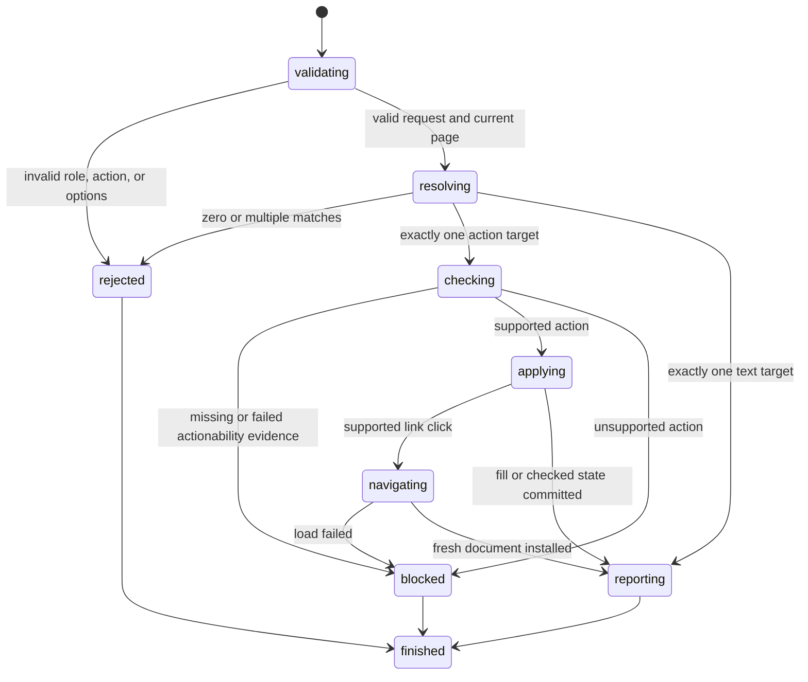

# Find an element by role

## Summary

Package callers create a `RoleLocator`. They submit one typed role request to the current session.

`FindByRole` returns semantic data. `ClickByRole`, `FillByRole`, `SetCheckedByRole`, and `HoverByRole` request actions.

Session-mode callers use this form:

```text
find role <role> [click|fill <text>|check|uncheck|hover|text] [--name <accessible-name>] [--exact]
```

The command defaults to `click`. This matches agent-browser command composition.

Every request resolves the current semantic index. Interactive snapshots remain a separate reference mechanism.

## The simple case

The caller opens a page, then sends:

```text
find role textbox fill hello --name Email
```

browser.jr resolves one current textbox. It checks supported visibility and editable evidence before changing the value.

The caller does not need a snapshot. A later snapshot reports the changed value.

## The interaction, event by event



### Invoke

The package request contains one validated `RoleLocator`.

Each package action has its own reply type. A fill request cannot return a click result.

Session mode accepts one role and optional accessible name. It accepts one action after the role.

`fill` requires text before locator options. Other actions have no action value.

### Exit immediately

An empty role is invalid. A role token may contain only ASCII letters, digits, or hyphens.

Session mode rejects missing fill text, missing option values, and unsupported syntax.

Finding or acting before a successful open returns `SessionError::NoPage`.

### Begin running

browser.jr reads the current document's supported semantic index.

The native subset includes controls, headings, lists, landmarks, common groups, images, and table structure.

The supported explicit ARIA subset uses the same roles. The first supported token wins.

Role matching ignores ASCII case. The locator stores a normalized lowercase role.

Default accessible-name matching uses a case-insensitive substring.

`--exact` requires normalized, case-sensitive accessible-name equality.

Resolution is strict. Zero matches return `RoleLocatorNotFound`.

Multiple matches return `RoleLocatorAmbiguous` with the match count.

### While running

Each action resolves again when its request executes. It does not retain a prior semantic match.

Resolution does not fetch, capture a snapshot, run scripts, wait, or retry.

`text` returns normalized descendant text without actionability checks.

`fill` requires supported visible evidence. The target must be an editable text control.

`check` and `uncheck` require supported visible evidence. The target must be an enabled native checkbox.

`click` requires supported visible and enabled evidence. Only same-context link navigation is implemented.

`hover` resolves strictly, then returns an unsupported-action error. Hover state and pointer events are not implemented.

Missing visibility evidence blocks an action. Hidden elements also block an action.

Disabled or read-only controls block before mutation. A blocked request preserves current state.

Successful fill and checked-state actions preserve existing interactive references.

Successful link navigation installs a new document. It invalidates existing interactive references.

Failed link navigation preserves the current document and references.

Accessible names use the implemented role-specific subset. `aria-labelledby` has priority over `aria-label`.

Native labels name supported controls. Landmark and list content does not become an accessible name.

### Finish

`FindByRole` returns `RoleMatch` with `element`, `role`, `name`, and `text`.

`FillByRole` returns the match and committed value.

`SetCheckedByRole` returns the match and committed Boolean state.

`ClickByRole` returns the old match and newly installed page after navigation.

Session text actions print only normalized descendant text.

Session fill output reports target identity and character count. It does not echo the value.

Session check output reports target identity and the committed Boolean state.

Session link clicks report target identity, the new URL, and the new interactive-element count.

## Variants

| Modifier | Set at invocation | Changed while running |
| --- | --- | --- |
| Flags and options | The package selects default or exact name matching. | Session mode accepts one action. It accepts `--exact` before `--name` or at the line end. |
| Project configuration | No locator configuration exists. | Nothing reloads. |
| Target matrix | The current page supplies one document. | Navigation or reload replaces the searchable document. |
| Output channel | Package requests return typed replies. Session mode uses text. | Session mode flushes stdout or stderr. |

## Cancel and interrupt

| Event | Before running | While running |
| --- | --- | --- |
| Ctrl+C once | The host or CLI process may exit. | Resolution and static mutations have no wait phase. |
| Ctrl+C again before the evaluation stops | The process may already be gone. | No second-stage handler exists. |
| The process receives SIGTERM | The process may exit before resolution. | In-memory state disappears. |
| The terminal closes | Package behavior is unchanged. | Session output may fail. |
| stdin or stdout closes | Package behavior is unchanged. | Closed stdin ends session mode. |
| The network fails or a request times out | Non-navigation actions use no network. | Failed navigation preserves the installed document. |
| The inspected page changes | Successful navigation replaces the document. | Each later action resolves the replacement document. |
| Another lint run targets the same page | It owns another session. | It cannot change this locator result. |
| The process exits outright | No result returns. | No in-memory match or mutation survives. |

## Interactions with other systems

**Configuration precedence.** The locator and action values are the only query inputs.

**Output and exit status.** Invalid syntax, no match, and ambiguity use status two.

Blocked actionability, unsupported actions, and missing pages use status three.

**Resource limits.** The shared page-body limit bounds candidate semantics.

**Network and storage.** Only a supported link click may load another page. Locator actions write no retained storage.

**Rendering compatibility.** Locators cover the stated static HTML and ARIA subset.

Actionability covers supported visibility, enabled, and editable evidence only.

Stable-box and receives-events checks remain unavailable.

**Isolation.** Locators and replies belong to one session. They do not identify live targets across processes.

**Accessibility inspection.** Role and name use browser.jr's supported accessibility subset.

Locator resolution does not filter hidden elements. Actions apply their supported visibility checks after strict resolution.

## Edge cases

- A role-only locator must resolve to exactly one element.
- An empty exact package name can select one unnamed element.
- Name queries collapse whitespace before matching.
- Exact name matching remains case-sensitive after whitespace normalization.
- A successful or failed text query preserves interactive references.
- Successful fill, check, and uncheck actions preserve interactive references.
- A successful link click invalidates interactive references.
- A failed or unsupported action preserves interactive references.
- Repeated check and uncheck actions are idempotent.
- Session names can contain spaces without quotes.
- Session fill values can contain spaces.
- A fill value containing `--name` or `--exact` as a token is not expressible yet.
- A name ending in the literal token `--exact` is not expressible yet.
- An unnamed list can resolve with a role-only locator.
- Landmark descendant text does not become its accessible name.
- `aria-labelledby` references contribute names in token order.

## Open questions and verification

- Define full ARIA role and accessible-name computation.
- Add auto-waiting and action timeouts.
- Add stable-box and receives-events evidence.
- Implement pointer dispatch, button activation, and hover state.
- Define regular-expression name matching.
- Define ordered multi-match results and explicit first, last, or index selection.
- Add label, placeholder, text, alt, title, test-id, CSS, and XPath locators.
- Define machine-readable locator results.

Drafted from Rust package, parser, and compiled-process tests on 2026-08-31.
