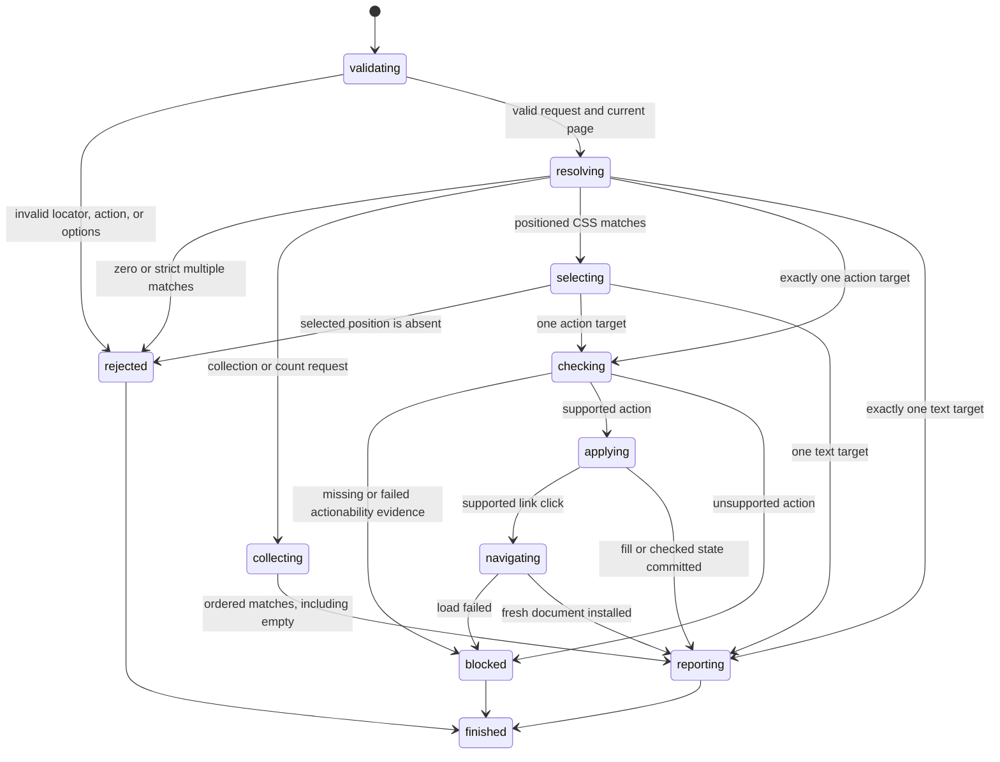

# Find elements with locators

## Summary

Package callers create a `Locator` from a semantic, attribute, CSS, or XPath query.

`FindByLocator` returns one strict current match. `FindAllByLocator` returns an ordered collection, and `CountByLocator` returns its size.

Locator action requests share one strict resolution and action path.

The existing role-specific request types remain available for callers that need a guaranteed semantic role.

Session-mode callers use this form:

```text
find role <role> [click|fill <text>|check|uncheck|hover|text] [--name <accessible-name>] [--exact]
find text <text> [click|fill <text>|check|uncheck|hover|text] [--exact]
find label <label> [click|fill <text>|check|uncheck|hover|text] [--exact]
find placeholder <text> [click|fill <text>|check|uncheck|hover|text] [--exact]
find alt <text> [click|fill <text>|check|uncheck|hover|text] [--exact]
find title <text> [click|fill <text>|check|uncheck|hover|text] [--exact]
find testid <id> [click|fill <text>|check|uncheck|hover|text]
find css <selector> [click|fill <text>|check|uncheck|hover|text]
find xpath <expression> [click|fill <text>|check|uncheck|hover|text]
find first <selector> [click|fill <text>|check|uncheck|hover|text]
find last <selector> [click|fill <text>|check|uncheck|hover|text]
find nth <index> <selector> [click|fill <text>|check|uncheck|hover|text]
click <ref|selector>
fill <ref|selector> <text>
select <ref|selector> <value>
select <ref|selector> "<value>" ["<value>" ...]
check <ref|selector>
uncheck <ref|selector>
is checked <ref|selector>
is enabled <ref|selector>
is visible <ref|selector>
get attr <ref|selector> <name>
get html <ref|selector>
get text <ref|selector>
get value <ref|selector>
get count <selector>
```

The command defaults to `click`. This matches agent-browser command composition.

Every request resolves the current locator index. Interactive snapshots remain a separate reference mechanism.

## The simple case

The caller opens a page, then sends:

```text
find label Email fill hello --exact
```

browser.jr resolves one currently labeled control. It checks supported visibility and editable evidence before changing the value.

The caller does not need a snapshot. A later snapshot reports the changed value.

## The interaction, event by event



### Invoke

The package request contains one validated `Locator` variant.

Each package action has its own reply type. A fill request cannot return a click result.

Session mode accepts one locator kind and value. Role locators also accept an optional accessible name.

Non-role values with spaces require matching single or double quotes.

`nth` requires a zero-based unsigned index before its selector.

`fill` requires text before locator options. Other actions have no action value.

### Exit immediately

An empty role is invalid. A role token may contain only ASCII letters, digits, or hyphens.

Empty text-backed and test ID locator values are invalid.

Empty or malformed CSS selectors and XPath expressions are invalid.

A valid XPath expression that returns a scalar, attribute, text, or other non-element result blocks resolution.

Session mode rejects unterminated quotes, missing fill text, missing option values, and unsupported syntax.

Finding or acting before a successful open returns `SessionError::NoPage`.

### Begin running

browser.jr reads the current document's locator index.

The index includes every parsed content element. Each entry records semantic evidence, source attributes, and action identity.

The native subset includes controls, headings, lists, landmarks, common groups, images, and table structure.

The supported explicit ARIA subset uses the same roles. The first supported token wins.

Role matching ignores ASCII case. The locator stores a normalized lowercase role.

Default accessible-name matching uses a case-insensitive substring.

`--exact` requires normalized, case-sensitive accessible-name equality.

Text, label, placeholder, alt, and title queries collapse HTML whitespace before matching.

Their default matching uses a case-insensitive substring. `--exact` uses normalized, case-sensitive equality.

Label queries match supported controls through `aria-labelledby`, `aria-label`, explicit labels, or ancestor labels.

Placeholder queries match non-empty `placeholder` attributes on inputs and textareas.

Alt queries match parsed `alt` attributes. Title queries match parsed `title` attributes.

Test ID queries use case-sensitive equality against `data-testid`. They do not accept `--exact`.

Text queries use normalized descendant text. Button and submit inputs use their `value` attribute.

When a matching descendant also matches, a text query removes its matching ancestor.

CSS locators query the normalized HTML5 document. They support selector groups, combinators, attribute operators, and parsed pseudo-classes.

`CssLocator::new` is strict. First, last, and nth CSS locators select document order instead.

XPath locators evaluate XPath 1.0 expressions against a namespace-free mirror of the same normalized document.

XPath results must contain only elements. Scalar, attribute, text, comment, and processing-instruction results block resolution.

> Technical note: CSS uses `dom_query` 0.28.0. XPath evaluation uses `sxd-xpath` 0.4.2.

Selector results map back to the existing parsed content index. A mapping failure blocks resolution.

Direct selectors default to CSS. `css=` forces CSS. `xpath=`, `//`, and `..` select XPath.

Direct selectors containing spaces require matching single or double quotes.

`first`, `last`, and `nth` select document order. `nth` uses a zero-based index.

Non-positioned resolution is strict. Generic requests return `LocatorNotFound` for zero matches.

Generic requests return `LocatorAmbiguous` for multiple matches. Role-specific requests keep their role-specific errors.

Positioned CSS queries select one match instead of reporting ambiguity. An absent position returns `LocatorNotFound`.

Strict CSS and XPath queries use the same zero-match and ambiguity errors as semantic locators.

Collection requests keep every match in document order. Zero matches return an empty collection instead of an error.

Positioned CSS locators apply their position before collection. Their collection contains zero or one match.

### While running

Each action resolves again when its request executes. It does not retain a prior match.

Resolution and collection do not fetch, capture a snapshot, run scripts, wait, or retry.

`text` returns normalized descendant text without actionability checks.

`get html` serializes normalized static child markup without actionability checks.

A descendant password source value blocks HTML serialization.

`fill` requires supported visible evidence. The target must be an editable text control.

`select` requires supported visible evidence. The target must be an enabled native select.

`check` and `uncheck` require supported visible evidence. The target must be an enabled native checkbox.

`click` requires supported visible and enabled evidence. Only same-context link navigation is implemented.

`hover` resolves strictly, then returns an unsupported-action error. Hover state and pointer events are not implemented.

Missing visibility evidence blocks an action. Hidden elements also block an action.

Disabled or read-only controls block before mutation. A blocked request preserves current state.

Successful fill and checked-state actions preserve existing interactive references.

Successful link navigation installs a new document. It invalidates existing interactive references.

Failed link navigation preserves the current document and references.

Accessible names use the implemented role-specific subset. `aria-labelledby` has priority over `aria-label`.

Native labels name supported controls. Landmark and list content does not become an accessible name.

### Finish

`FindByLocator` returns `LocatorMatch` with `element`, optional `role`, `name`, and `text`.

`FindAllByLocator` returns `LocatorMatches` with zero or more ordered matches.

`CountByLocator` returns `LocatorCount` with the same collection size.

Typed locator reads return the resolved match with current HTML, value, attribute, checked, enabled, or visible state.

`FindByRole` returns `RoleMatch` with a required role.

`FillByLocator` returns the match and committed value.

`SetCheckedByLocator` returns the match and committed Boolean state.

`SelectByLocator` returns the match and committed exact option value.

`SelectOptionsByLocator` accepts typed value, label, or index targets. It returns committed option values.

`ClickByLocator` returns the old match and newly installed page after navigation.

Role-specific action requests return the same state through role-specific reply types.

Session text actions print only normalized descendant text.

Session `get count` prints one base-10 integer without a label.

Session fill output reports target identity and character count. It does not echo the value.

Session check output reports target identity and the committed Boolean state.

Session direct HTML reads print serialized markup without a label.

Session direct value, attribute, checked, enabled, and visible reads print the value without a label.

Session direct select output reports target identity and the committed value.

Session link clicks report target identity, the new URL, and the new interactive-element count.

## Variants

| Modifier | Set at invocation | Changed while running |
| --- | --- | --- |
| Flags and options | The package selects one locator kind, match mode, and optional position. | Session mode accepts one action. `nth` uses a zero-based index. |
| Project configuration | No locator configuration exists. | Nothing reloads. |
| Target matrix | The current page supplies one document. | Navigation or reload replaces the searchable document. |
| Output channel | Package requests return typed replies. Session mode uses text. | Session mode flushes stdout or stderr. |

## Cancel and interrupt

| Event | Before running | While running |
| --- | --- | --- |
| Ctrl+C once | The host or CLI process may exit. | Resolution and static mutations have no wait phase. |
| Ctrl+C again before the evaluation stops | The process may already be gone. | No second-stage handler exists. |
| The process receives SIGTERM | The process may exit before resolution. | In-memory state disappears. |
| The terminal closes | Package behavior is unchanged. | Session output may fail. |
| stdin or stdout closes | Package behavior is unchanged. | Closed stdin ends session mode. |
| The network fails or a request times out | Non-navigation actions use no network. | Failed navigation preserves the installed document. |
| The inspected page changes | Successful navigation replaces the document. | Each later action resolves the replacement document. |
| Another lint run targets the same page | It owns another session. | It cannot change this locator result. |
| The process exits outright | No result returns. | No in-memory match or mutation survives. |

## Interactions with other systems

**Configuration precedence.** The locator and action values are the only query inputs.

**Output and exit status.** Invalid syntax, strict no match, and strict ambiguity use status two.

An empty count succeeds and prints zero.

Blocked actionability, unsupported actions, and missing pages use status three.

**Resource limits.** The shared page-body limit bounds candidate semantics.

**Network and storage.** Only a supported link click may load another page. Locator actions write no retained storage.

**Rendering compatibility.** Locators cover the stated static HTML and ARIA subsets. CSS and XPath query the normalized static document.

XPath drops HTML namespaces when it mirrors the document. Namespace-aware XPath is not implemented.

Actionability covers supported visibility, enabled, and editable evidence only.

Stable-box and receives-events checks remain unavailable.

**Isolation.** Locators and replies belong to one session. They do not identify live targets across processes.

**Accessibility inspection.** Role and label queries use browser.jr's supported accessibility subset.

Locator resolution does not filter hidden elements. Actions apply their supported visibility checks after strict resolution.

## Edge cases

- A role-only locator must resolve to exactly one element.
- An empty exact package name can select one unnamed element.
- Text-backed locator constructors reject empty normalized values.
- Test ID values preserve case and whitespace for exact attribute equality.
- Name and text-backed queries collapse whitespace before matching.
- Exact matching remains case-sensitive after whitespace normalization.
- A text query chooses a matching descendant over its matching ancestor.
- Button and submit inputs match text through their source value.
- A successful or failed text query preserves interactive references.
- Successful fill, check, and uncheck actions preserve interactive references.
- A successful link click invalidates interactive references.
- A failed or unsupported action preserves interactive references.
- Repeated check and uncheck actions are idempotent.
- Role accessible names can contain spaces without quotes.
- Multiword non-role locator values require quotes.
- First and last select the first and last document-order CSS match.
- `nth(0)` selects the first CSS match.
- An out-of-range `nth` reports no match and preserves current references.
- Positioned CSS locators intentionally opt out of ambiguity errors.
- Collections preserve document order and do not apply strict ambiguity checks.
- Empty collections and counts succeed without changing current references.
- A positioned collection contains zero or one match.
- Malformed CSS and XPath fail before resolution and preserve current references.
- Strict CSS and XPath queries reject multiple matches.
- XPath non-element results block and preserve current references.
- Direct selectors accept CSS by default and auto-detect leading `//` or `..` as XPath.
- Direct selectors work across implemented click, fill, select, check, uncheck, HTML, text, value, attribute, state, and count commands.
- Quoted direct selectors can contain combinators and XPath predicates with spaces.
- Locator quotes cannot contain an escaped matching quote yet.
- Session fill values can contain spaces.
- A fill value containing `--name` or `--exact` as a token is not expressible yet.
- A name ending in the literal token `--exact` is not expressible yet.
- An unnamed list can resolve with a role-only locator.
- Landmark descendant text does not become its accessible name.
- `aria-labelledby` references contribute names in token order.

## Open questions and verification

- Define full ARIA role and accessible-name computation.
- Add auto-waiting and action timeouts.
- Add stable-box and receives-events evidence.
- Implement pointer dispatch, button activation, and hover state.
- Define regular-expression name matching.
- Define complete CSS and XPath conformance boundaries.
- Add namespace-aware XPath.
- Define configurable test ID attributes.
- Define text matching for replaced and generated content.
- Define machine-readable locator results.

Drafted from Rust package, parser, and compiled-process tests on 2026-08-31.
