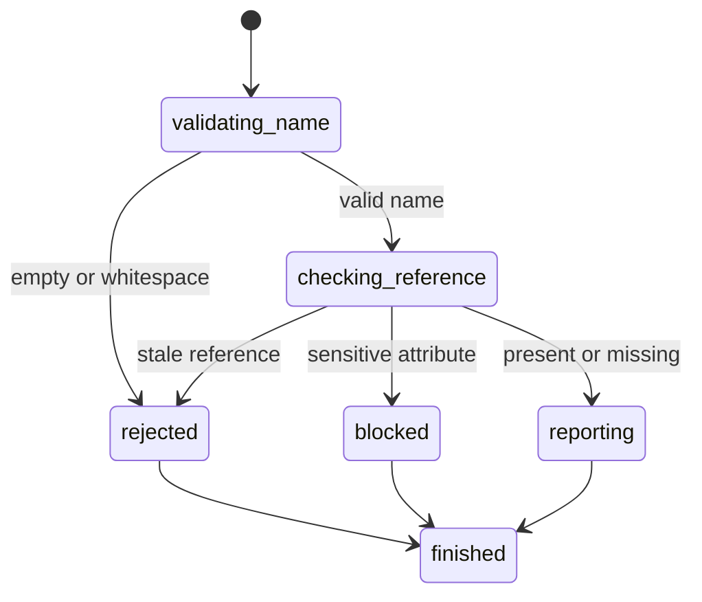

# Read an element attribute

## Summary

Package callers submit `GetElementAttribute` with a current interactive reference and attribute name.

Session-mode callers send `get attr <ref> <name>` after an interactive snapshot.

The result distinguishes present attributes, missing attributes, and blocked sensitive attributes.

## The simple case

The caller opens a page and captures an interactive snapshot. It selects a current reference.

browser.jr normalizes the requested name to ASCII lowercase. It returns the static source attribute when present.

## The interaction, event by event

### Invoke

The package request contains one typed reference and one string name.

Session mode reads `get attr`, a displayed reference, and one name token.

### Exit immediately

Empty names and names containing whitespace return `SessionError::InvalidAttributeName`.

Unknown or stale references fail without reading another element.

### Begin running

browser.jr converts ASCII letters in the name to lowercase. Non-ASCII characters remain unchanged.

The engine checks its static attribute map for the referenced source element.

### While running

Password input `value` attributes return `SessionError::SensitiveAttribute`.

Other present attributes return their decoded source string. Missing attributes return `None`.

The read does not capture, dispatch events, run scripts, or change focus.

### Finish

The package returns `ElementAttribute` with the normalized name and optional string.

Session mode reports quoted names and values. It reports a missing value as `null`.

The reference remains current after the read.

## Variants

| Modifier | Set at invocation | Changed while running |
| --- | --- | --- |
| Flags and options | The package takes a reference and name. Session mode takes two tokens. | No attribute flags exist. |
| Project configuration | No attribute policy configuration exists. | Nothing reloads. |
| Target matrix | The current page and snapshot select one element. | The read does not change it. |
| Output channel | The package returns an optional string. Session mode uses quoted text or `null`. | Session mode flushes stdout. |

## Cancel and interrupt

| Event | Before running | While running |
| --- | --- | --- |
| Ctrl+C once | The host or CLI process may exit. | The read has no asynchronous phase. |
| Ctrl+C again before the evaluation stops | The process may already be gone. | No second-stage handler exists. |
| The process receives SIGTERM | The process may exit before the request. | In-memory state disappears. |
| The terminal closes | Package behavior is unchanged. | Session output may fail. |
| stdin or stdout closes | Package behavior is unchanged. | Closed stdin ends session mode. |
| The network fails or times out | The read uses no network. | The page already exists in memory. |
| The inspected page changes | Navigation can stale the reference. | This read does not change state. |
| Another lint run targets the page | It owns another session. | It cannot read this document. |
| The process exits outright | No result returns. | No session attribute survives. |

## Interactions with other systems

**Configuration precedence.** The static parsed attribute map is the only source.

**Output and exit status.** Package callers receive `ElementAttribute` or `SessionError`. Session failures use status two or three.

**Resource limits.** The shared body limit bounds source attribute data.

**Network and storage.** The read uses no network and writes no storage.

**Rendering compatibility.** Results represent parsed static attributes, not live DOM properties.

**Isolation.** Attributes and references belong to one session and document.

**Accessibility inspection.** Attribute reads do not replace role, name, text, or control-state observations.

## Edge cases

- Attribute-name ASCII case does not affect lookup.
- Missing attributes return `None` or `null`.
- Present empty attributes return an empty string.
- HTML character references are decoded during parsing.
- Names containing whitespace are invalid.
- Password input `value` attributes remain blocked.
- Other password attributes, including `type`, remain readable.
- A direct read does not invalidate its reference.
- A later snapshot invalidates references from the previous snapshot.

## Open questions and verification

- Define policy for other secret-bearing attributes.
- Define live property inspection after DOM mutation exists.
- Define non-interactive element locators.
- Define machine-readable response encoding.

Drafted from Rust package and compiled-process tests on 2026-08-31.
