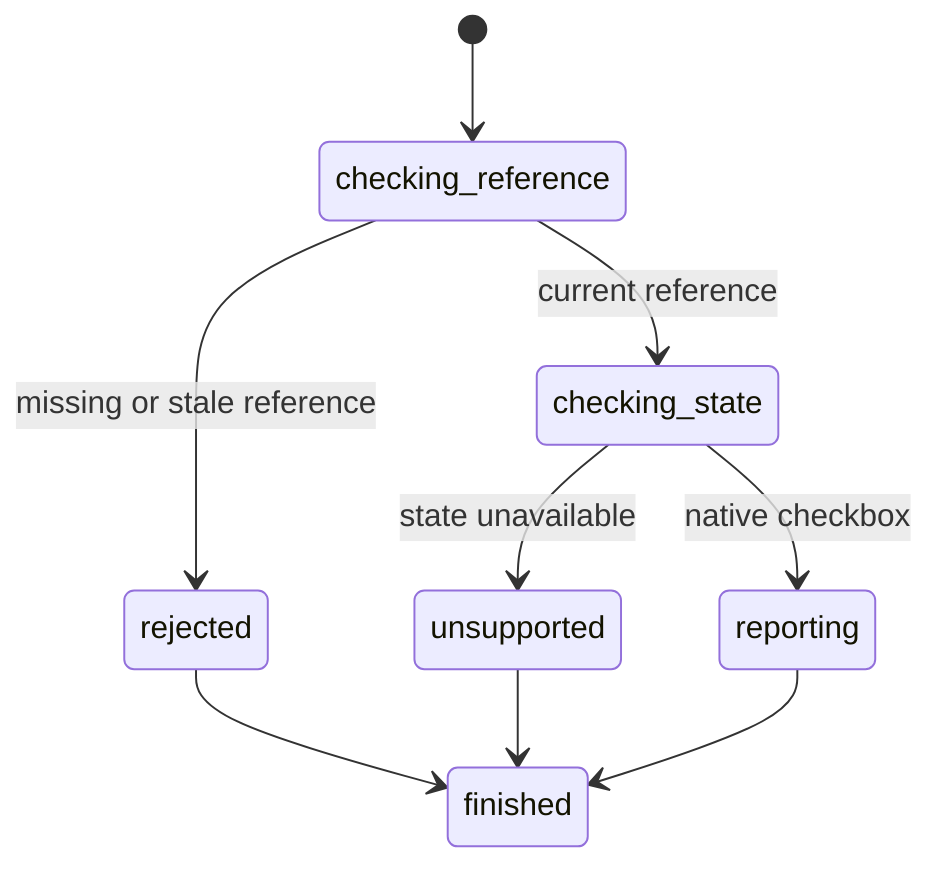

# Read checkbox state

## Summary

Package callers submit `GetElementChecked` with a current interactive reference.

Session-mode callers send `is checked <ref>` after an interactive snapshot.

Interactive snapshots also report current native checkbox state.

## The simple case

The caller opens a page and captures an interactive snapshot. It selects a checkbox reference.

browser.jr returns the current Boolean state without changing the page or reference.

## The interaction, event by event

### Invoke

The package request contains one typed reference.

Session mode reads `is checked` and one displayed reference.

### Exit immediately

A stale package reference returns `SessionError::StaleElementReference`.

An unknown session label reports invalid input. Neither path reads another element.

### Begin running

browser.jr resolves the reference through the latest interactive snapshot.

State inspection supports native checkbox inputs, including disabled checkboxes.

### While running

The engine copies the current Boolean state. It does not capture a new snapshot.

The read does not dispatch events, run scripts, validate input, or change focus.

### Finish

The package returns `ElementChecked` with the reference and current state.

Session mode reports `checked ref=<ref> value=<boolean>` and flushes stdout.

The reference remains current after the read.

## Variants

| Modifier | Set at invocation | Changed while running |
| --- | --- | --- |
| Flags and options | The package and session commands take one reference. | No state-read flags exist. |
| Project configuration | No checkbox inspection configuration exists. | Nothing reloads. |
| Target matrix | The current page and snapshot select one control. | The read does not change it. |
| Output channel | The package returns a typed value. Session mode uses flushed text. | Snapshots expose the same Boolean. |

## Cancel and interrupt

| Event | Before running | While running |
| --- | --- | --- |
| Ctrl+C once | The host or CLI process may exit. | The read has no asynchronous phase. |
| Ctrl+C again before the evaluation stops | The process may already be gone. | No second-stage handler exists. |
| The process receives SIGTERM | The process may exit before the request. | In-memory state disappears. |
| The terminal closes | Package behavior is unchanged. | Session output may fail. |
| stdin or stdout closes | Package behavior is unchanged. | Closed stdin ends session mode. |
| The network fails or times out | The read uses no network. | The page already exists in memory. |
| The inspected page changes | Navigation can stale the reference. | This read does not change state. |
| Another lint run targets the page | It owns another session. | It cannot read this state. |
| The process exits outright | No result returns. | No session state survives. |

## Interactions with other systems

**Configuration precedence.** Current session state is the only source.

**Output and exit status.** Package callers receive a typed result or `SessionError`. Session failures use status two or three.

**Resource limits.** No separate read limit exists.

**Network and storage.** The read uses no network and writes no storage.

**Rendering compatibility.** The result comes from browser.jr's native checkbox model.

**Isolation.** Checked state and references belong to one session and document.

**Accessibility inspection.** Snapshot state stays separate from the accessible name.

## Edge cases

- Unchecked native checkboxes return false.
- Checked native checkboxes return true.
- Disabled native checkboxes remain readable.
- Radio buttons, switches, buttons, links, and textboxes report unsupported state.
- A successful state change affects the next direct read immediately.
- A direct read does not invalidate its reference.
- A later snapshot invalidates references from the previous snapshot.

## Open questions and verification

- Define radio checked-state inspection with group semantics.
- Define ARIA checked-state inspection independently from native state.
- Define machine-readable response encoding.

Drafted from Rust package and compiled-process tests on 2026-08-31.
