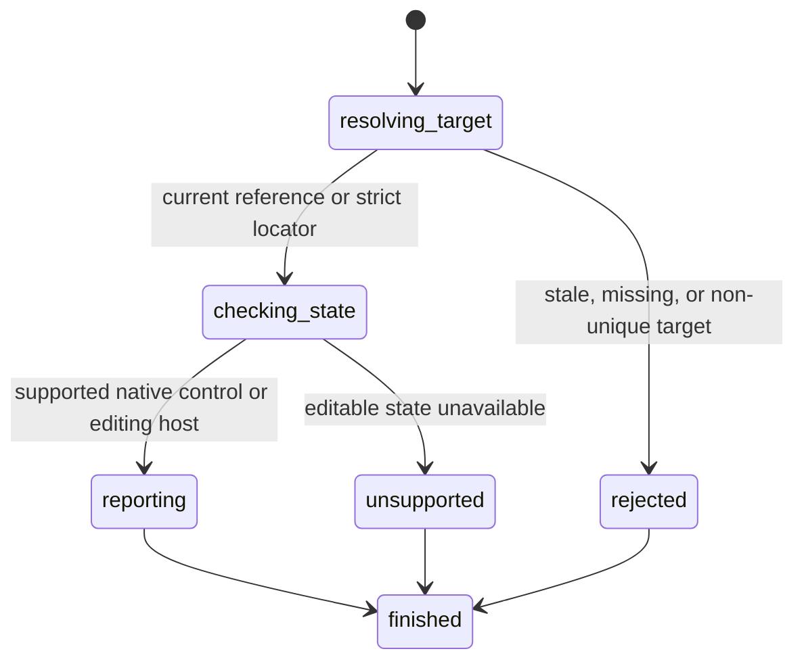

# Read editable state

## Summary

Package callers submit `GetElementEditable` with a reference or `GetEditableByLocator` with a locator.

Session-mode callers send `is editable <ref|selector>`. Direct selectors need no snapshot.

The current subset supports native inputs, textareas, selects, and HTML editing hosts.

## The simple case

The caller opens a page containing an input and captures an interactive snapshot.

browser.jr returns true for an enabled input without `readonly`. Disabled or read-only inputs return false.

## The interaction, event by event

### Invoke

The package request contains one typed reference or locator.

Session mode reads `is editable` and one reference or selector.

### Exit immediately

A stale package reference returns `SessionError::StaleElementReference`.

An unknown session label reports invalid input. Neither path reads another element.

### Begin running

browser.jr resolves references through the latest interactive snapshot.

It resolves locators strictly against the current static document.

### While running

Enabled native inputs return true unless they have `readonly`.

Enabled native textareas return true unless they have `readonly`. Enabled selects return true.

Input types share this inspection rule. Checkbox, radio, range, and button inputs can return true.

An explicit or inherited true `contenteditable` value returns true through a locator.

Explicit false `contenteditable`, plain elements, and `button` elements report unsupported state.

Disabled fieldset inheritance blocks this inspection until first-legend behavior is modeled.

The read does not require visibility. It does not change focus, values, selections, or references.

### Finish

The package returns `ElementEditable` for references or `LocatorEditable` for locators.

Reference output reports `editable ref=<ref> value=<boolean>`. Direct selectors print the Boolean.

The reference remains current after the read.

## Variants

| Modifier | Set at invocation | Changed while running |
| --- | --- | --- |
| Flags and options | The request takes one reference or locator. | No editable-state flags exist. |
| Project configuration | No editable-state configuration exists. | Nothing reloads. |
| Target matrix | The current page and snapshot select one element. | The read does not change it. |
| Output channel | The package returns a Boolean. Session mode uses flushed text. | Output remains stable. |

## Cancel and interrupt

| Event | Before running | While running |
| --- | --- | --- |
| Ctrl+C once | The host or CLI process may exit. | The read has no asynchronous phase. |
| Ctrl+C again before evaluation stops | The process may already be gone. | No second-stage handler exists. |
| The process receives SIGTERM | The process may exit before the request. | In-memory state disappears. |
| The terminal closes | Package behavior is unchanged. | Session output may fail. |
| stdin or stdout closes | Package behavior is unchanged. | Closed stdin ends session mode. |
| The network fails or times out | The read uses no network. | The page already exists in memory. |
| The inspected page changes | Navigation can stale the reference. | This read does not change state. |
| Another lint run targets the page | It owns another session. | It cannot read this state. |
| The process exits outright | No result returns. | No session state survives. |

## Interactions with other systems

**Configuration precedence.** Parsed native and inherited `contenteditable` state are the only sources.

**Output and exit status.** Package callers receive a typed result or `SessionError`. Session failures use status two or three.

**Resource limits.** Contenteditable lookup walks the target's bounded ancestor chain.

**Network and storage.** The read uses no network and writes no storage.

**Rendering compatibility.** Playwright 1.61.1 Chromium produced the implemented matrix through `locator.isEditable()`.

`agent-browser` 0.32.4 Lightpanda had no `is editable` command during the controlled comparison.

See Playwright's [`locator.isEditable()`](https://playwright.dev/docs/api/class-locator#locator-is-editable).

**Isolation.** Editable state and references belong to one session and document.

**Accessibility inspection.** ARIA read-only state does not change this native and HTML editing-host subset.

## Edge cases

- Native input types share the same disabled and read-only rule.
- A `readonly` attribute affects inputs and textareas. It does not affect selects.
- A disabled native input, textarea, or select returns false.
- An inherited true `contenteditable` value makes a descendant editable.
- Explicit false `contenteditable` stops inheritance and reports unsupported state.
- Empty, `true`, and `plaintext-only` contenteditable values establish an editing host.
- Invalid contenteditable values inherit from their ancestors.
- Native buttons report unsupported state. Button-like input elements can return true.
- Contenteditable elements are selector-only until interactive snapshots represent them.
- A direct read does not invalidate current references.

## Open questions and verification

- Implement disabled fieldset and first-legend inheritance.
- Represent contenteditable elements in interactive snapshots.
- Define ARIA read-only observation separately from native editability.
- Define editing behavior for supported non-text input types.

Drafted from Rust package tests, compiled-process tests, and controlled Playwright evidence on 2026-08-31.
