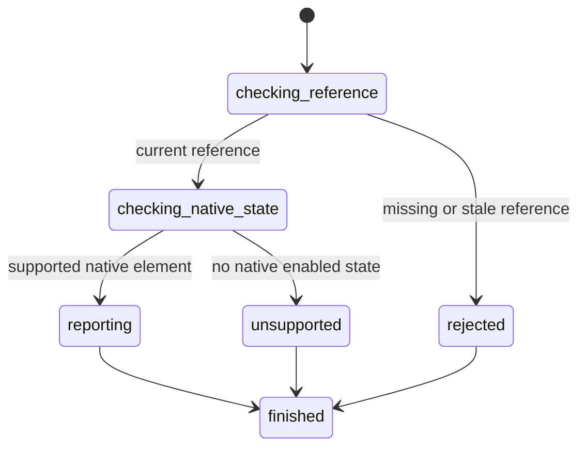

# Read enabled state

## Summary

Package callers submit `GetElementEnabled` with a current interactive reference.

Session-mode callers send `is enabled <ref>` after an interactive snapshot.

The current subset supports native form controls and native links.

## The simple case

The caller opens a page and captures an interactive snapshot. It selects a native control reference.

browser.jr returns false when that control has a `disabled` attribute. Other supported native controls return true.

## The interaction, event by event

### Invoke

The package request contains one typed reference.

Session mode reads `is enabled` and one displayed reference.

### Exit immediately

A stale package reference returns `SessionError::StaleElementReference`.

An unknown session label reports invalid input. Neither path reads another element.

### Begin running

browser.jr resolves the reference through the latest interactive snapshot.

Native buttons, inputs, selects, and textareas use their `disabled` attribute. Native links with `href` return true.

### While running

The engine copies the derived Boolean. It does not capture a new snapshot.

Explicit ARIA roles without native element behavior return `SessionError::UnsupportedEnabledState`.

The read does not dispatch events, run scripts, or change focus.

### Finish

The package returns `ElementEnabled` with the reference and Boolean.

Session mode reports `enabled ref=<ref> value=<boolean>` and flushes stdout.

The reference remains current after the read.

## Variants

| Modifier | Set at invocation | Changed while running |
| --- | --- | --- |
| Flags and options | The package and session commands take one reference. | No enabled-state flags exist. |
| Project configuration | No enabled-state configuration exists. | Nothing reloads. |
| Target matrix | The current page and snapshot select one element. | The read does not change it. |
| Output channel | The package returns a Boolean. Session mode uses flushed text. | Output remains stable. |

## Cancel and interrupt

| Event | Before running | While running |
| --- | --- | --- |
| Ctrl+C once | The host or CLI process may exit. | The read has no asynchronous phase. |
| Ctrl+C again before the evaluation stops | The process may already be gone. | No second-stage handler exists. |
| The process receives SIGTERM | The process may exit before the request. | In-memory state disappears. |
| The terminal closes | Package behavior is unchanged. | Session output may fail. |
| stdin or stdout closes | Package behavior is unchanged. | Closed stdin ends session mode. |
| The network fails or times out | The read uses no network. | The page already exists in memory. |
| The inspected page changes | Navigation can stale the reference. | This read does not change state. |
| Another lint run targets the page | It owns another session. | It cannot read this state. |
| The process exits outright | No result returns. | No session state survives. |

## Interactions with other systems

**Configuration precedence.** The parsed native disabled state is the only source.

**Output and exit status.** Package callers receive `ElementEnabled` or `SessionError`. Session failures use status two or three.

**Resource limits.** The read allocates no page-sized data.

**Network and storage.** The read uses no network and writes no storage.

**Rendering compatibility.** This subset does not implement fieldset inheritance or full browser actionability.

**Isolation.** Enabled state and references belong to one session and document.

**Accessibility inspection.** `aria-disabled` does not define native enabled state in this slice.

## Edge cases

- Native form controls without `disabled` return true.
- Native form controls with `disabled` return false.
- Native links with `href` return true.
- A `disabled` attribute does not disable a native link.
- Explicit interactive roles without native behavior return unsupported.
- `aria-disabled` does not change the result.
- A direct read does not invalidate its reference.
- A later snapshot invalidates references from the previous snapshot.

## Open questions and verification

- Define disabled fieldset inheritance.
- Define option and optgroup disabled behavior.
- Define ARIA-disabled observation separately from native state.
- Define actionability after visibility and pointer targeting exist.

Drafted from Rust package and compiled-process tests on 2026-08-31.
