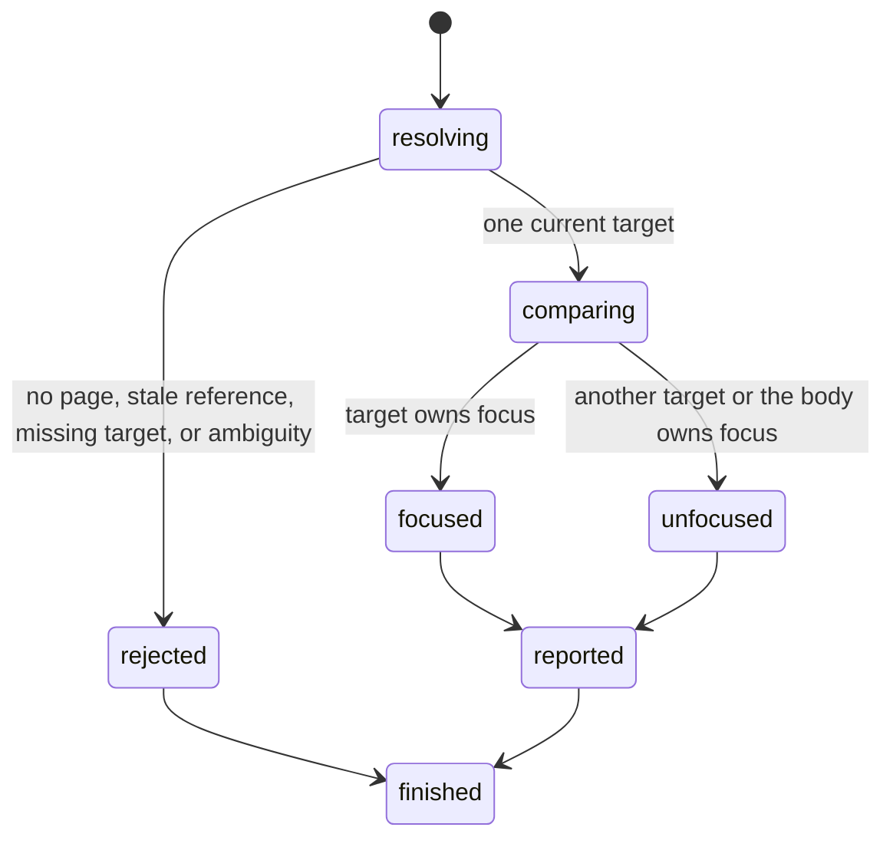

# Read focused state

## Summary

Package callers submit `GetElementFocused` with a reference or `GetFocusedByLocator` with a locator.

Session callers send `is focused <ref|selector>`.

Semantic locator commands use `find ... focused`.

The result states whether one strict target owns the current page focus.

## The simple case

The caller opens a page with two controls and focuses the second control.

Focused-state reads return false for the first control and true for the second.

## The interaction, event by event

### Invoke

The package request contains one current interactive reference or typed locator.

Session mode accepts one current reference, CSS selector, or XPath selector after `is focused`.

Every `find` locator kind accepts `focused` as its action.

### Exit immediately

A read before an open returns `SessionError::NoPage`.

A stale package reference returns `SessionError::StaleElementReference`.

Missing and ambiguous locators return their existing strict-resolution errors.

Invalid session syntax uses status two. These failures do not change focus or references.

### Begin running

browser.jr resolves the target against the current document.

Reference reads compare the resolved interactive index with the page's stored focus.

Locator reads can also target structural elements. A structural target returns false unless it is the active document body.

### While running

The read copies one Boolean. It does not wait, retry, capture, focus, blur, or dispatch events.

The document body owns focus before an element receives focus and at each supported traversal boundary.

A successful document replacement restores focus to the body.

Focused-state reads preserve the current focus and interactive references.

### Finish

`GetElementFocused` returns `ElementFocused` with the reference and Boolean.

`GetFocusedByLocator` returns `LocatorFocused` with the strict match and Boolean.

Reference output uses `focused ref=<ref> value=<boolean>`.

Direct selectors print one Boolean.

`find ... focused` reports role, name, element identity, and Boolean.

## Variants

| Modifier | Set at invocation | Changed while running |
| --- | --- | --- |
| Flags and options | The request contains one reference or locator. | No focused-state flags exist. |
| Project configuration | No focused-state configuration exists. | Nothing reloads. |
| Target matrix | The current page and optional snapshot select one target. | The read does not change either. |
| Output channel | Package requests return typed values. Session mode uses flushed text. | Output stays stable. |

## Cancel and interrupt

| Event | Before running | While running |
| --- | --- | --- |
| Ctrl+C once | The host or CLI process may exit. | The read has no asynchronous phase. |
| Ctrl+C again before the evaluation stops | The process may already be gone. | No second-stage handler exists. |
| The process receives SIGTERM | The process may exit before the request. | In-memory state disappears. |
| The terminal closes | Package behavior is unchanged. | Session output may fail. |
| stdin or stdout closes | Package behavior is unchanged. | Closed stdin ends session mode. |
| The network fails or times out | The read uses no network. | The current page already exists. |
| The inspected page changes | Navigation can stale a reference. | Static pages do not mutate themselves. |
| Another lint run targets the page | It owns another session. | It cannot read this focus. |
| The process exits outright | No result returns. | No session state survives. |

## Interactions with other systems

**Configuration precedence.** The current page focus and strict target are the only inputs.

**Output and exit status.** Package callers receive a typed result or `SessionError`. Session failures use status two or three.

**Resource limits.** One read compares bounded indexes and copies one Boolean.

**Network and storage.** The read uses no network and writes no storage.

**Rendering compatibility.** Playwright [`toBeFocused`](https://playwright.dev/docs/api/class-locatorassertions#locator-assertions-to-be-focused) checks whether a locator points to a focused DOM node.

Playwright assertions retry until their timeout. browser.jr performs one synchronous read of its installed static document.

`agent-browser` 0.32.4 has no direct focused-state command. A controlled Lightpanda run required `document.activeElement` evaluation.

**Isolation.** Focus and references belong to one session and document.

**Accessibility inspection.** Semantic focused reads use the implemented role and accessible-name subset.

## Edge cases

- Two targets cannot return true in one read sequence without an intervening focus change.
- A structural target returns false instead of an unsupported-state error.
- An explicit body locator returns true when the body owns focus.
- A successful `focus`, `Tab`, or `Shift+Tab` can change later results.
- A failed direct focus or traversal request preserves later results.
- A focused-state read never changes text selection.
- A new snapshot preserves focus but invalidates earlier references.
- Direct selectors resolve strictly without a snapshot.
- Semantic `focused` actions preserve the current reference set.

## Open questions and verification

- Define retrying focused assertions separately from one-time reads.
- Define blur and focus-event order.
- Define shadow-tree and iframe active-element ownership.

Drafted from Rust package tests, compiled-process tests, Playwright documentation, and controlled agent-browser evidence on 2026-08-31.
