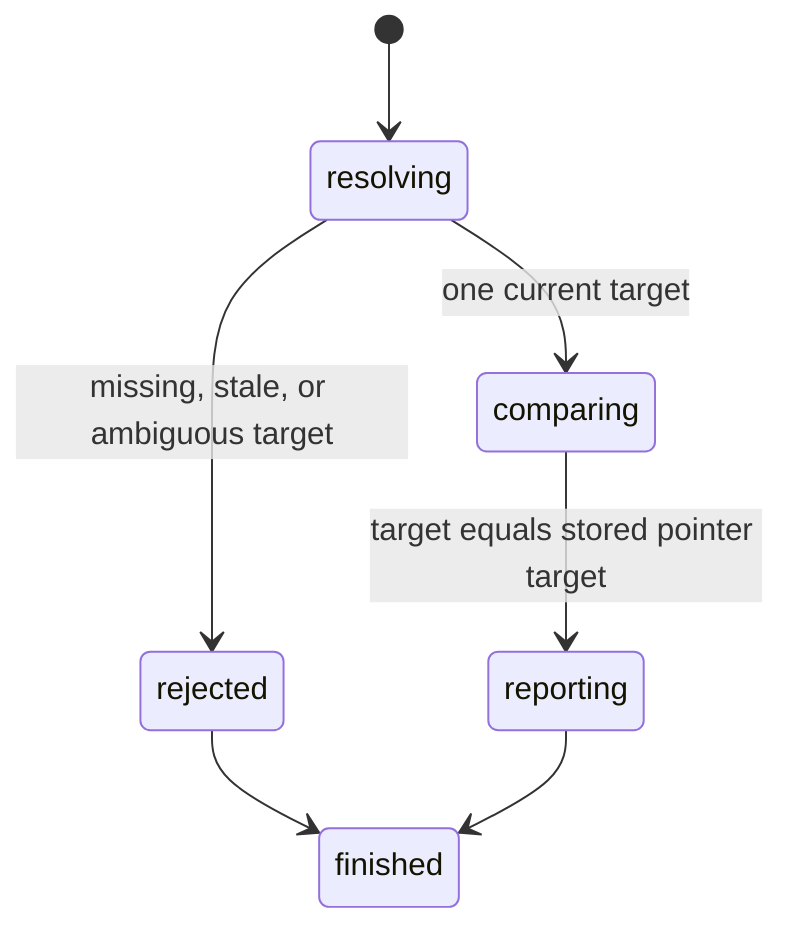

# Read hovered state

## Summary

Package callers use `GetElementHovered` or `GetHoveredByLocator`.

Session callers send `is hovered <ref|selector>` or use `find ... hovered`.

The result states whether that exact element is the current pointer target.

It does not report CSS `:hover` matching for ancestors.

## The simple case

The caller hovers one button, then reads the same reference.

browser.jr returns `true`. Reading another element returns `false`.

## The interaction, event by event

### Invoke

Reference reads require a current interactive snapshot reference.

Locator reads resolve one current match when the request executes.

### Exit immediately

Missing pages, stale references, and strict locator failures reject the read.

These failures preserve page, pointer, focus, control, and reference state.

### Begin running

The read compares source identity with the page's optional pointer target.

It performs no visibility or enabled-state check.

### While running

The read does not capture, fetch, wait, scroll, or dispatch events.

Reading hovered state does not change the current pointer target.

### Finish

`ElementHovered` returns the reference and Boolean state.

`LocatorHovered` returns the resolved match and Boolean state.

Session reference output includes the reference, `value`, and Boolean.

Session locator output reports only the Boolean for direct selectors.

Semantic `hovered` output also reports target identity.

## Variants

| Modifier | Set at invocation | Changed while running |
| --- | --- | --- |
| Flags and options | The read accepts one reference or locator. | No read flags exist. |
| Project configuration | No hovered-state configuration exists. | Nothing reloads. |
| Target matrix | The current page supplies one target. | The read does not navigate. |
| Output channel | Package requests return typed values. Session mode uses flushed text. | The read reports one Boolean. |

## Cancel and interrupt

| Event | Before running | While running |
| --- | --- | --- |
| Ctrl+C once | The host or CLI process may exit. | The read has no asynchronous phase. |
| Ctrl+C again before the evaluation stops | The process may already be gone. | No second-stage handler exists. |
| The process receives SIGTERM | The process may exit first. | In-memory state disappears. |
| The terminal closes | Package behavior is unchanged. | Session output may fail. |
| stdin or stdout closes | Package behavior is unchanged. | Closed stdin ends session mode. |
| The network fails or a request times out | The read uses no network. | The current page already exists. |
| The inspected page changes | Document replacement clears the target. | Static pages do not mutate themselves. |
| Another lint run targets the same page | It owns another session. | It cannot observe this state. |
| The process exits outright | No read runs. | No state survives. |

## Interactions with other systems

**Configuration precedence.** The target is the only input.

**Output and exit status.** Invalid targets use status two. Missing pages use status three.

**Resource limits.** The read allocates one typed result.

**Network and storage.** The read uses no network and writes no storage.

**Rendering compatibility.** This Boolean reports browser.jr's exact pointer target.

CSS `:hover` also matches relevant ancestors in web browsers.

browser.jr does not claim that broader pseudo-class behavior.

**Isolation.** The pointer target belongs to one session and document.

**Accessibility inspection.** Semantic locators use the implemented role and accessible-name subset.

## Edge cases

- Every target reads false before the first successful hover.
- The current target reads true even when it is disabled.
- A structural locator can read true after a locator hover.
- The previous target reads false after another successful hover.
- A failed hover leaves the previous target true.
- Document replacement makes every new-document target false.
- A new snapshot preserves pointer state but replaces earlier references.

## Open questions and verification

- Decide whether this read should expose ancestor pseudo-class matching.
- Add CSS `:hover` inspection after dynamic style support exists.
- Add machine-readable session responses.

Drafted from package, parser, and compiled-process tests on 2026-08-31.
