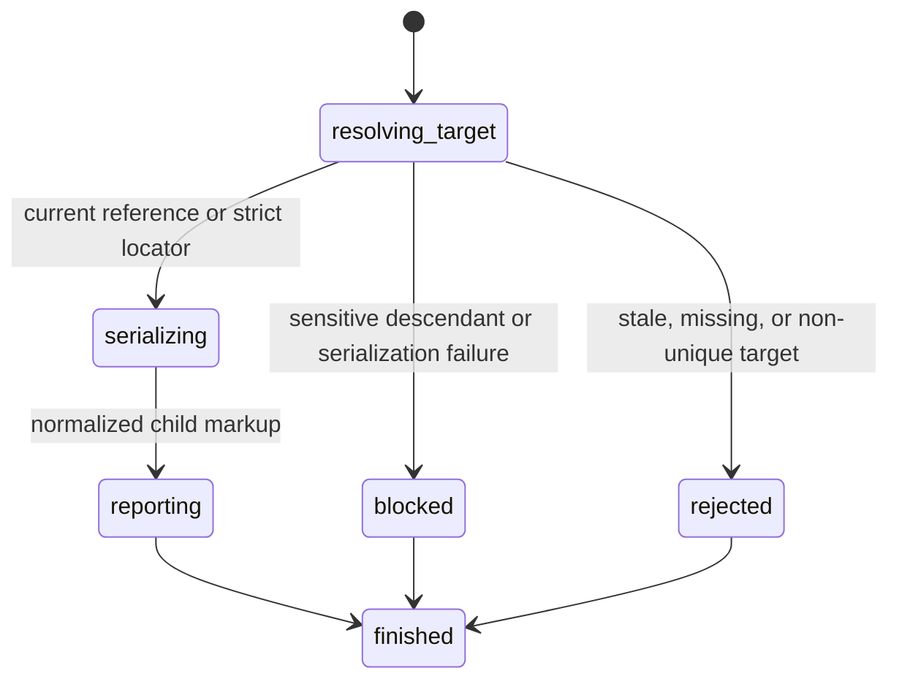

# Read element HTML

## Summary

Package callers submit `GetElementHtml` with a reference or `GetHtmlByLocator` with a locator.

Session-mode callers send `get html <ref|selector>`. Direct selectors need no snapshot.

The result contains the selected element's normalized static child markup.

## The simple case

The caller opens a page and targets one element.

browser.jr serializes that element's children from the normalized HTML5 document.

## The interaction, event by event

### Invoke

The package request contains one typed reference or locator.

Session mode reads `get html` and one reference or selector.

### Exit immediately

A stale package reference returns `SessionError::StaleElementReference`.

Invalid, missing, and ambiguous locators follow [Find elements with locators](query-elements.md).

### Begin running

browser.jr resolves the target against the current normalized HTML5 document.

Reference reads use the source element associated with the current interactive reference.

### While running

The serializer includes child elements, text, and comments. It excludes the selected outer element.

It escapes text and attribute values as HTML requires.

A password input with a source `value` attribute blocks serialization when it is a descendant.

The read does not capture, dispatch events, run scripts, or change focus.

### Finish

The package returns `ElementHtml` for a reference or `LocatorHtml` for a locator.

Direct selectors print raw serialized markup. Reference output reports `html ref=<ref> <quoted-html>`.

The reference remains current after the read.

## Variants

| Modifier | Set at invocation | Changed while running |
| --- | --- | --- |
| Flags and options | The package takes one reference or locator. Session mode accepts a quoted selector. | No HTML-read flags exist. |
| Project configuration | No serialization configuration exists. | Nothing reloads. |
| Target matrix | The current page and snapshot select one element. | The read does not change it. |
| Output channel | The package returns a string. Session mode writes markup. | Session mode flushes stdout. |

## Cancel and interrupt

| Event | Before running | While running |
| --- | --- | --- |
| Ctrl+C once | The host or CLI process may exit. | Serialization has no asynchronous phase. |
| Ctrl+C again before the evaluation stops | The process may already be gone. | No second-stage handler exists. |
| The process receives SIGTERM | The process may exit before the request. | In-memory state disappears. |
| The terminal closes | Package behavior is unchanged. | Session output may fail. |
| stdin or stdout closes | Package behavior is unchanged. | Closed stdin ends session mode. |
| The network fails or times out | The read uses no network. | The page already exists in memory. |
| The inspected page changes | Navigation can stale the reference. | This read does not change state. |
| Another lint run targets the page | It owns another session. | It cannot read this document. |
| The process exits outright | No result returns. | No serialized markup survives. |

## Interactions with other systems

**Configuration precedence.** The normalized current document is the only serialization source.

**Output and exit status.** Package callers receive typed replies or `SessionError`. Session failures use status two or three.

**Resource limits.** The shared one-MiB body limit bounds serialized markup.

**Network and storage.** The read uses no network and writes no storage.

**Rendering compatibility.** The result is static DOM markup. It is not rendered HTML or shadow DOM.

**Isolation.** Markup and references belong to one session and document.

**Accessibility inspection.** HTML reads do not replace role, name, text, or state observations.

## Edge cases

- An element without children returns an empty string.
- The selected element's opening and closing tags are absent.
- HTML character references serialize with required escaping.
- Comments remain in document order.
- Parser-inserted HTML structure may differ from the response bytes.
- Fill, check, and select state do not rewrite static source attributes.
- A descendant password value blocks the complete read instead of leaking partial markup.
- A password input's own inner HTML is empty because its attributes are outside the result.
- Direct selectors resolve non-interactive elements strictly without a snapshot.
- A later snapshot invalidates references from the previous snapshot.

## Open questions and verification

- Define live DOM serialization after script execution exists.
- Define shadow-root and template-content behavior.
- Define machine-readable response encoding.

Drafted from Rust package and compiled-process tests on 2026-08-31.
