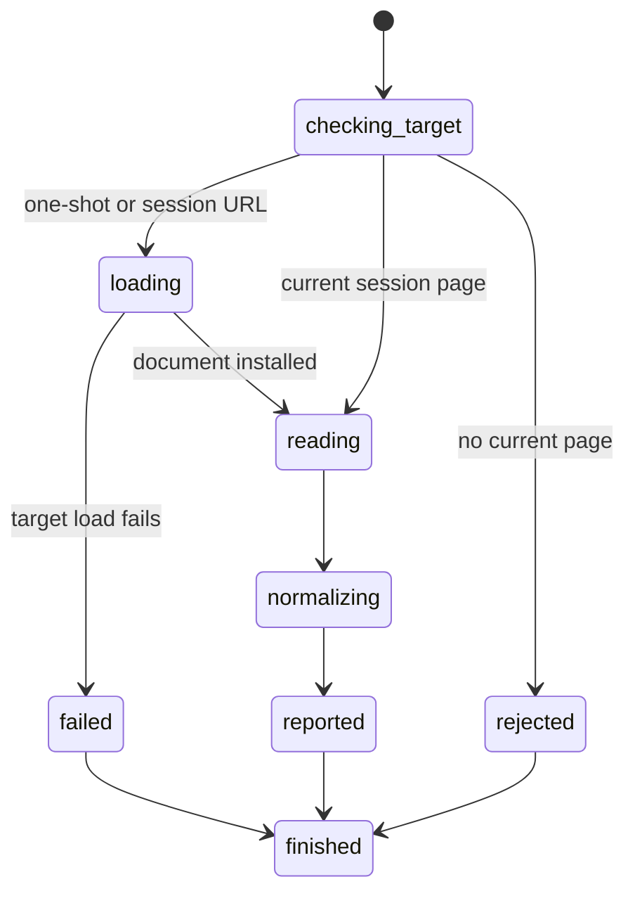

# Read page text

## Summary

Package callers submit `GetPageText` to read the current page.

The one-shot CLI accepts `browser.jr read <url>`. Session mode accepts `read [url]`.

The result is normalized static document text. It is plain text, not rendered `innerText`, Markdown, or an accessibility tree.

## The simple case

The caller reads a controlled page containing `Hello`, an inline `world`, and a `Save` button.

browser.jr returns `Hello world Save` on one line.

The caller needs no snapshot or locator.

## The interaction, event by event

### Invoke

The package request is the zero-sized `GetPageText` type.

The one-shot CLI requires one URL. Session mode accepts no URL or one URL.

### Exit immediately

`GetPageText` and session `read` without a current page return `SessionError::NoPage`.

One-shot and session URL reads reject invalid or unavailable targets through the normal loader errors.

Extra arguments report invalid input.

### Begin running

A one-shot URL read opens one bounded loopback page before reading.

A session URL read performs `OpenPage`. It installs a new document, adds history, and clears reported references.

A session read without a URL uses the installed document and preserves reported references.

### While running

The static parser collects document character data in source order.

It excludes `head`, `title`, `script`, `style`, `noscript`, and `template` content.

It does not expose source form-control values. Fill and type state also stays outside page text.

Whitespace collapses to single spaces. Inline adjacency stays unchanged when the source contains no separating whitespace.

Block boundaries contribute separation through the parser's supported text model.

Visibility, generated content, Shadow DOM, frames, and JavaScript mutations are not evaluated.

### Finish

The package returns `PageText { text }`.

One-shot and session commands print the text without a label. Empty text produces one empty output line.

A current-page read does not change the page, history, layout evidence, or references.

## Variants

| Modifier | Set at invocation | Changed while running |
| --- | --- | --- |
| Flags and options | Read accepts no flags. Session mode accepts one optional URL. | No format switch exists. |
| Project configuration | No read configuration exists. | Nothing reloads configuration. |
| Target matrix | One URL or current page supplies one document. | A session URL read replaces the page. |
| Output channel | Package callers receive a typed value. CLI callers receive plain text. | Errors use the normal error channel. |

## Cancel and interrupt

| Event | Before running | While running |
| --- | --- | --- |
| Ctrl+C once | The host or CLI process may exit. | Current-page normalization has no asynchronous phase. |
| Ctrl+C again before the evaluation stops | The process may already be gone. | No second-stage handler exists. |
| The process receives SIGTERM | The process may exit before reading. | In-memory page state disappears. |
| The terminal closes | Package behavior is unchanged. | CLI output may fail. |
| stdin or stdout closes | Package behavior is unchanged. | Closed session stdin ends the process. Closed stdout causes status three. |
| The network fails or a request times out | Current-page reads use no network. | A URL read preserves the old session page when loading fails. |
| The inspected page changes | A successful navigation replaces its text. | Current static text cannot mutate itself. |
| Another lint run targets the same page | It owns another session. | It cannot change this page text. |
| The process exits outright | No result survives. | No page text persists. |

## Interactions with other systems

**Configuration precedence.** An explicit session URL replaces the current-page target.

**Output and exit status.** Successful reads use status zero. Invalid input uses two. Unavailable pages use three.

**Resource limits.** URL reads use the one MiB body limit. No separate output limit exists.

**Network and storage.** Current-page reads use no network. URL reads use bounded loopback HTTP. Nothing writes persistent storage.

**Rendering compatibility.** `agent-browser read` emits structured readable output. browser.jr currently emits one normalized plain-text line.

Playwright [`locator.innerText()`](https://playwright.dev/docs/api/class-locator#locator-inner-text) returns rendered `innerText`. browser.jr does not claim rendered-text parity.

**Isolation.** Page text belongs to one installed document. It does not cross sessions.

**Accessibility inspection.** Page text is document character data. It does not compute roles or accessible names.

## Edge cases

- Empty document text succeeds and prints an empty line.
- Metadata and executable text do not appear.
- Input and textarea current values do not appear unless the page also contains them as text.
- Hidden element text can appear because complete visibility filtering is unavailable.
- Inline elements without source whitespace remain adjacent.
- HTML whitespace collapses across lines and tabs.
- A current-page read preserves snapshot references.
- A session URL read clears snapshot references after successful loading.
- A failed session URL read preserves the old page and references.

## Open questions and verification

- Define structured Markdown output.
- Define rendered visibility and generated-content behavior.
- Define Shadow DOM and frame boundaries.
- Add machine-readable output and output limits.
- Define live JavaScript mutation behavior.

Drafted from the Rust implementation, package tests, compiled-process tests, Playwright documentation, and controlled agent-browser comparison on 2026-08-31.
