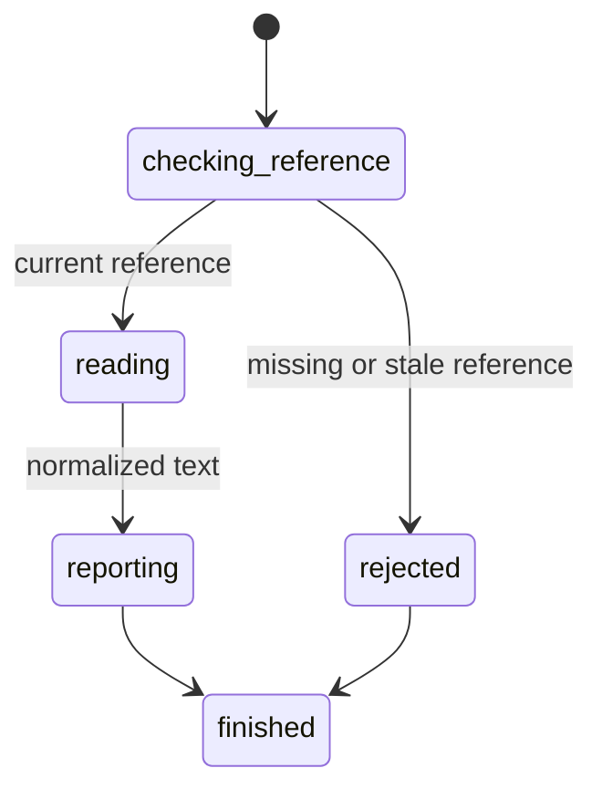

# Read element text

## Summary

Package callers submit `GetElementText` with a current interactive reference.

Session-mode callers send `get text <ref>` after an interactive snapshot.

The result contains normalized descendant text from the loaded static HTML.

## The simple case

The caller opens a page and captures an interactive snapshot. It selects a current reference.

browser.jr returns the element's descendant text. It collapses whitespace before storing that text.

## The interaction, event by event

### Invoke

The package request contains one typed reference.

Session mode reads `get text` and one displayed reference.

### Exit immediately

A stale package reference returns `SessionError::StaleElementReference`.

An unknown session label reports invalid input. Neither path reads another element.

### Begin running

browser.jr resolves the reference through the latest interactive snapshot.

Every supported interactive element has a text result. Elements without descendant text return an empty string.

### While running

The engine clones the normalized text stored with the current static document.

The read does not capture, dispatch events, run scripts, or change focus.

### Finish

The package returns `ElementText` with the reference and string.

Session mode reports `text ref=<ref> <quoted-text>` and flushes stdout.

The reference remains current after the read.

## Variants

| Modifier | Set at invocation | Changed while running |
| --- | --- | --- |
| Flags and options | The package and session commands take one reference. | No text-read flags exist. |
| Project configuration | No text-inspection configuration exists. | Nothing reloads. |
| Target matrix | The current page and snapshot select one element. | The read does not change it. |
| Output channel | The package returns a typed string. Session mode uses quoted text. | Session mode flushes stdout. |

## Cancel and interrupt

| Event | Before running | While running |
| --- | --- | --- |
| Ctrl+C once | The host or CLI process may exit. | The read has no asynchronous phase. |
| Ctrl+C again before the evaluation stops | The process may already be gone. | No second-stage handler exists. |
| The process receives SIGTERM | The process may exit before the request. | In-memory state disappears. |
| The terminal closes | Package behavior is unchanged. | Session output may fail. |
| stdin or stdout closes | Package behavior is unchanged. | Closed stdin ends session mode. |
| The network fails or times out | The read uses no network. | The page already exists in memory. |
| The inspected page changes | Navigation can stale the reference. | This read does not change state. |
| Another lint run targets the page | It owns another session. | It cannot read this document. |
| The process exits outright | No result returns. | No session text survives. |

## Interactions with other systems

**Configuration precedence.** Current parsed document text is the only source.

**Output and exit status.** Package callers receive `ElementText` or `SessionError`. Session failures use status two or three.

**Resource limits.** The shared one-MiB body limit bounds source text.

**Network and storage.** The read uses no network and writes no storage.

**Rendering compatibility.** This is normalized descendant source text. It is not a full `innerText` implementation.

**Isolation.** Text and references belong to one session and document.

**Accessibility inspection.** Descendant text stays distinct from the accessible name.

## Edge cases

- Whitespace-only content returns an empty string.
- Runs of Unicode whitespace become one ASCII space.
- Input elements return empty text even when labels or values exist.
- An `aria-label` does not replace descendant text.
- Text-control fills do not change source descendant text.
- A direct read does not invalidate its reference.
- A later snapshot invalidates references from the previous snapshot.
- Session output escapes quotes, backslashes, controls, and line breaks.

## Open questions and verification

- Define CSS-aware rendered text after visibility and layout support expands.
- Define text reads for non-interactive element locators.
- Define machine-readable response encoding.

Drafted from Rust package and compiled-process tests on 2026-08-31.
