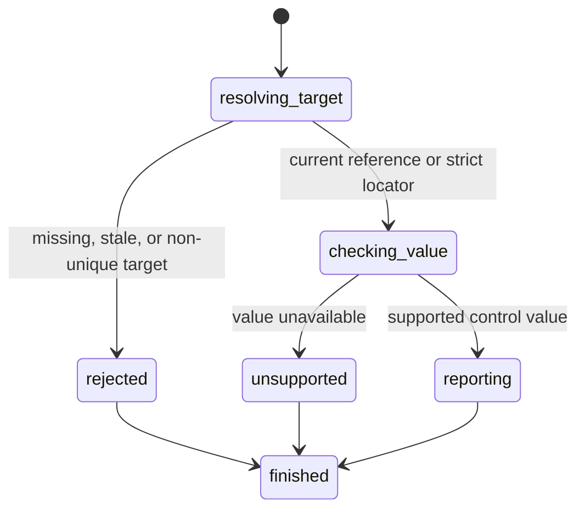

# Read a control value

## Summary

Package callers submit `GetElementValue` with a current interactive reference or `GetValueByLocator` with a locator.

Session-mode callers send `get value <ref|selector>`. Direct selectors need no snapshot.

Interactive snapshots also include each supported current value.

Value inspection supports text controls and native select controls.

## The simple case

The caller opens a page and captures an interactive snapshot. It selects a supported control reference.

The caller requests its value. browser.jr returns the current string without changing page or reference state.

## The interaction, event by event

### Invoke

The package request contains one typed reference or locator.

Session mode reads `get value` and one displayed reference or direct selector.

### Exit immediately

A stale package reference returns `SessionError::StaleElementReference`.

An unknown or stale session label reports invalid input. Locator resolution follows [Find elements with locators](query-elements.md).

### Begin running

browser.jr resolves a reference through the latest interactive snapshot or a locator through the current document.

Value inspection supports `textarea` and these `input` types: empty, `text`, `email`, `search`, `tel`, and `url`.

Disabled and read-only controls in that subset remain readable.

Native single and multiple selects are readable. Disabled selects also remain readable.

[Select options](../interaction/select-option.md) defines select values and selection behavior.

### While running

The engine clones the current in-memory value. It does not capture a new snapshot.

The read does not dispatch events, run scripts, validate input, or change focus.

### Finish

The package returns `ElementValue` for a reference or `LocatorValue` for a locator.

Session mode writes `value ref=<ref> <quoted-value>` for references. Direct selectors print the current string.

The reference remains current after the read.

## Variants

| Modifier | Set at invocation | Changed while running |
| --- | --- | --- |
| Flags and options | The package and session commands take one reference or locator. | No value-read flags exist. |
| Project configuration | No value-inspection configuration exists. | Nothing reloads. |
| Target matrix | The current page and snapshot select one control. | The read does not change the target. |
| Output channel | The package returns a typed value. Session mode uses escaped quoted text. | Session mode flushes after the command. |

## Cancel and interrupt

| Event | Before running | While running |
| --- | --- | --- |
| Ctrl+C once | The host or CLI process may exit. | The read has no asynchronous phase or graceful handler. |
| Ctrl+C again before the evaluation stops | The process may already be gone. | No second-stage handler exists. |
| The process receives SIGTERM | The process may exit before the request. | In-memory state disappears with the process. |
| The terminal closes | Package behavior is unchanged. | Session-mode output may fail. |
| stdin or stdout closes | Package behavior is unchanged. | Closed stdin ends session mode. Closed stdout causes status three. |
| The network fails or a request times out | The read uses no network. | The current page already exists in memory. |
| The inspected page changes | Another snapshot or navigation can stale the reference. | This read does not change the page. |
| Another lint run targets the same page | It owns another session. | It cannot read this session's value. |
| The process exits outright | No result returns. | No session value survives. |

## Interactions with other systems

**Configuration precedence.** The current session value is the only source.

**Output and exit status.** Package callers receive `ElementValue` or `SessionError`. Session mode uses status two or three for failures.

**Resource limits.** No separate read limit exists. The current stored value bounds the returned string.

**Network and storage.** The read uses no network and writes no storage.

**Rendering compatibility.** The result comes from browser.jr's control-state model, not a platform DOM property implementation.

**Isolation.** Values and references belong to one session and document.

**Accessibility inspection.** The current value stays separate from the accessible name.

## Edge cases

- An empty supported value returns an empty string.
- Disabled and read-only supported text controls remain readable.
- Password values remain unavailable.
- A multiple select returns its first selected value in document order.
- A select without a selected option returns an empty string.
- Number, checkbox, radio, range, button, link, and contenteditable values remain unavailable.
- A successful fill or select changes the next direct read immediately.
- A value read does not invalidate its reference.
- Direct selectors resolve strictly without a prior snapshot.
- A later snapshot invalidates references from the previous snapshot.
- Session-mode output escapes quotes, backslashes, control characters, and line breaks.

## Open questions and verification

- Define password reads without exposing secrets.
- Define a typed read that returns every selected option.
- Define other form-control value types.
- Define machine-readable response encoding.
- Define value size limits.

Drafted from the Rust implementation and package and compiled-process tests on 2026-08-31.
