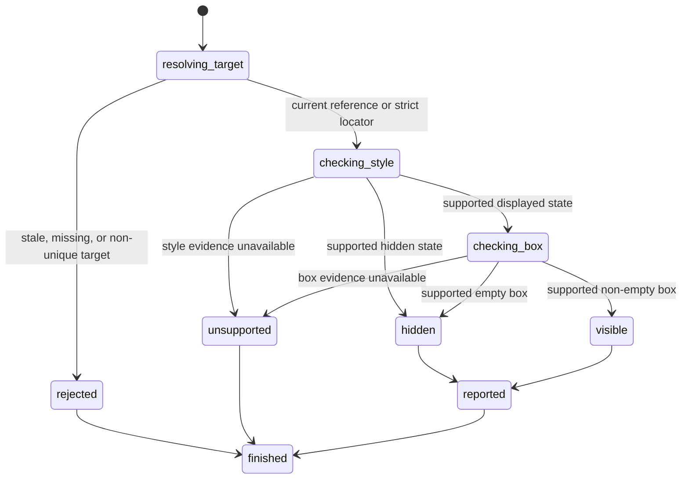

# Read visible state

## Summary

Package callers submit `GetElementVisible` with a reference or `GetVisibleByLocator` with a locator.

Session-mode callers send `is visible <ref|selector>`. Direct selectors can target non-interactive elements.

The read returns immediately. It does not wait for visibility to change.

browser.jr reports a Boolean only when static style and box evidence support it.

## The simple case

The caller opens a page and captures an interactive snapshot. It selects a native button reference.

browser.jr confirms the button has supported visibility and a default non-empty box. It returns true.

The reference remains usable after the read.

## The interaction, event by event

### Invoke

The package request contains one typed reference or locator.

Session mode reads `is visible` and one reference or selector.

### Exit immediately

A stale package reference returns `SessionError::StaleElementReference`.

An unknown session label reports invalid input. Neither path reads another element.

### Begin running

browser.jr resolves the reference through the latest interactive snapshot or the locator through the current document.

The visibility definition needs a non-empty box and a supported computed `visibility` value.

The implementation reads static HTML and supported inline and embedded style evidence.

CSS comment markers inside quoted selector values remain literal selector text.

Linked stylesheets and unsupported embedded CSS make visibility unsupported for that document.

### While running

`display:none`, `content-visibility:hidden`, and supported `hidden` states return false.

Those states also hide supported descendants.

Inherited `visibility:hidden` and `visibility:collapse` return false.

A supported `visibility:visible` descendant overrides inherited hidden visibility.

Supported `display` can override the ordinary `hidden` presentation within this subset.

Native buttons, inputs, selects, and textareas have supported default non-empty boxes.

Text-bearing interactive elements have supported default non-empty boxes.

An empty non-replaced interactive element has a supported empty box and returns false.

Geometry declarations block box proof. Intrinsic replaced-element geometry also remains unsupported.

`opacity:0` does not make a supported element invisible.

The read does not check stability, pointer targeting, viewport intersection, or enabled state.

### Finish

The package returns `ElementVisible` for references or `LocatorVisible` for locators.

Reference output reports `visible ref=<ref> value=<boolean>`. Direct selectors print the Boolean.

Unsupported evidence returns `SessionError::UnsupportedVisibility` instead of false.

The reference remains current after a successful or unsupported read.

## Variants

| Modifier | Set at invocation | Changed while running |
| --- | --- | --- |
| Flags and options | The package and session commands take one reference or locator. | No visibility flags exist. |
| Project configuration | No visibility configuration exists. | Nothing reloads. |
| Target matrix | The current page and snapshot select one element. | The read does not change it. |
| Output channel | The package returns a typed result. Session mode uses flushed text. | Output remains stable. |

## Cancel and interrupt

| Event | Before running | While running |
| --- | --- | --- |
| Ctrl+C once | The host or CLI process may exit. | The read has no asynchronous phase. |
| Ctrl+C again before the evaluation stops | The process may already be gone. | No second-stage handler exists. |
| The process receives SIGTERM | The process may exit before the request. | In-memory state disappears. |
| The terminal closes | Package behavior is unchanged. | Session output may fail. |
| stdin or stdout closes | Package behavior is unchanged. | Closed stdin ends session mode. |
| The network fails or a request times out | The read uses no network. | The page already exists in memory. |
| The inspected page changes | Navigation can stale the reference. | This read does not change state. |
| Another lint run targets the same page | It owns another session. | It cannot read this state. |
| The process exits outright | No result returns. | No session state survives. |

## Interactions with other systems

**Configuration precedence.** Parsed static style and box evidence are the only sources.

**Output and exit status.** Package callers receive `ElementVisible` or `SessionError`. Session failures use status two or three.

**Resource limits.** The read walks only the target's parsed ancestor chain.

**Network and storage.** The read uses no network and writes no storage.

**Rendering compatibility.** The subset follows [Playwright's visibility definition](https://playwright.dev/docs/actionability#visible) when browser.jr has both facts.

**Isolation.** Visibility evidence and references belong to one session and document.

**Accessibility inspection.** Interactive snapshots do not filter references by visible state.

## Edge cases

- A target with an ordinary `hidden` attribute returns false.
- A supported displayed value can override that ordinary hidden presentation.
- A target under `display:none` returns false.
- A target under inherited hidden visibility returns false.
- A later supported visible value can override inherited hidden visibility.
- An empty ARIA control without box geometry returns false.
- `display:contents` remains unsupported.
- Size, border, padding, font, transform, scale, or zoom declarations remain unsupported.
- Linked stylesheets and unsupported embedded CSS make every visibility read unsupported.
- Intrinsic media and replaced-element geometry remain unsupported.
- Definite hidden evidence takes priority over uncertain inline geometry.
- Zero opacity still returns true when the box is otherwise supported.
- A visibility read never changes the current reference set.
- Direct selectors resolve strictly and can inspect non-interactive elements.
- A later snapshot invalidates references from the previous snapshot.

## Open questions and verification

- Implement vertical geometry before accepting inline box dimensions.
- Define `display:contents` through visible descendant boxes.
- Define closed details, dialog, popover, and hidden-until-found behavior.
- Load bounded loopback stylesheets before accepting their visibility evidence.
- Add waiting as a separate request with time and cancellation limits.
- Keep visibility separate from complete actionability.

Drafted from the Rust implementation and unit, package, and compiled-process tests on 2026-08-31.
