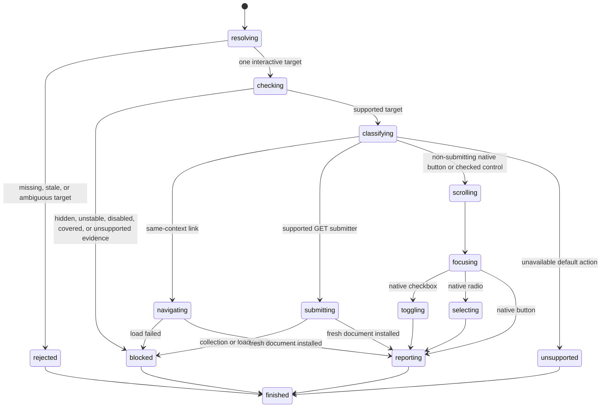

# Click an element

## Summary

Package callers submit `ClickElement`, `ClickByLocator`, or `ClickByRole`.

Session callers send `click <ref|selector>` or use `find ... click`.

The supported click subset navigates links, submits bounded GET forms, activates native buttons, and changes native checked controls.

Native button, checkbox, and radio clicks move current page focus to their target.

Supported local clicks reveal an off-screen target box after checks and before mutation.

Supported static hit-test scenes reject a fixed or later normal-flow element that owns the action point.

Every successful supported click records `click` in the native event transcript.

A changed checkbox or radio also records `input`, then `change`.

browser.jr does not deliver events to page scripts.

## The simple case

The caller opens a page with one button, checkbox, and radio group.

It clicks the button through a current reference. browser.jr stores that button as current focus.

It clicks the checkbox through a locator. browser.jr toggles checked state and moves focus.

Both actions preserve current interactive references.

Clicking a radio selects it, unchecks its group peers, and stores that radio as current focus.

## The interaction, event by event

### Invoke

Reference clicks require a current interactive snapshot reference.

Locator clicks resolve one current match when the request executes.

Session direct selectors use CSS unless the selector selects XPath explicitly.

### Exit immediately

A stale reference returns `SessionError::StaleElementReference`.

Missing or ambiguous locators return their existing strict-resolution errors.

A structural target without supported interactive behavior rejects the action.

These paths preserve focus, control state, the current document, and current references.

### Begin running

Every click requires supported visible evidence. Hidden targets reject the action.

Native controls must also be enabled. Disabled controls reject the action.

Every click also requires supported static stability evidence.

Inline animation or transition declarations on the target or its ancestors block that evidence.

When target geometry is supported, browser.jr computes the post-scroll action point without changing page offsets.

It checks supported static and fixed boxes at that point.

A target descendant may receive the event. A box with `pointer-events:none` cannot receive it.

A known outside blocker reports the `ReceivesEvents` actionability check and its element identity.

Overlapping unsupported hit-test evidence also blocks instead of becoming a pass.

Unsupported target geometry keeps the earlier action behavior without claiming a complete document hit test.

browser.jr does not sample animation frames or model complete stacking, clipping, or transformed hit geometry.

A supported local click auto-scrolls when browser.jr has a complete target box.

Unsupported box geometry leaves offsets unchanged. It does not block an otherwise supported click.

Supported links require `href` and the current browsing context.

Links with `download` or a non-`_self` target reject the action.

The native button subset includes `button` elements and button-like `input` types.

Button-like inputs use `button`, `image`, `reset`, and `submit` types.

Supported submit controls with form owners navigate through [`submit-form.md`](submit-form.md).

Reset controls and image submitters with form owners reject clicks.

A `button` without `type="button"` follows the same form-owner boundary.

Native checkbox clicks require `input type="checkbox"`.

Native radio clicks require `input type="radio"`.

Explicit ARIA buttons and checkboxes do not gain native default actions.

### While running

A supported local click reveals its target before applying focus or checked state.

It commits the same prospective scroll used to choose the action point.

A rejected local click preserves page offsets and native state.

A supported native button click stores that button as current focus.

A supported checkbox click reverses current checked state, then stores checkbox focus.

Repeated checkbox clicks alternate `false`, `true`, and `false`.

A supported radio click selects that radio, unchecks its group peers, then stores radio focus.

Repeated radio clicks keep the selected radio true.

A same-context link click resolves its URL and loads one replacement document.

Successful navigation starts its replacement page at zero offsets. Failed navigation preserves current offsets.

Non-submitting native control clicks preserve the current document and interactive references.

Supported GET form submission installs a fresh document and history entry.

Successful navigation installs a fresh document and invalidates old references.

Failed navigation preserves the current document, focus, control state, and references.

No supported click changes layout state or persistent storage.

A supported click records `click` against its source document and target path.

A changed checkbox or radio then records `input` and `change` against the same target.

All records bubble. `click` and `input` compose. `change` does not compose.

A repeated click on an already selected radio records only `click`.

Navigation preserves the source click record after document replacement.

A later load or form-default failure also preserves an already recorded click.

No pointer, mouse, focus, or submit records exist yet.

### Finish

`ClickResult` returns `Navigated`, `Activated`, or `Checked`.

`ClickByLocatorResult` returns the resolved match with the same typed outcome.

`ClickByRoleResult` returns the resolved role match with the same typed outcome.

`Checked` includes the committed Boolean state. `Activated` means the supported native default completed.

`Activated` confirms the supported default effect. It does not claim page-script event delivery.

Session navigation output reports the URL and new interactive-element count.

Session native output reports target identity and `focused=true`.

Checkbox output also reports the committed `checked` value.

Package callers drain records with `TakeDomEvents`. Session callers use `events`.

## Variants

| Modifier | Set at invocation | Changed while running |
| --- | --- | --- |
| Flags and options | Click accepts one reference or locator. | Click has no pointer or force options. |
| Project configuration | No click configuration exists. | Nothing reloads for non-submitting native controls. |
| Target matrix | The current page supplies one target. | Links and supported submitters may replace the document. |
| Output channel | Package requests return typed values. Session mode uses flushed text. | Native output does not expose page content. |

## Cancel and interrupt

| Event | Before running | While running |
| --- | --- | --- |
| Ctrl+C once | The host or CLI process may exit. | Native state changes have no wait phase. |
| Ctrl+C again before evaluation stops | The process may already be gone. | No second-stage handler exists. |
| The process receives SIGTERM | The process may exit first. | In-memory state disappears. |
| The terminal closes | Package behavior is unchanged. | Session output may fail. |
| stdin or stdout closes | Package behavior is unchanged. | Closed stdin ends session mode. |
| The network fails or times out | Non-navigation actions use no network. | Failed link or form loading preserves current state. |
| The inspected page changes | Static pages do not mutate themselves. | Successful navigation replaces the document. |
| Another run targets the page | It owns another session. | It cannot observe this action. |
| The process exits outright | No result returns. | No in-memory click state survives. |

## Interactions with other systems

**Configuration precedence.** The target is the only click input.

**Output and exit status.** Invalid targets use status two. Blocked actions and missing pages use status three.

**Resource limits.** Native clicks update one focus index and bounded native checked state.

**Network and storage.** Supported link and GET form navigation load pages. Click writes no retained storage.

**Rendering compatibility.** Playwright `locator.click()` checks strictness, visibility, stability, event receipt, and enabled state.

It then performs a mouse click and waits for initiated navigation.

browser.jr checks strictness for locators, plus supported visibility, static stability, enabled evidence, and bounded event receipt.

It auto-scrolls supported local target boxes after those checks.

It applies supported native default effects without dispatching pointer input.

It records supported native event metadata without delivering events to page handlers.

See Playwright's [`locator.click()`](https://playwright.dev/docs/api/class-locator#locator-click) and [actionability table](https://playwright.dev/docs/actionability).

The checkbox effect follows the HTML [checkbox state](https://html.spec.whatwg.org/multipage/input.html#checkbox-state-(type=checkbox)).

The radio effect follows the HTML [radio button state](https://html.spec.whatwg.org/multipage/input.html#radio-button-state-(type=radio)).

The form boundary follows HTML [button activation](https://html.spec.whatwg.org/multipage/form-elements.html#the-button-element:activation-behaviour).

Controlled Playwright 1.61.1 and `agent-browser` 0.32.4 Lightpanda runs matched radio click exclusivity.

Controlled Playwright 1.62.1 Chromium, Firefox, and WebKit runs matched the recorded native event sequences.

Those runs also focused buttons and toggled checkboxes.

All three engines timed out while clicking a continuously moving control.

`agent-browser` 0.32.4 Lightpanda clicked the same control immediately. See [BJR-010](../bug-triage.md#bjr-010).

All three Playwright engines rejected a fixed blocker and accepted a target descendant.

They also ignored a `pointer-events:none` blocker. `agent-browser` Lightpanda rejected it. See [BJR-011](../bug-triage.md#bjr-011).

**Isolation.** Click state belongs to one session and document.

**Accessibility inspection.** Semantic locators use the implemented role and accessible-name subset.

## Edge cases

- A disabled checkbox never toggles.
- A disabled radio never selects.
- Selecting one named radio unchecks peers with the same form owner.
- Radios with another form owner remain independent.
- An unnamed radio is its own group.
- A hidden button never gains focus.
- Inline animation or transition declarations block before click effects.
- A supported fixed blocker rejects the click before scrolling, focus, state, or event mutation.
- A supported target descendant may own the action point.
- A `pointer-events:none` box does not block a supported target.
- A target with `pointer-events:none` rejects when another supported element owns the action point.
- An off-screen supported local target moves into the viewport before mutation.
- Unsupported target geometry preserves offsets and keeps the supported click behavior.
- Failed local clicks preserve page offsets.
- Failed native activation preserves previous focus and checked state.
- A button outside a form can activate without submission.
- A `type="button"` inside a form can activate without submission.
- A supported GET submit button navigates with current successful controls.
- POST, reset, and image behavior remain unsupported.
- A missing `form` target does not create a form owner.
- Successful native activation preserves the latest interactive snapshot references.
- A later snapshot still invalidates the earlier references.
- Navigation clears focus through document replacement.
- Checkbox clicks do not become idempotent. `check` and `uncheck` remain idempotent.
- Every successful native button, checked-control, link, or form click records `click`.
- A changed checkbox or radio also records `input` and `change`.
- A repeated selected-radio click records only `click`.
- Navigation retains the source-document event records until the caller drains them.
- Custom ARIA controls stay unsupported without native behavior.

## Open questions and verification

- Add pointer, mouse, focus, and submit records.
- Add page-script event delivery after JavaScript exists.
- Complete stacking, clipping, transformed geometry, and unsupported-scene hit testing.
- Add frame sampling for supported motion.
- Expand form submission and implement reset.
- Define click coordinates, modifiers, count, force, trial, scroll control, and timeouts.

Drafted from package tests, compiled-process tests, official specifications, and controlled browser evidence on 2026-09-01.
