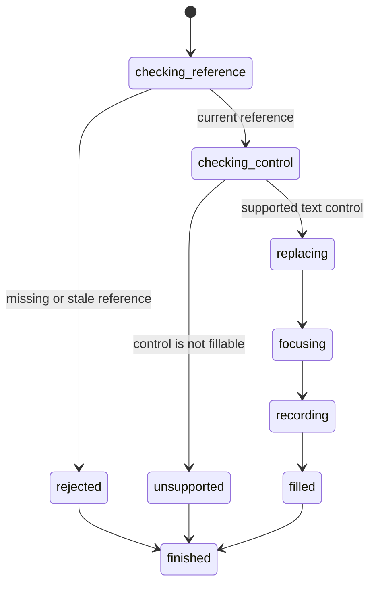

# Fill a text control

## Summary

Package callers submit `FillElement` with a current interactive reference and replacement text.

Session-mode callers send `fill <ref> <text>` after an interactive snapshot in the same process.

[Locator actions](../inspection/query-elements.md) define the snapshot-free fill path.

Fill focuses the control and replaces its complete value.

It collapses the control selection at the new value end.

Each success records `beforeinput` and `input` in the session's native event transcript.

It does not imitate keyboard entry or deliver events to page scripts.

[Type text](type-text.md) owns append-style entry.

## The simple case

The caller opens a page and captures an interactive snapshot. It selects a textbox reference such as `@e1`.

The caller fills that reference. browser.jr focuses it, replaces the stored value, and reports success.

Another snapshot reports the replacement value in escaped quoted form.

## The interaction, event by event

### Invoke

The package request contains one typed reference and one string.

Session mode reads the reference and treats the remaining line as its string.

### Exit immediately

A stale package reference returns `SessionError::StaleElementReference`.

An unknown or stale session label reports invalid input. Neither path changes the document.

### Begin running

browser.jr checks the referenced element's fill capability.

[Value inspection](../inspection/read-value.md) defines supported text controls. Disabled and read-only controls expose values but reject fill.

### While running

Fill replaces the stored value once. It keeps the current reference usable.

Success stores the filled control as current focus.

The control's selection collapses at the new value's UTF-16 length.

Every successful fill records `beforeinput`, then `input`, even when the stored value already matches.

Both records bubble and compose. They contain target structure, not the replacement value.

Rejected fills record nothing.

Fill does not record deferred `change`, focus, or keyboard events.

The transcript does not deliver events to page scripts.

It does not run constraint validation, page scripts, or form submission.

### Finish

The package returns `FillResult` with the reference and replacement value.

Session mode reports the reference and Unicode scalar-value count. It does not repeat the value in that result line.

Package callers drain records with `TakeDomEvents`. Session callers use `events`.

A later interactive snapshot reports the current value. That new capture makes the earlier reference stale.

## Variants

| Modifier | Set at invocation | Changed while running |
| --- | --- | --- |
| Flags and options | The package takes a string. Session mode takes the rest of one line. | Fill has no flags. |
| Project configuration | No fill configuration exists. | Nothing reloads. |
| Target matrix | The current page and snapshot select one control. | Fill does not navigate or create a page. |
| Output channel | The package returns a typed value. Session mode uses flushed text. | A later snapshot exposes the stored value. |

## Cancel and interrupt

| Event | Before running | While running |
| --- | --- | --- |
| Ctrl+C once | The host or CLI process may exit. | Fill has no asynchronous phase or graceful handler. |
| Ctrl+C again before the evaluation stops | The process may already be gone. | No second-stage handler exists. |
| The process receives SIGTERM | The process may exit before the request. | In-memory state disappears with the process. |
| The terminal closes | Package behavior is unchanged. | Session-mode output may fail. |
| stdin or stdout closes | Package behavior is unchanged. | Closed session stdin ends the process. Closed stdout causes status three. |
| The network fails or a request times out | Fill uses no network. | The stored page already exists in memory. |
| The inspected page changes | Another snapshot or navigation can stale the reference. | Fill itself changes only the supported value. |
| Another lint run targets the same page | It owns another session. | It cannot observe this in-memory value. |
| The process exits outright | No fill occurs. | No filled value survives. |

## Interactions with other systems

**Configuration precedence.** The request string is the only value source.

**Output and exit status.** Package callers receive `FillResult` or `SessionError`. Session mode uses status two or three for failures.

**Resource limits.** No value-length limit exists yet. Session mode limits one value to one input line.

**Network and storage.** Fill uses no network and writes no persistent storage.

**Rendering compatibility.** Playwright fill focuses before replacing the complete text-control value.

browser.jr matches those state changes and records the observed Playwright `beforeinput`, `input` order.

It does not run page handlers or model blur-time `change`.

See Playwright's [text input](https://playwright.dev/docs/input#text-input) behavior.

Controlled Playwright 1.62.1 Chromium, Firefox, and WebKit runs matched this sequence.

**Isolation.** Values belong to one session and document. A successful open or navigation replaces them.

**Accessibility inspection.** The accessible name stays separate from the current value.

## Edge cases

- Package strings may contain line breaks. Session-mode strings may not.
- Session mode removes delimiter whitespace before the value.
- Session mode preserves trailing whitespace.
- A trailing delimiter with no text fills an empty string.
- Disabled and read-only controls reject fill.
- Password, number, checkbox, radio, range, select, and contenteditable controls reject fill.
- Explicit ARIA roles do not make a non-editable element fillable.
- A successful fill replaces previous focus.
- A rejected fill preserves the current value, reference, and focus.
- Repeated fill replaces the previous value.
- Repeated fill with the same value still records `beforeinput` and `input`.
- Rejected fill records no event.
- Fill does not invalidate the current reference. A later snapshot does.

## Open questions and verification

- Define password input handling without exposing secrets.
- Define native validation before expanding input types.
- Define maximum value size.
- Add deferred `change` when focus leaves a dirty text control.
- Add page-script event delivery after JavaScript exists.

Drafted from the Rust implementation and package and compiled-process tests on 2026-08-31.
