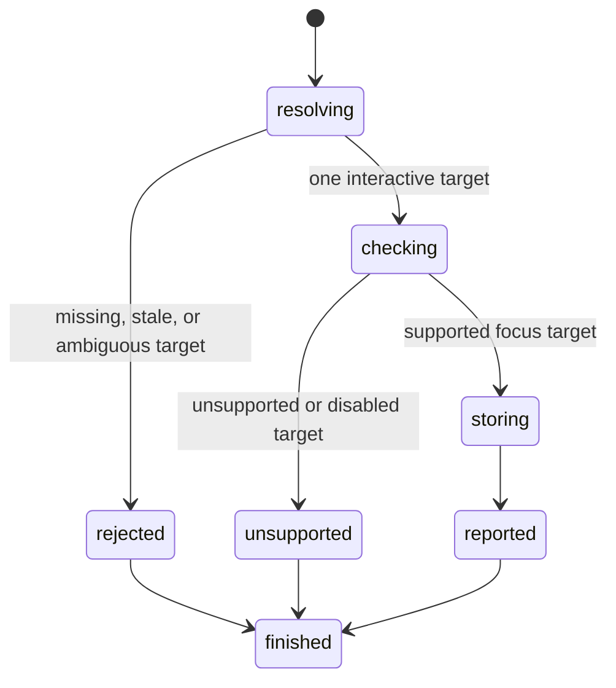

# Focus an element

## Summary

Package callers submit `FocusElement` with a current interactive reference.

`FocusByLocator` gives package callers a snapshot-free locator path.

Session callers send `focus <ref|selector>` or use `find ... focus`.

Focus stores one supported target on the current page. It dispatches no browser events.

[`Tab` and `Shift+Tab`](press-key.md) can then move through the supported sequential focus order.

Text controls own a collapsed UTF-16 selection from document creation.

## The simple case

The caller opens a page with one labeled input.

It focuses the input through a reference, semantic locator, CSS selector, or XPath selector.

browser.jr stores that target. A later [`press`](press-key.md) request uses it.

## The interaction, event by event

### Invoke

The package request contains a typed reference or `Locator`.

Session mode accepts a current reference or direct selector. `find ... focus` accepts every implemented locator kind.

### Exit immediately

A stale package reference returns `SessionError::StaleElementReference`.

Unknown session labels report invalid input. Missing or ambiguous locators return their existing strict-resolution errors.

None of these paths changes the current focus.

### Begin running

browser.jr checks its static focus subset after resolution.

Native buttons, non-hidden inputs, selects, textareas, and links with `href` can take focus.

An interactive element with an integer `tabindex` can also take focus.

Disabled native controls reject focus. Unsupported explicit roles also reject focus.

Focus performs no visible, stable, enabled, editable, or receives-events actionability check.

### While running

Successful focus replaces the previous focused target on the current page.

Sequential traversal can replace it with another target or the document body.

Focus does not change values, checked state, selection, layout, or interactive references.

Repeated focus restores the control's existing selection.

It does not dispatch `focus`, `focusin`, pointer, keyboard, or input events.

### Finish

`FocusResult` returns the reference and static element identity.

`FocusByLocatorResult` returns the resolved match.

Session output reports the target identity. It does not expose page content or control values.

## Variants

| Modifier | Set at invocation | Changed while running |
| --- | --- | --- |
| Flags and options | Focus accepts one reference or locator. | Focus has no flags. |
| Project configuration | No focus configuration exists. | Nothing reloads. |
| Target matrix | The current page supplies one target. | Focus does not navigate. |
| Output channel | Package requests return typed values. Session mode uses flushed text. | Later presses use the stored target. |

## Cancel and interrupt

| Event | Before running | While running |
| --- | --- | --- |
| Ctrl+C once | The host or CLI process may exit. | Focus has no asynchronous phase. |
| Ctrl+C again before the evaluation stops | The process may already be gone. | No second-stage handler exists. |
| The process receives SIGTERM | The process may exit first. | In-memory focus disappears. |
| The terminal closes | Package behavior is unchanged. | Session output may fail. |
| stdin or stdout closes | Package behavior is unchanged. | Closed stdin ends session mode. |
| The network fails or a request times out | Focus uses no network. | The current page already exists. |
| The inspected page changes | Document replacement clears focus. | Static pages do not mutate themselves. |
| Another lint run targets the same page | It owns another session. | It cannot observe this focus. |
| The process exits outright | No focus request runs. | No focus state survives. |

## Interactions with other systems

**Configuration precedence.** The target is the only focus input.

**Output and exit status.** Invalid targets use status two. Unsupported targets and missing pages use status three.

**Resource limits.** Focus adds one optional index to current page state. Each text control owns two bounded offsets.

**Network and storage.** Focus uses no network and writes no persistent storage.

**Rendering compatibility.** Playwright [`locator.focus()`](https://playwright.dev/docs/api/class-locator#locator-focus) calls focus on one matching element.

Playwright lists no actionability checks for focus in its [actionability table](https://playwright.dev/docs/actionability).

browser.jr follows that no-actionability boundary after strict static resolution.

Its sequential order follows positive `tabindex`, then natural targets and `tabindex="0"` in document order.

Each native radio group supplies one natural tab stop. It uses the checked eligible radio, or the first eligible radio.

Selecting another eligible radio moves the group's natural tab stop to that radio.

A controlled `agent-browser` 0.32.4 Lightpanda run focused inputs, textareas, buttons, read-only inputs, and disabled inputs.

browser.jr rejects disabled controls because its stored focus must represent an active target.

**Isolation.** Focus belongs to one session and document. Document replacement clears it.

**Accessibility inspection.** Semantic locators use the implemented role and accessible-name subset.

## Edge cases

- A failed focus preserves the previous focused target.
- Focus before an open reports `SessionError::NoPage`.
- A new snapshot preserves focus but makes older references stale.
- Open, reload, link or form navigation, back, and forward clear focus after success.
- Failed document replacement preserves focus with the current page.
- Read-only inputs and textareas can take focus.
- Disabled native controls cannot take focus.
- Explicit interactive roles require a valid integer `tabindex` unless their native element is focusable.
- New text controls start with a collapsed selection at UTF-16 offset zero.
- Focus preserves each text control's current selection.
- Repeated focus on one target is idempotent.
- The document body owns focus before traversal and at each traversal boundary.
- Negative-`tabindex` targets support direct focus but do not enter sequential focus order.
- A direct traversal request with unsupported focus candidates preserves current focus.
- Named radios share one natural tab stop only when they share a form owner.
- Unnamed radios each supply their own natural tab stop.
- Explicit `tabindex` on a visible radio blocks sequential traversal.
- Inline box geometry does not block sequential focus.

## Open questions and verification

- Define blur.
- Define browser focus event order.
- Define supported non-interactive `tabindex`, disabled fieldsets, stylesheets, shadow DOM, and iframes.
- Implement explicit radio `tabindex` order.
- Expand native focus conformance coverage.

Drafted from Rust package tests, compiled-process tests, Playwright documentation, and controlled agent-browser evidence on 2026-08-31.
