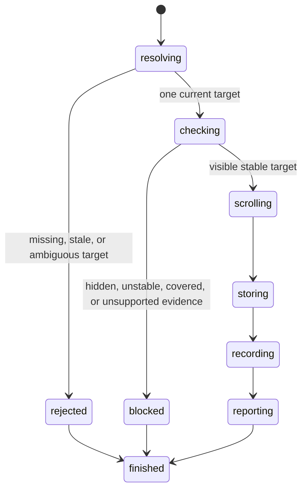

# Hover an element

## Summary

Package callers submit `HoverElement`, `HoverByLocator`, or `HoverByRole`.

Session callers send `hover <ref|selector>` or use `find ... hover`.

A successful hover stores one visible element as the current pointer target.

It reveals an off-screen target when browser.jr has complete box geometry.

Supported static hit-test scenes reject an outside element that owns the action point.

Hover records target-level pointer and mouse transitions. It does not deliver them or apply CSS `:hover` rules.

## The simple case

The caller opens a page and captures an interactive snapshot.

It sends `hover @e1`. browser.jr checks visibility and stores that source element.

The caller can read the target through `is hovered @e1`.

## The interaction, event by event

### Invoke

Reference hover requires a current interactive snapshot reference.

Locator hover resolves one current match when the request executes.

Direct selectors use CSS unless the selector selects XPath explicitly.

### Exit immediately

A stale reference returns `SessionError::StaleElementReference`.

Missing or ambiguous locators return their strict-resolution errors.

These failures preserve the current pointer target and references.

### Begin running

Hover requires supported visible evidence. Hidden targets reject the action.

Embedded or linked stylesheets block visibility evidence today.

Disabled native controls may become the pointer target.

Hover requires supported static stability evidence.

Inline animation or transition declarations on the target or its ancestors block that evidence.

When target geometry is supported, browser.jr computes the post-scroll action point without changing offsets.

It accepts the target or its descendant and ignores boxes with `pointer-events:none`.

A known outside blocker reports the `ReceivesEvents` actionability check and its element identity.

Overlapping unsupported hit-test evidence also blocks instead of becoming a pass.

Unsupported target geometry keeps the earlier hover behavior without claiming a complete document hit test.

browser.jr does not sample animation frames or model complete stacking, clipping, or transformed hit geometry.

Unsupported box geometry leaves offsets unchanged. It does not block a visible hover target.

### While running

A successful hover reveals its supported target box before replacing the previous pointer target.

It commits the same prospective scroll used to choose the action point.

A rejected hover preserves page offsets and the previous pointer target.

The target may be interactive or structural when selected through a locator.

Reference hover targets the source element represented by that reference.

The action does not move focus or change native control state.

The action preserves the current document and interactive references.

A first target records pointer over and enter, then mouse over and enter.

Every success records `pointermove`, then `mousemove` against the current target.

A changed target first records pointer out and leave against the prior target.

It records pointer over and enter against the new target.

It then records mouse out and leave, followed by mouse over and enter.

Transition records include the other target's identity and source ordinal.

Hover records Chrome's target-level order. It does not claim complete ancestor dispatch.

### Finish

`HoverResult` returns the current reference.

`HoverByLocatorResult` returns the resolved match.

`HoverByRoleResult` returns the resolved role match.

Session output reports target identity. The `events` command drains recorded transitions.

## Variants

| Modifier | Set at invocation | Changed while running |
| --- | --- | --- |
| Flags and options | Hover accepts one reference or locator. | Hover has no coordinates, force, trial, or modifiers. |
| Project configuration | No hover configuration exists. | Nothing reloads. |
| Target matrix | The current page supplies one target. | Hover does not navigate. |
| Output channel | Package requests return typed values. Session mode uses flushed text. | Output does not expose page content. |

## Cancel and interrupt

| Event | Before running | While running |
| --- | --- | --- |
| Ctrl+C once | The host or CLI process may exit. | Hover has no asynchronous phase. |
| Ctrl+C again before the evaluation stops | The process may already be gone. | No second-stage handler exists. |
| The process receives SIGTERM | The process may exit first. | In-memory hover state disappears. |
| The terminal closes | Package behavior is unchanged. | Session output may fail. |
| stdin or stdout closes | Package behavior is unchanged. | Closed stdin ends session mode. |
| The network fails or a request times out | Hover uses no network. | The current page already exists. |
| The inspected page changes | Document replacement clears hover state. | Static pages do not mutate themselves. |
| Another lint run targets the same page | It owns another session. | It cannot observe this target. |
| The process exits outright | No hover request runs. | No hover state survives. |

## Interactions with other systems

**Configuration precedence.** The target is the only hover input.

**Output and exit status.** Invalid targets use status two. Blocked targets use status three.

**Resource limits.** Hover stores one optional source index.

**Network and storage.** Hover uses no network and writes no persistent storage.

**Rendering compatibility.** Playwright hover checks visibility, stability, and event receipt.

browser.jr checks strict resolution, supported static visibility, static stability, and bounded event receipt.

It auto-scrolls supported target boxes and records target-level pointer transitions.

See Playwright's [`locator.hover()`](https://playwright.dev/docs/api/class-locator#locator-hover) and [actionability table](https://playwright.dev/docs/actionability).

A controlled `agent-browser` 0.32.4 Chromium run accepted visible, disabled, and hidden targets.

Its next command did not observe a persistent DOM `:hover` match.

This evidence does not prove browser.jr event or CSS parity.

Controlled Playwright 1.62.1 Chromium, Firefox, and WebKit rejected a fixed blocker and accepted a target descendant.

They ignored a `pointer-events:none` blocker. `agent-browser` Lightpanda rejected it. See [BJR-011](../bug-triage.md#bjr-011).

The three Playwright engines emitted pointer and mouse transition families, but their order differed. See [BJR-013](../bug-triage.md#bjr-013).

`agent-browser` 0.34.0 Lightpanda omitted PointerEvents, exit records, and related targets. See [BJR-012](../bug-triage.md#bjr-012).

**Isolation.** Hover state belongs to one session and document.

**Accessibility inspection.** Semantic locators use the implemented role and accessible-name subset.

## Edge cases

- Hovering the current target again preserves state and records `pointermove`, then `mousemove`.
- Inline animation or transition declarations block without replacing the current target.
- A supported outside blocker preserves offsets and the previous pointer target.
- A supported target descendant may own the action point.
- A `pointer-events:none` box does not block a supported target.
- Hovering an off-screen supported box reveals it before storing pointer state.
- Unsupported target geometry leaves offsets unchanged and still stores a visible target.
- Hovering another target removes current-target state from the previous element.
- A failed hover preserves page offsets and the previous target.
- Disabled native controls can become the pointer target.
- Hidden targets cannot become the pointer target.
- Embedded stylesheet evidence blocks hover before mutation.
- A successful hover preserves current interactive references.
- Another snapshot preserves hover state but replaces earlier references.
- Open, reload, link or form navigation, back, and forward clear hover state after success.
- Failed document replacement preserves hover state with the current page.

## Open questions and verification

- Complete stacking, clipping, transformed geometry, and unsupported-scene hit testing.
- Implement frame sampling for supported motion.
- Define pointer coordinates, nested scrolling, modifiers, force, trial, and timeouts.
- Add complete ancestor dispatch, actual descendant hit targets, and pointer metadata.
- Apply dynamic CSS `:hover` matching and style invalidation.
- Decide whether hovered-state inspection should include hovered ancestors.

Drafted from Rust tests, Playwright documentation, and controlled `agent-browser` evidence on 2026-09-01.
