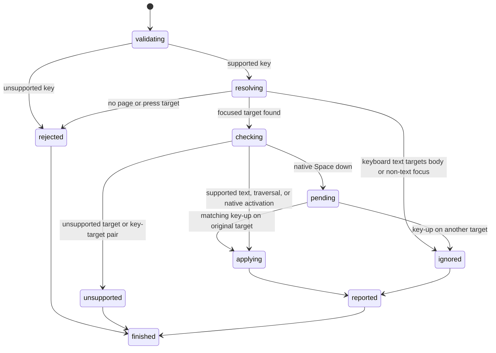

# Press a key

## Summary

Package callers construct `KeyboardKey`, then submit `PressKey`.

`KeyboardInsertText` and `KeyboardType` apply text to the current page focus.

`KeyDown` stores one held `KeyboardEventKey`. `KeyUp` releases its normalized identity.

Native-control `Space` stores one pending activation. Its matching key-up applies that activation.

`PressByLocator` resolves and focuses one strict locator before applying the same key.

Session callers send `press <key>` after a successful [`focus`](focus-element.md) command.

They send `keyboard inserttext <text>` or `keyboard type <text>` for focused text input.

They send `keydown <key>` and `keyup <key>` to control held-key state.

Each supported text control owns a selection with UTF-16 offsets.

Press applies bounded insertion, deletion, movement, extension, and select-all behavior to that selection.

Held `Shift` changes supported character, movement, and traversal presses. Held control or meta selects all with `a`.

Focused keyboard text replaces the selected range and collapses the selection after the inserted text.

`Tab` and `Shift+Tab` move the page focus through the supported sequential focus order.

`Enter` activates links and supported native buttons. `Space` activates buttons and changes native checked controls.

Both keys submit supported GET forms when they activate a native submit button.

`Enter` also performs supported implicit submission from single-line text controls.

Non-empty `KeyboardInsertText` records its supported input-event sequence.

`KeyboardType` records its supported portable per-scalar event sequence.

Complete press records supported text and same-target native-control sequences.

Supported held-key phases record their portable sequence. No keyboard operation runs page scripts.

## The simple case

The caller focuses an input whose current value is `hello`.

New controls begin with a collapsed selection at offset zero.

It presses `!`. browser.jr stores `!hello` and collapses the selection at offset one.

A later value read reports `!hello`.

## The interaction, event by event

### Invoke

`KeyboardKey::new` accepts these inputs:

- one non-control Unicode scalar
- `Space`, `Enter`, `Backspace`, and `Delete`
- `ArrowLeft`, `ArrowRight`, `ArrowUp`, `ArrowDown`, `Home`, and `End`
- the same movement keys with a `Shift+` prefix
- `Tab` and `Shift+Tab`
- `ControlOrMeta+A`, with `Control+A` and `Meta+A` aliases

`KeyboardEventKey::new` accepts one unmodified `KeyboardKey` or these modifiers:

- `Shift`, `Control`, `Alt`, `Meta`, and `ControlOrMeta`
- left and right aliases for `Shift`, `Control`, `Alt`, and `Meta`

Session mode accepts one whitespace-delimited key token.

Keyboard text requests contain one string. Session mode uses the remaining line after the operation name.

### Exit immediately

Empty names, control characters, multiple plain characters, and unsupported named keys fail key construction.

Keyboard event keys reject chord input. Hold a modifier, then submit the base key.

Session syntax failures use status two without changing page state.

Press before an open returns `SessionError::NoPage`.

Key down and key up before an open return `SessionError::NoPage`.

Text press without a focused target returns `SessionError::NoFocusedElement`.

Keyboard text before an open returns `SessionError::NoPage`.

Keyboard text on the document body succeeds with `KeyboardTextEffect::Ignored`.

`Tab` starts from the document body when no interactive target owns focus.

### Begin running

browser.jr resolves the focused target stored on the current page.

Locator press resolves one target, checks focus support, and stores it before applying the key.

Locator `Tab` therefore moves beyond the resolved target. Locator `Shift+Tab` moves before it.

Each input and textarea starts with a collapsed selection at UTF-16 offset zero.

Focus changes the active target. It preserves that control's existing selection.

Character keys and `Space` replace the selected range on text controls.

Focused `inserttext` replaces the selected range exactly once.

Focused `type` applies each Unicode scalar in order.

Both operations share stored-value behavior. Their native event transcripts differ.

Non-empty editable `inserttext` records `beforeinput`, then `input`.

Non-empty read-only `inserttext` records only `beforeinput`. Its stored value remains unchanged.

Empty or ignored keyboard text records nothing.

Printable ASCII type records `keydown`, `keypress`, `beforeinput`, `input`, then `keyup` on editable text.

Editable non-ASCII type records `beforeinput`, then `input`.

Textarea type normalizes carriage return and line feed to line feed.

Its editable line breaks use the printable-key event sequence.

Single-line type ignores both line-break scalars. It records only their shared key events.

Read-only printable ASCII and line breaks record `keydown`, `keypress`, then `keyup`.

Read-only non-key input events differ across Playwright engines. browser.jr does not record them.

Changed printable ASCII press records `keydown`, `keypress`, `beforeinput`, `input`, then `keyup`.

Its read-only or no-op form records `keydown`, `keypress`, then `keyup`.

Changed Backspace and Delete record `keydown`, `beforeinput`, `input`, then `keyup`.

Their read-only or no-op forms record `keydown`, then `keyup`.

Unmodified movement press records `keydown`, then `keyup`.

Button Enter records `keydown`, `keypress`, `click`, then `keyup`.

Button Space records `keydown`, `keypress`, `keyup`, then `click`.

Checkbox and radio Space use the same order. A changed control adds `input`, then `change`.

Focus-changing, navigating, modified, and non-ASCII presses do not record incomplete sequences.

Key down captures the current focused event target.

Native-control `Space` records its down phase without applying the native effect.

Other supported non-modifier keys apply their default effect during key down.

Key down then stores the normalized event key.

Supported text, movement, modifier, Enter, and Tab down phases record before storage.

A failed key down does not add that key to held state.

Key up releases held state.

An eligible matching down lets key-up record against the current focused target.

Matching native-control `Space` applies its pending effect only when the original target still owns focus.

A focus change to another target cancels that pending activation.

Releasing an up key succeeds with `was_pressed=false` and records nothing.

Textarea `Enter` inserts one line feed.

Single-line input `Enter` follows the form's implicit submission rule.

`Enter` and `Space` activate a supported native button.

They navigate when that button is a supported GET submitter.

`Enter` on a supported same-context link resolves its URL and loads one replacement document.

`Space` reverses current native checkbox state.

`Space` selects a native radio and unchecks its group peers.

Plain arrow keys move within a native radio group. They select and focus the destination radio.

They insert at the caret when the range is collapsed.

`Backspace` removes the previous Unicode scalar. `Delete` removes the next scalar.

Either deletion removes the complete selected range first.

### While running

`ArrowLeft` and `ArrowRight` move across Unicode scalar boundaries.

On radios, left and up move backward. Right and down move forward.

Radio movement wraps and skips disabled or hidden group peers.

A plain arrow collapses an active selection toward its matching edge.

A shifted arrow extends from the preserved anchor.

Input `Home` and `End` move to the complete value boundaries.

Textarea `Home` and `End` move to logical line boundaries separated by U+000A.

Shifted `Home` and `End` extend the selection to the same targets.

`ControlOrMeta+A` selects the complete value.

A first key down reports `repeat=false`. Another down before its matching up reports `repeat=true`.

Repeated native-control `Space` records another down phase. One matching key-up applies one activation.

Held `Shift` uppercases supported ASCII letters and maps supported US-keyboard punctuation.

Held `Shift` also extends horizontal, Home, and End movement. It reverses `Tab` traversal.

Held `Control`, `Meta`, or `ControlOrMeta` converts `a` into the normalized select-all press.

Held modifiers affect `PressKey`, `PressByLocator`, and non-modifier `KeyDown` requests.

Held modifiers do not change `KeyboardType` text.

Sequential focus puts positive `tabindex` values first, in ascending order.

Equal positive values keep document order. Natural targets and `tabindex="0"` follow in document order.

Each native radio group supplies one natural tab stop. The checked eligible radio wins, or the first eligible radio wins.

Selecting another eligible radio moves that group's natural tab stop to the selected radio.

Disabled, hidden, inert, and negative-`tabindex` targets do not enter this order.

Forward traversal past the last target returns focus to the document body.

Reverse traversal before the first target also returns focus to the document body.

The next `Tab` from the body selects the first target. `Shift+Tab` selects the last target.

Mutation keys leave read-only values unchanged. Movement and selection keys still update their selection.

Keyboard text also leaves a focused read-only value unchanged and reports `changed=false`.

Keyboard text on another focused target reports `Ignored` without changing focus or references.

Text press preserves current focus and interactive references after success or failure.

Successful focus traversal changes focus and preserves interactive references.

Successful non-submitting native control activation preserves focus and interactive references.

Successful link or form activation installs a fresh document. It clears focus and invalidates previous references.

Failed link or form navigation preserves the current page and references.

A failed locator form submission keeps the newly focused submitter.

An implicit no-op preserves focus and references.

Button activation reports one typed effect. Checkbox and radio activation report committed checked state.

Supported complete press records portable text and same-target native-control events.

Supported key down records its portable down phase.

Its matching key up records against the current focused target.

Native-control `Space` defers activation until matching key-up on its original focused target.

Button and submitter activation records `keyup`, then `click` after recorded down phases.

Changed checkbox and radio activation then records `input` and `change`.

An unchanged checked radio records only the key phases shared by measured Playwright engines.

Supported `KeyboardInsertText` records `beforeinput` and optional `input` without key events.

Supported `KeyboardType` records the portable per-scalar sequence without values or key data.

No keyboard operation delivers events to page scripts.

### Finish

`PressResult` returns the normalized key and one typed `PressEffect`.

`PressEffect::Text` returns element identity, complete value, selection, and mutation state.

`PressEffect::FocusTraversal` returns the previous and current focused element identities.

`PressEffect::Navigated` returns the activated target identity, resolved URL, and interactive-element count.

`PressEffect::Ignored` returns the input identity when supported `Enter` has no default effect.

`PressEffect::Activated` returns the activated button identity.

`PressEffect::Checked` returns the changed control identity and committed Boolean state.

For radio arrows, that identity is the newly focused group member.

`None` represents the document body at either focus boundary.

`PressByLocatorResult` also returns the strict locator match.

`KeyboardTextResult` returns `KeyboardTextEffect::Text` or `KeyboardTextEffect::Ignored`.

The text effect returns element identity, complete value, selection, and mutation state.

The ignored effect returns the focused element when one exists. `None` represents the body.

`KeyDownResult` returns the event key, repeat state, deferred state, and an optional `PressResult`.

A modifier down has no press effect. Deferred native `Space` also has no down-press effect.

Another non-modifier down returns its effective press.

`KeyUpResult` returns the event key, prior held state, and an optional deferred `PressResult`.

Selection offsets count UTF-16 code units. Value character counts use Unicode scalar values.

Text output reports the key, target, value count, selection range, and mutation flag.

Keyboard text output adds the operation and input character count. It does not echo the input text.

Key-down output reports the normalized event key, repeat state, and press, modifier, or deferred state.

Key-up output reports the normalized event key, prior held state, and any deferred press effect.

Traversal output reports the key, prior focus, and current focus role, name, and identity.

Native output reports the key, target identity, and activation, checked, ignored, or navigation effect.

Session output does not echo the control value.

## Variants

| Modifier | Set at invocation | Changed while running |
| --- | --- | --- |
| Flags and options | Press contains one validated key. Keyboard text contains one string. Key down and up contain one event key. | Key down changes held and repeat state. Key up releases it. Delay does not exist. |
| Project configuration | No keyboard configuration exists. | Nothing reloads. |
| Target matrix | Current page focus selects one target or the body. | Traversal changes focus. Checkbox activation changes state. |
| Output channel | Package requests return typed values. Session mode uses flushed text. | Later reads expose the stored value. |

## Cancel and interrupt

| Event | Before running | While running |
| --- | --- | --- |
| Ctrl+C once | The host or CLI process may exit. | Press has no asynchronous phase. |
| Ctrl+C again before the evaluation stops | The process may already be gone. | No second-stage handler exists. |
| The process receives SIGTERM | The process may exit first. | In-memory changes disappear with the process. |
| The terminal closes | Package behavior is unchanged. | Session output may fail. |
| stdin or stdout closes | Package behavior is unchanged. | Closed stdin ends session mode. |
| The network fails or a request times out | Non-navigation press uses no network. | Failed navigation preserves the current page. |
| The inspected page changes | Document replacement clears focus. | Static pages do not mutate themselves. |
| Another lint run targets the same page | It owns another session. | It cannot observe this value. |
| The process exits outright | No key effect occurs. | No in-memory value survives. |

## Interactions with other systems

**Configuration precedence.** The operation, key or text, current focus, value, and selection are the only inputs.

**Output and exit status.** Invalid keys use status two. Missing focus and unsupported targets use status three.

**Resource limits.** No value-length limit exists. One request applies one bounded editing operation.

**Network and storage.** Link and GET form activation may load a page. Press writes no persistent storage.

**Rendering compatibility.** Playwright [`locator.press()`](https://playwright.dev/docs/api/class-locator#locator-press) focuses before keyboard down and up.

Playwright supports a broader [keyboard key set](https://playwright.dev/docs/api/class-keyboard#keyboard-press) and browser event dispatch.

Playwright `keyboard.down()` keeps modifiers active and marks later downs of the same key as repeats.

Playwright `keyboard.up()` releases the key.

Controlled held-key runs used Playwright 1.62.1 Chromium 151, Firefox 153, and WebKit 26.5.

The engines agreed on supported text, movement, modifier, Enter, and Tab phase order.

browser.jr records those down phases and one matching up against the current focus.

All three engines deferred native button, checkbox, radio, and submitter `Space` activation until key-up.

All three canceled activation when focus remained on another target at key-up.

Repeated down phases produced one activation at matching key-up.

browser.jr follows those shared results.

Chromium canceled activation after focus left and returned. Firefox and WebKit activated the original target.

browser.jr requires the original target to own focus at key-up. This follows Firefox and WebKit for that divergence.

Chromium and WebKit omitted `click` for checked-radio `Space`. Firefox included it.

browser.jr records only their shared key phases when radio state does not change.

A controlled `agent-browser` 0.32.4 Lightpanda run recorded only `keydown` and `keyup` for held button `Space`.

It omitted `keypress`, `click`, and native activation. browser.jr follows the three Playwright engines for native defaults.

Controlled complete-press runs used Playwright 1.62.1 Chromium, Firefox, and WebKit.

The engines agreed on printable text, textarea Enter, movement, button activation, and checked-control Space order.

No-op editing and read-only input events differed. browser.jr records their shared sequence.

Playwright rejected non-ASCII `keyboard.press()` keys. browser.jr preserves its value effect without event claims.

Playwright `keyboard.insertText()` dispatches input without key events.

Controlled Playwright 1.62.1 Chromium, Firefox, and WebKit runs recorded `beforeinput`, then `input`.

The same runs recorded only `beforeinput` for non-empty read-only insertion. Empty insertion recorded nothing.

Playwright `keyboard.type()` sends per-character keyboard and input events to the focused element.

Controlled Playwright 1.62.1 Chromium, Firefox, and WebKit runs agreed on editable event order.

Printable ASCII produced `keydown`, `keypress`, `beforeinput`, `input`, then `keyup`.

Other editable scalars produced `beforeinput`, then `input`.

Read-only printable ASCII produced shared key events. Chromium also produced `beforeinput`.

Read-only non-ASCII events differed across all three engines.

browser.jr records the shared sequence and keeps the divergence explicit.

Typing delay remains unsupported.

HTML defines [sequential focus navigation](https://html.spec.whatwg.org/multipage/interaction.html#sequential-focus-navigation) through tabindex-ordered scopes.

HTML text selections use offsets into the control value. browser.jr uses UTF-16 offsets for this boundary.

HTML also defines [implicit submission](https://html.spec.whatwg.org/multipage/form-control-infrastructure.html#implicit-submission) for text-control `Enter`.

Playwright documents fill followed by `Enter` as a normal form workflow.

A controlled Playwright 1.61.1 Chromium run verified the implemented caret, selection, deletion, and line-boundary outcomes.

It also activated buttons through `Enter` and `Space`. Checkbox `Space` toggled checked state.

Chromium selected radios through `Space` and used one natural tab stop per group.

Chromium radio arrows wrapped and skipped disabled or hidden peers.

Chromium also navigated when `Enter` activated a focused native link.

The same run verified positive `tabindex`, natural order, body boundaries, locator `Tab`, and negative-`tabindex` departure.

A controlled `agent-browser` 0.32.4 Lightpanda run matched the focus order before the body boundary.

Lightpanda then kept the last target focused. Chromium returned focus to the body.

browser.jr follows Chromium and the HTML sequential focus model at that boundary.

The Lightpanda run also ignored collapsed-caret movement and deletion.

Lightpanda appended focused keyboard text at its reported zero selection offset.

It also changed a focused read-only input. browser.jr follows Playwright and native editability instead.

It did not apply link, button, checkbox, or radio keyboard defaults through `agent-browser press`.

A separate Lightpanda run performed implicit submission but ignored HTML default-button and blocker rules.

browser.jr follows the Playwright and HTML results for this slice.

**Isolation.** Values, selections, and focus belong to one session and document.

**Accessibility inspection.** Press does not change accessible names.

## Edge cases

- `KeyboardKey::new(" ")` and `KeyboardKey::new("Space")` represent one space.
- `KeyboardEventKey` normalizes left and right modifier aliases to one held identity.
- Event keys reject embedded chords such as `Shift+Tab`.
- A failed non-modifier key down does not become held.
- Repeated key down reapplies supported immediate effects and reports `repeat=true`.
- Repeated native-control `Space` preserves one pending activation for key-up.
- Repeated key up succeeds and reports `was_pressed=false`.
- Held keys survive same-session document replacement until their matching key up.
- Held Shift changes supported ASCII letters, US punctuation, movement, and Tab.
- Held control or meta changes `a` into select-all. Other modified defaults remain bounded.
- Other control, meta, and Alt default effects reject instead of applying an unmodified key.
- A non-control, non-ASCII scalar is one supported key.
- UTF-16 offsets never split a Unicode scalar.
- A surrogate-pair character occupies two selection offsets and one editing step.
- A combining mark occupies one editing step separate from its base scalar.
- `Enter` activates supported native buttons.
- Link `Enter` follows supported same-context navigation and records history.
- Link `Space` rejects because scrolling and event dispatch are unavailable.
- `Space` activates supported native buttons and toggles native checkboxes.
- Radio `Space` selects its target and unchecks its group peers.
- Plain radio arrows select and focus the adjacent eligible peer, with wrapping.
- Shifted horizontal radio arrows remain unsupported.
- Radio `Enter` rejects because event-only keyboard effects are unavailable.
- Checkbox `Enter` rejects because event-only keyboard effects are unavailable.
- Remaining form defaults and custom ARIA activation stay unsupported.
- Single-line input `Enter` can navigate, report `Ignored`, or return a supported submission failure.
- Native select keys remain unsupported.
- Character and editing keys reject non-text targets.
- Read-only controls accept supported keys without stored value mutation.
- Complete printable text press records portable key and input events.
- Complete Backspace and Delete record input events only when the value changes.
- Complete button Enter and Space record their measured click order.
- Changed checkbox and radio Space record click, input, and change after the key phases.
- An unchanged checked radio records only the measured shared key phases.
- Locator press uses the same event boundary after strict resolution and focus.
- Focus traversal, navigation, radio arrows, modified, and non-ASCII press record nothing.
- Supported key down records text, movement, modifier, Enter, and Tab phases.
- An eligible matching key up records against the current focus.
- Tab therefore records down on the old target and up on the new target.
- Repeated or unmatched key up records nothing.
- Native-control `Space` records portable phases and applies one matching key-up effect.
- Native-control `Space` cancels its effect when another target owns focus at key-up.
- Enter navigation, radio movement, modified, and non-ASCII held phases record nothing.
- Focused keyboard text replaces active selections with UTF-16-safe offsets.
- Empty focused keyboard text succeeds without changing value or selection.
- Empty focused `inserttext` records nothing.
- Focused keyboard text preserves read-only values and selections.
- Non-empty read-only `inserttext` records only `beforeinput`.
- Ignored and empty keyboard text records nothing.
- Editable `KeyboardType` records portable events for each scalar.
- Read-only `KeyboardType` records shared key events for printable ASCII and line breaks.
- Keyboard text on the body or a non-text target reports `Ignored`.
- Session keyboard text cannot contain a line break. Package strings may contain one.
- Session keyboard text preserves trailing whitespace and does not echo input.
- Disabled controls cannot become the stored focus target.
- A rejected press preserves focus, selection, and value.
- Failed locator resolution preserves the earlier focused target.
- Locator `Tab` starts from its resolved target, not the body.
- Programmatic focus on a negative-`tabindex` target can leave through `Tab` or `Shift+Tab`.
- A page without sequential targets keeps focus on the body.
- Unsupported focusable elements block traversal instead of producing an incomplete order.
- Explicit `tabindex` on a visible radio blocks traversal until its group order is modeled.
- Disabled fieldsets and stylesheet-derived focus visibility block traversal.
- Inline box geometry does not block a focus candidate.
- Package `KeyboardType` normalizes line breaks in textareas and ignores them in single-line inputs.
- `ArrowUp` and `ArrowDown` reject text controls because vertical text movement is unavailable.
- `Escape`, page keys, and function keys remain unsupported.
- Supported submit buttons perform bounded GET submission. Reset remains unsupported.
- An implicit no-op preserves the input focus and current references.

## Open questions and verification

- Define focus-changing, navigating, modified, and non-ASCII press event order.
- Define navigating, radio-movement, modified, and non-ASCII held-key event order.
- Define physical key data, input types, and typing delay for `KeyboardType`.
- Define page-script delivery, remaining modified defaults, broader form submission, reset, and custom control activation.
- Add vertical textarea movement and visual-line behavior.
- Implement disabled-fieldset, stylesheet, shadow-tree, and iframe focus order.
- Define repeat timing, physical key codes, and key locations.
- Define maximum value size.

Drafted from Rust package tests, compiled-process tests, Playwright documentation, HTML selection algorithms, and controlled runtime evidence on 2026-08-31.
