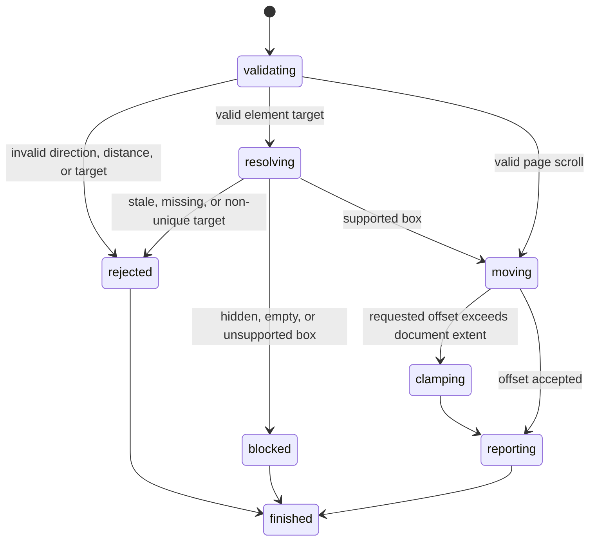

# Scroll the page and reveal an element

## Summary

Package callers submit `ScrollPage`, `ScrollElementIntoView`, or `ScrollIntoViewByLocator`.

Session callers send `scroll <up|down|left|right> [pixels]`.

They send `scrollintoview <ref|selector>`, `scrollinto <ref|selector>`, or use `find ... scroll`.

Page scrolling changes viewport offsets. Element scrolling reveals one supported normal-flow box when possible.

Supported local click, hover, check, and uncheck actions also reveal their targets before mutation.

## The simple case

The caller opens a tall local page and sends `scroll down`.

browser.jr moves down by 300 CSS pixels, subject to the document limit.

The caller sends `scrollintoview @e1`. browser.jr makes the nearest supported adjustment.

A later `get box @e1` reports viewport-relative coordinates from the new scroll position.

## The interaction, event by event

### Invoke

`ScrollPage` contains one `ScrollDirection` and an unsigned distance.

Session page scroll accepts `up`, `down`, `left`, or `right`.

The optional distance defaults to 300 CSS pixels. Zero is valid.

Element scrolling accepts a current interactive reference or strict locator.

Automatic action scrolling accepts no separate command or option.

### Exit immediately

Scrolling without an open page returns `SessionError::NoPage`.

Invalid session directions, distances, and target syntax use status two.

Stale references and strict locator failures use their existing errors.

These failures preserve page offsets and current references.

### Begin running

The current viewport uses the configured positive width and height.

The page owns unsigned horizontal and vertical scroll offsets.

The maximum offset is the supported document extent minus the viewport size.

Supported normal-flow boxes contribute their positive right and bottom edges.

Fixed boxes do not increase document extent.

### While running

Page scrolling adds or subtracts the requested distance and clamps each offset.

Element scrolling keeps a fully visible normal-flow box unchanged.

Otherwise, it makes the smallest axis adjustment that can reveal the box.

An oversized box aligns its start edge, subject to the page limit.

Fixed boxes keep viewport coordinates. Element scrolling cannot move them.

Hidden, empty, or unsupported boxes reject element scrolling without changing offsets.

Local click, hover, changed check, and changed uncheck run actionability checks before automatic scrolling.

These actions use the same smallest adjustment when the target has a supported box.

Unsupported target geometry leaves offsets unchanged. The validated action still runs.

Rejected actions and unchanged check states preserve page offsets.

Link and form click success replaces the page at zero offsets. Failed navigation preserves current offsets.

Scrolling preserves the document, focus, pointer target, controls, and interactive references.

### Finish

`PageScroll` returns `x`, `y`, and `moved`.

`ElementScroll` adds the current reference. `LocatorScroll` adds the resolved match.

Session page output uses `scrolled x=<x> y=<y> moved=<bool>`.

Element output adds its reference, element identifier, or semantic identity.

Action replies do not add scroll fields. Later box reads expose the new viewport-relative position.

## Variants

| Modifier | Set at invocation | Changed while running |
| --- | --- | --- |
| Flags and options | Page scroll accepts one direction and optional distance. Element scroll accepts one target. | Automatic action scrolling has no disable option. |
| Project configuration | The viewport starts at 1280 by 720 CSS pixels. | [`set viewport`](set-viewport.md) can resize it. |
| Target matrix | The current page supplies one document extent. | Navigation installs a fresh zero offset. |
| Output channel | Package requests return typed values. Session mode uses flushed text. | Output reports the committed offsets. |

## Cancel and interrupt

| Event | Before running | While running |
| --- | --- | --- |
| Ctrl+C once | The host or CLI process may exit. | Scrolling has no asynchronous phase. |
| Ctrl+C again before the evaluation stops | The process may already be gone. | No second-stage handler exists. |
| The process receives SIGTERM | The process may exit first. | In-memory offsets disappear. |
| The terminal closes | Package behavior is unchanged. | Session output may fail after mutation. |
| stdin or stdout closes | Closed stdin ends session mode. | Closed stdout can hide the committed result. |
| The network fails or a request times out | Scrolling uses no network. | The current page already exists. |
| The inspected page changes | Successful navigation installs a fresh page. | Static pages do not mutate themselves. |
| Another lint run targets the same page | It owns another session. | It cannot observe these offsets. |
| The process exits outright | No scroll request runs. | No offsets survive. |

## Interactions with other systems

**Configuration precedence.** The request supplies direction, distance, or target.

**Output and exit status.** Invalid inputs use status two. Blocked evidence uses status three.

**Resource limits.** Scrolling stores two unsigned offsets per current page.

**Network and storage.** Scrolling uses no network and writes no persistent storage.

**Rendering compatibility.** Playwright returns boxes relative to the viewport and changes them after scrolling.

Playwright scrolls pointer-action targets after actionability checks when scrolling is automatic.

`agent-browser` accepts the same four page directions and a `scrollintoview` command.

Lightpanda geometry differences remain in [`bug-triage.md`](../bug-triage.md).

**Isolation.** Scroll offsets belong to one page in one session.

**Accessibility inspection.** Semantic locator scrolling uses the implemented role and accessible-name subset.

## Edge cases

- A zero-distance page scroll returns `moved=false`.
- Reaching a page edge makes later movement in that direction idempotent.
- Up and left never produce negative page offsets.
- Down and right never exceed supported document extent.
- Normal-flow bounding boxes subtract current page offsets.
- Fixed bounding boxes ignore current page offsets.
- A fixed target returns `moved=false`, even when its box lies outside the viewport.
- A hidden or empty target rejects element scrolling.
- Unsupported geometry rejects element scrolling.
- Supported-box local click, hover, changed check, and changed uncheck reveal off-screen targets.
- Automatic action scrolling does not block an action when its box geometry is unsupported.
- A rejected action never changes page offsets.
- An unchanged check or uncheck returns without changing page offsets.
- Successful and failed element scrolling preserve current references.
- Open, reload, link navigation, form navigation, back, and forward start at zero offsets.

## Open questions and verification

- Define fractional scrolling and fractional CSS pixels.
- Add nested scroll-container ownership.
- Add smooth behavior and alignment options only after a caller needs them.
- Decide whether actions need a caller option to disable automatic scrolling.

Drafted from Rust package tests, compiled-process tests, Playwright documentation, and controlled `agent-browser` evidence on 2026-08-31.
