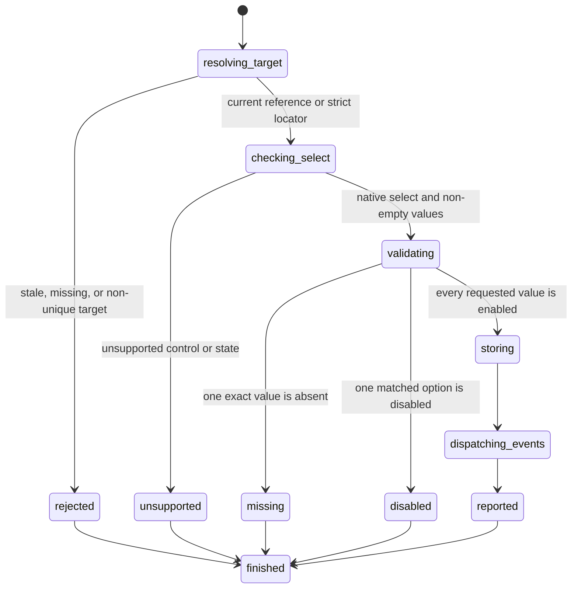

# Select options

## Summary

Package callers use `SelectElement` or `SelectByLocator` for one exact option value.

They use `SelectOptions` or `SelectOptionsByLocator` for a non-empty typed option list.

Session mode accepts `select <ref|selector> <value>` for one value. Quoted values form a list.

Select supports native single and multiple controls. A changed selection records bubbling `input` and `change` events.

## The simple case

The caller opens a page and targets a current select.

One exact value replaces the current selection. A non-empty value list can select multiple options.

A later value read and snapshot report the first selected value in document order.

## The interaction, event by event

### Invoke

Single-value package requests contain one typed reference or locator and one string.

List requests contain `NonEmpty<SelectOptionTarget>`. An empty option list is not representable.

Each package target is an exact value, exact label, or zero-based index.

Session mode treats an unquoted remainder as one exact value, including spaces.

Quoted values form a list: `select @e1 "b" "a"`. Every listed value must use quotes.

### Exit immediately

A stale package reference returns `SessionError::StaleElementReference`.

An unknown session label reports invalid input. Locator failures follow [Find elements with locators](../inspection/query-elements.md).

Malformed or incomplete quoted lists report invalid input before selection.

### Begin running

browser.jr resolves the target and confirms that it is a native `<select>`.

The engine resolves each typed target against parsed options in tree order.

An option uses its `value` attribute when present. Otherwise, it uses normalized descendant text.

An option label uses its `label` attribute when present. Otherwise, it uses normalized descendant text.

The engine resolves and validates the complete request before mutation.

### While running

Each value or label resolves to its first exact match. An index resolves directly from zero.

Targets that resolve to the same option are de-duplicated.

For a multiple select, all resolved options become selected. Earlier selections are cleared.

For a single select, the first matching option in document order becomes selected.

Any missing or disabled option rejects the complete request without changing selection.

An option is disabled when it has `disabled`. A disabled ancestor `<optgroup>` also disables it.

A disabled `<select>` remains readable but rejects selection changes.

Locator selection also requires supported visible evidence before mutation.

The action keeps the current reference usable. It changes no other control.

When selection changes, the implementation records `input`, then `change`. Both events bubble.

Selecting the current value records no event. The implementation does not invoke listeners or dispatch focus, pointer, or keyboard events.

It does not run scripts, constraint validation, form submission, or browser activation algorithms.

### Finish

Single-value requests return `SelectResult` or `SelectByLocatorResult`.

List requests return `SelectOptionsResult` or `SelectOptionsByLocatorResult`.

List results contain committed option values in request order after de-duplication.

Single-select list requests return only the actual selected value.

Reference output reports `value=<quoted-value>` for one value and `values=[...]` for a quoted list.

A later value read or snapshot reports the first selected value in document order.

## Variants

| Modifier | Set at invocation | Changed while running |
| --- | --- | --- |
| Option shape | One exact value or `NonEmpty<SelectOptionTarget>`. | Multiple selects commit every resolved option. Single selects commit one. |
| Session syntax | An unquoted remainder is one value. Quoted tokens form a list. | Select has no flags. |
| Target | A current reference or strict locator. | Select does not navigate or create a page. |
| Output channel | The package returns a typed result. Session mode uses flushed text. | A later snapshot exposes the first selected value. |

## Cancel and interrupt

| Event | Before running | While running |
| --- | --- | --- |
| Ctrl+C once | The host or CLI process may exit. | Select has no asynchronous phase or graceful handler. |
| Ctrl+C again before evaluation stops | The process may already be gone. | No second-stage handler exists. |
| The process receives SIGTERM | The process may exit before the request. | In-memory state disappears with the process. |
| The terminal closes | Package behavior is unchanged. | Session-mode output may fail. |
| stdin or stdout closes | Package behavior is unchanged. | Closed stdin ends session mode. Closed stdout causes status three. |
| The network fails or times out | Select uses no network. | The stored page already exists in memory. |
| The inspected page changes | Another snapshot or navigation can stale a reference. | Select changes only supported selection state. |
| Another lint run targets the page | It owns another session. | It cannot observe this in-memory state. |
| The process exits outright | No selection occurs. | No selected value survives. |

## Interactions with other systems

**Configuration precedence.** The request values are the only requested-selection source.

**Output and exit status.** Package callers receive typed results or `SessionError`. Session failures use status two or three.

**Resource limits.** No separate value limit exists. Session values fit on one input line.

**Network and storage.** Select uses no network and writes no persistent storage.

**Rendering compatibility.** Select mutates browser.jr's static native-select model. It implements no browser event algorithms.

**Playwright compatibility.** Value, label, index, lists, and single-select resolution follow [Playwright locator.selectOption](https://playwright.dev/docs/api/class-locator#locator-select-option) option behavior.

**agent-browser compatibility.** Quoted lists match its command shape. browser.jr returns committed values, not merely requested values.

An observed agent-browser 0.32.4 run accepted a disabled option. browser.jr keeps disabled-option rejection.

**Isolation.** Selection state belongs to one session and document. Navigation replaces it.

**Accessibility inspection.** A normal single select reports `combobox`. Multiple or `size > 1` reports `listbox`.

## Edge cases

- A multiple select preserves every initial `selected` attribute.
- For a single select, the last parsed `selected` attribute establishes initial state.
- Otherwise, a display size of one selects the first non-disabled option.
- A listbox-shaped single select may start without a selected option.
- A multiple select may start without a selected option.
- Value reads return the first selected value, or an empty string when none exists.
- `select @e1 ` requests one empty value. `select @e1` is invalid input.
- Session values may contain spaces. They cannot contain line breaks.
- Quoted session values do not support quote escapes yet.
- Duplicate requested values select one matching option and return one value.
- Duplicate option values use the first option. A disabled first match rejects the action.
- Labels match exactly. A `label` attribute takes priority over descendant text.
- Indexes start at zero. An out-of-range index is not found.
- A missing value returns `SessionError::SelectOptionNotFound`.
- A disabled match returns `SessionError::SelectOptionDisabled`.
- Missing or disabled label and index targets return typed target errors.
- A non-select reference rejects selection.
- Repeated selection is idempotent.
- Direct selectors resolve strictly without a prior snapshot.
- Rejected actions preserve selection state and the current reference.
- A later snapshot invalidates the action reference.

## Open questions and verification

- Define empty-list selection and explicit deselection.
- Define label and index syntax for session mode.
- Define focus, listener, and native activation behavior before broadening event dispatch.
- Define form reset and submission behavior.
- Define quote escaping for session value lists.

Drafted from the Rust implementation, controlled comparisons, and package and compiled-process tests on 2026-08-31.
