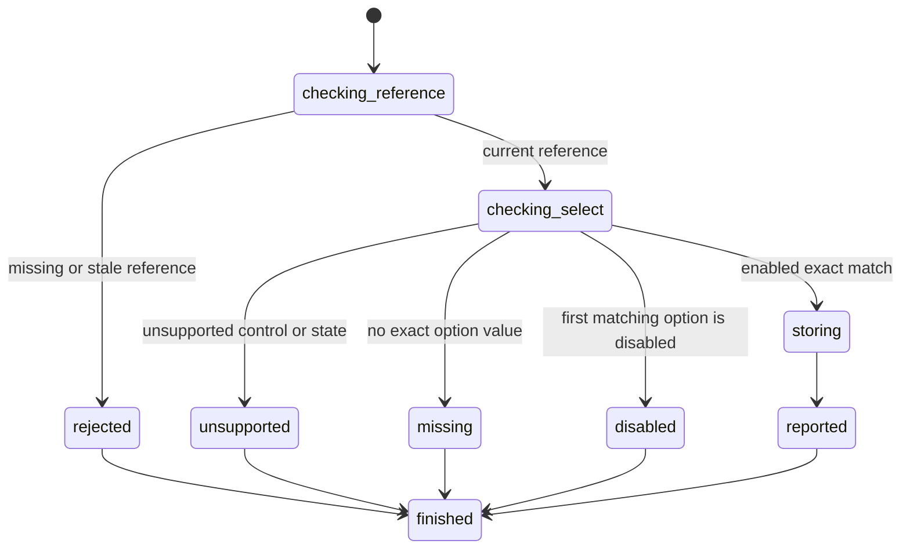

# Select one option

## Summary

Package callers submit `SelectElement` with a current interactive reference and one exact option value.

Session-mode callers send `select <ref> <value>` after an interactive snapshot.

Select supports native single-select controls. It does not dispatch browser events.

## The simple case

The caller opens a page and captures an interactive snapshot. It selects a combobox reference.

The caller supplies one exact option value. browser.jr stores the first matching option and reports its value.

The current reference remains usable. A later snapshot reports the selected value.

## The interaction, event by event

### Invoke

The package request contains one typed reference and one string.

Session mode reads the reference and treats the remaining line as the exact value.

### Exit immediately

A stale package reference returns `SessionError::StaleElementReference`.

An unknown session label reports invalid input. Neither path changes selection state.

### Begin running

browser.jr confirms that the source element is a native single `<select>`.

The engine compares the supplied string with each parsed option value in tree order.

An option uses its `value` attribute when present. Otherwise, it uses normalized descendant text.

### While running

The first exact match determines the result. A disabled first match rejects the action.

An option is disabled when it has `disabled`. A disabled ancestor `<optgroup>` also disables it.

A disabled `<select>` remains readable but rejects selection changes.

The action keeps the current reference usable. It changes no other control.

The implementation dispatches no `input`, `change`, focus, pointer, or keyboard events.

It does not run scripts, constraint validation, form submission, or browser activation algorithms.

### Finish

The package returns `SelectResult` with the reference and selected value.

Session mode reports `selected ref=<ref> value=<quoted-value>` and flushes stdout.

A later interactive snapshot reports the current value. That capture makes the earlier reference stale.

## Variants

| Modifier | Set at invocation | Changed while running |
| --- | --- | --- |
| Flags and options | The package takes a string. Session mode takes the rest of one line. | Select has no flags. |
| Project configuration | No select configuration exists. | Nothing reloads. |
| Target matrix | The current page and snapshot select one control. | Select does not navigate or create a page. |
| Output channel | The package returns a typed result. Session mode uses flushed text. | A later snapshot exposes the selected value. |

## Cancel and interrupt

| Event | Before running | While running |
| --- | --- | --- |
| Ctrl+C once | The host or CLI process may exit. | Select has no asynchronous phase or graceful handler. |
| Ctrl+C again before the evaluation stops | The process may already be gone. | No second-stage handler exists. |
| The process receives SIGTERM | The process may exit before the request. | In-memory state disappears with the process. |
| The terminal closes | Package behavior is unchanged. | Session-mode output may fail. |
| stdin or stdout closes | Package behavior is unchanged. | Closed stdin ends session mode. Closed stdout causes status three. |
| The network fails or a request times out | Select uses no network. | The stored page already exists in memory. |
| The inspected page changes | Another snapshot or navigation can stale the reference. | Select itself changes only the supported value. |
| Another lint run targets the same page | It owns another session. | It cannot observe this in-memory value. |
| The process exits outright | No selection occurs. | No selected value survives. |

## Interactions with other systems

**Configuration precedence.** The request string is the only requested-value source.

**Output and exit status.** Package callers receive `SelectResult` or `SessionError`. Session failures use status two or three.

**Resource limits.** No separate value limit exists. Session mode limits one value to one input line.

**Network and storage.** Select uses no network and writes no persistent storage.

**Rendering compatibility.** Select mutates browser.jr's native single-select model. It does not implement browser event algorithms.

**Isolation.** Selection state belongs to one session and document. Navigation replaces it.

**Accessibility inspection.** A single select normally reports `combobox`. A select with `multiple` or `size > 1` reports `listbox`.

## Edge cases

- A present `selected` attribute establishes initial state.
- When several options have `selected`, the last parsed option starts selected.
- Otherwise, a display size of one selects the first non-disabled option.
- A single-select listbox may start without a selected option.
- An empty selection value returns an empty string.
- `select @e1 ` requests an empty value. `select @e1` is invalid input.
- Session values may contain spaces. They cannot contain line breaks.
- Session mode removes delimiter whitespace and preserves trailing whitespace.
- Duplicate values use the first match. A disabled first match rejects the action.
- A missing value returns `SessionError::SelectOptionNotFound`.
- A disabled match returns `SessionError::SelectOptionDisabled`.
- Multiple selects reject value reads and selection changes.
- Label and index matching are not implemented.
- A non-select reference rejects selection.
- Repeated selection is idempotent.
- Rejected actions preserve selection state and the current reference.
- A later snapshot invalidates the action reference.

## Open questions and verification

- Define multiple selection and its returned value shape.
- Decide whether later matching options may bypass a disabled duplicate.
- Add label and index matching only with separate typed request fields.
- Define event order before adding event dispatch.
- Define form reset and submission behavior.

Drafted from the Rust implementation and package and compiled-process tests on 2026-08-31.
