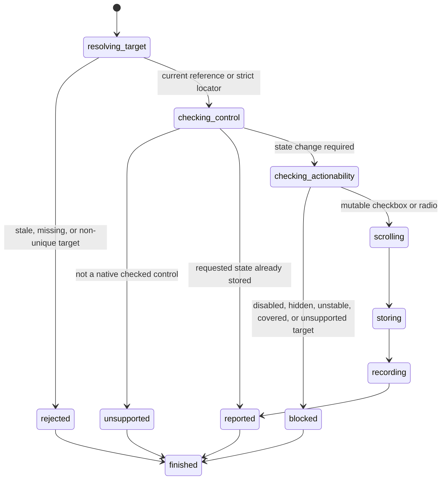

# Set checked state

## Summary

Package callers submit `SetElementChecked` with a current interactive reference and Boolean state.

Session-mode callers use `check <ref|selector>` or `uncheck <ref|selector>`. Direct selectors need no snapshot.

[Locator actions](../inspection/query-elements.md) define the snapshot-free checked-state path.

The action supports native checkbox and radio inputs.

A changed state records `click`, `input`, and `change` in the native event transcript.

A changed state reveals an off-screen target when browser.jr has complete box geometry.

Supported static hit-test scenes reject a changed state when an outside element owns the action point.

## The simple case

The caller opens a page and captures an interactive snapshot. It selects a checkbox or radio reference.

`check` stores true. `uncheck` stores false. The typed result reports the stored state.

Repeating either action returns the same state without an error.

Checking a radio selects it and unchecks its group peers. A checked radio cannot be unchecked through activation.

## The interaction, event by event

### Invoke

The package request contains one typed reference or locator and one Boolean value.

Session mode maps `check` to true and `uncheck` to false for references and selectors.

### Exit immediately

A stale package reference returns `SessionError::StaleElementReference`.

An unknown session label reports invalid input. Locator failures follow [Find elements with locators](../inspection/query-elements.md).

### Begin running

browser.jr confirms that the resolved source element is `input[type=checkbox]` or `input[type=radio]`.

An already stored state returns before visibility, enabled-state, or scrolling checks.

Changed states require supported visible and static stability evidence. Disabled controls reject changes.

Inline animation or transition declarations on the target or its ancestors block changed requests.

Supported target geometry enables a bounded `ReceivesEvents` check at the prospective post-scroll action point.

The check accepts target descendants and ignores boxes with `pointer-events:none`.

Overlapping unsupported hit-test evidence blocks the changed request.

Unsupported target geometry keeps the earlier checked-state behavior without claiming a complete document hit test.

Explicit ARIA checked roles do not create mutable native state.

Unsupported box geometry leaves offsets unchanged. It does not block a valid changed state.

### While running

Changed checkbox actions reveal supported target boxes before replacing the stored Boolean state.

They commit the same prospective scroll used to choose the action point.

Rejected changes preserve page offsets and checked state.

The current reference remains usable.

Checking a radio stores true and unchecks every radio in its group.

One radio group shares an exact non-empty name and form owner. Missing or empty names create singleton groups.

Unchecking a false radio returns false. Unchecking a true radio rejects without changing its group.

A changed state records `click`, then `input`, then `change`.

All three records bubble. `click` and `input` compose. `change` does not compose.

An idempotent request records nothing. Rejected changes also record nothing.

The action does not change focus or record pointer and focus events.

The transcript does not deliver events to page scripts.

### Finish

The package returns `SetCheckedResult` for references or `SetCheckedByLocatorResult` for locators.

Reference output reports `set checked ref=<ref> value=<boolean>`. Direct selector output includes the resolved element and state.

Package callers drain records with `TakeDomEvents`. Session callers use `events`.

A later snapshot reports the current state and invalidates earlier references.

## Variants

| Modifier | Set at invocation | Changed while running |
| --- | --- | --- |
| Flags and options | The package takes a reference or locator and Boolean. Session mode uses separate commands. | No checked-state flags exist. |
| Project configuration | No checked-state configuration exists. | Nothing reloads. |
| Target matrix | The current page and snapshot select one native control. | The action does not navigate. |
| Output channel | The package returns a typed result. Session mode uses flushed text. | A later snapshot exposes the state. |

## Cancel and interrupt

| Event | Before running | While running |
| --- | --- | --- |
| Ctrl+C once | The host or CLI process may exit. | The action has no asynchronous phase. |
| Ctrl+C again before the evaluation stops | The process may already be gone. | No second-stage handler exists. |
| The process receives SIGTERM | The process may exit before the request. | In-memory state disappears. |
| The terminal closes | Package behavior is unchanged. | Session output may fail. |
| stdin or stdout closes | Package behavior is unchanged. | Closed stdin ends session mode. |
| The network fails or times out | The action uses no network. | The page already exists in memory. |
| The inspected page changes | Navigation can stale the reference. | This action changes only checked state. |
| Another lint run targets the page | It owns another session. | It cannot observe this state. |
| The process exits outright | No action occurs. | No checked state survives. |

## Interactions with other systems

**Configuration precedence.** The request Boolean is the only new-state source.

**Output and exit status.** Package callers receive a typed result or `SessionError`. Session failures use status two or three.

**Resource limits.** The action allocates no page-sized data.

**Network and storage.** The action uses no network and writes no persistent storage.

**Rendering compatibility.** The action mutates browser.jr's native checked-state model.

Changed requests record the Playwright `click`, `input`, `change` order. Idempotent requests remain silent.

browser.jr does not run platform event handlers.

Controlled Playwright 1.62.1 Chromium, Firefox, and WebKit runs matched changed and idempotent requests.

Playwright requires stable geometry for changed checked-state actions.

Playwright also requires the target to receive pointer events.

Controlled Playwright 1.62.1 Chromium, Firefox, and WebKit rejected a fixed blocker.

They ignored a `pointer-events:none` blocker. `agent-browser` Lightpanda rejected it. See [BJR-011](../bug-triage.md#bjr-011).

**Isolation.** Checked state belongs to one session and document.

**Accessibility inspection.** The accessible name remains separate from checked state.

## Edge cases

- An absent `checked` attribute starts false.
- A present `checked` attribute starts true.
- The last initially checked radio in one group becomes the selected radio.
- Repeated checkbox check and uncheck requests are idempotent.
- Idempotent checked-state requests record no events.
- Changed checkbox and radio requests record `click`, `input`, and `change`.
- Inline animation or transition declarations block changed requests before mutation.
- A supported outside blocker preserves offsets, checked state, references, and events.
- A target with `pointer-events:none` rejects when another supported element owns the action point.
- Repeated state requests return without changing page offsets.
- Changed state reveals an off-screen supported target before mutation.
- Unsupported target geometry leaves offsets unchanged and still commits a valid change.
- Rejected checked-state changes preserve page offsets.
- Repeated radio check requests are idempotent.
- An unchecked radio accepts `uncheck` idempotently. A checked radio rejects `uncheck`.
- Disabled native controls remain readable but reject changes.
- Radios in different forms remain independent, even when their names match.
- Unnamed radios form singleton groups.
- Switches reject checked-state mutation.
- Explicit ARIA roles do not create native checked behavior.
- Rejected actions preserve state and the current reference.
- Direct selectors resolve strictly without a prior snapshot.
- A later snapshot invalidates the action reference.

## Open questions and verification

- Add page-script event delivery after JavaScript exists.
- Define keyboard activation records separately from direct checked-state actions.
- Define ARIA state observation separately from native checked state.
- Add form submission after scripts and activation behavior exist.
- Complete stacking, clipping, transformed geometry, and unsupported-scene hit testing.

Drafted from Rust package and compiled-process tests on 2026-09-01.
