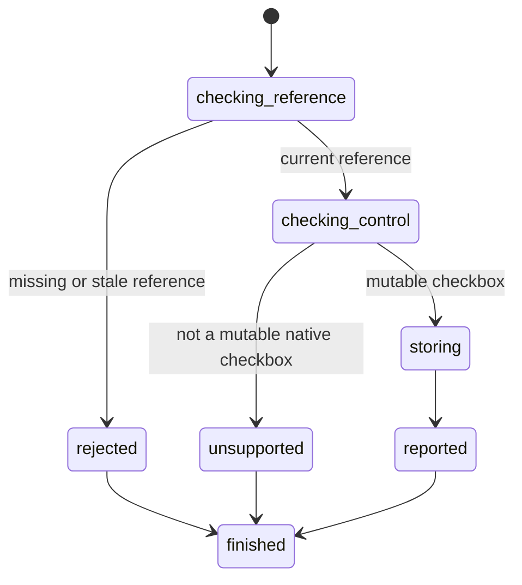

# Set checkbox state

## Summary

Package callers submit `SetElementChecked` with a current interactive reference and Boolean state.

Session-mode callers use `check <ref>` or `uncheck <ref>` after an interactive snapshot.

[Locator actions](../inspection/query-elements.md) define the snapshot-free checked-state path.

The action supports native checkbox inputs. It does not dispatch browser events.

## The simple case

The caller opens a page and captures an interactive snapshot. It selects a checkbox reference.

`check` stores true. `uncheck` stores false. The typed result reports the stored state.

Repeating either action returns the same state without an error.

## The interaction, event by event

### Invoke

The package request contains one typed reference and one Boolean value.

Session mode maps `check` to true and `uncheck` to false.

### Exit immediately

A stale package reference returns `SessionError::StaleElementReference`.

An unknown session label reports invalid input. Neither path changes any checkbox.

### Begin running

browser.jr confirms that the referenced source element is `input[type=checkbox]`.

Disabled checkboxes reject changes. Explicit ARIA checkbox roles do not create mutable native state.

### While running

The engine replaces the stored Boolean state. The current reference remains usable.

The action does not dispatch `input`, `change`, click, focus, or pointer events.

### Finish

The package returns `SetCheckedResult` with the reference and stored state.

Session mode reports `set checked ref=<ref> value=<boolean>` and flushes stdout.

A later snapshot reports the current state and invalidates earlier references.

## Variants

| Modifier | Set at invocation | Changed while running |
| --- | --- | --- |
| Flags and options | The package takes a Boolean. Session mode uses separate commands. | No checked-state flags exist. |
| Project configuration | No checkbox configuration exists. | Nothing reloads. |
| Target matrix | The current page and snapshot select one checkbox. | The action does not navigate. |
| Output channel | The package returns a typed result. Session mode uses flushed text. | A later snapshot exposes the state. |

## Cancel and interrupt

| Event | Before running | While running |
| --- | --- | --- |
| Ctrl+C once | The host or CLI process may exit. | The action has no asynchronous phase. |
| Ctrl+C again before the evaluation stops | The process may already be gone. | No second-stage handler exists. |
| The process receives SIGTERM | The process may exit before the request. | In-memory state disappears. |
| The terminal closes | Package behavior is unchanged. | Session output may fail. |
| stdin or stdout closes | Package behavior is unchanged. | Closed stdin ends session mode. |
| The network fails or times out | The action uses no network. | The page already exists in memory. |
| The inspected page changes | Navigation can stale the reference. | This action changes only checked state. |
| Another lint run targets the page | It owns another session. | It cannot observe this state. |
| The process exits outright | No action occurs. | No checkbox state survives. |

## Interactions with other systems

**Configuration precedence.** The request Boolean is the only new-state source.

**Output and exit status.** Package callers receive a typed result or `SessionError`. Session failures use status two or three.

**Resource limits.** The action allocates no page-sized data.

**Network and storage.** The action uses no network and writes no persistent storage.

**Rendering compatibility.** The action mutates browser.jr's checkbox model. It does not implement the platform activation algorithm.

**Isolation.** Checked state belongs to one session and document.

**Accessibility inspection.** The accessible name remains separate from checked state.

## Edge cases

- An absent `checked` attribute starts false.
- A present `checked` attribute starts true.
- Repeated check and uncheck requests are idempotent.
- Disabled native checkboxes remain readable but reject changes.
- Radio buttons and switches reject checked-state mutation.
- Explicit ARIA roles do not create native checkbox behavior.
- Rejected actions preserve state and the current reference.
- A later snapshot invalidates the action reference.

## Open questions and verification

- Define checkbox event order before adding event dispatch.
- Define radio-group behavior before supporting radio changes.
- Define ARIA state observation separately from native checkbox state.
- Add form submission after scripts and activation behavior exist.

Drafted from Rust package and compiled-process tests on 2026-08-31.
