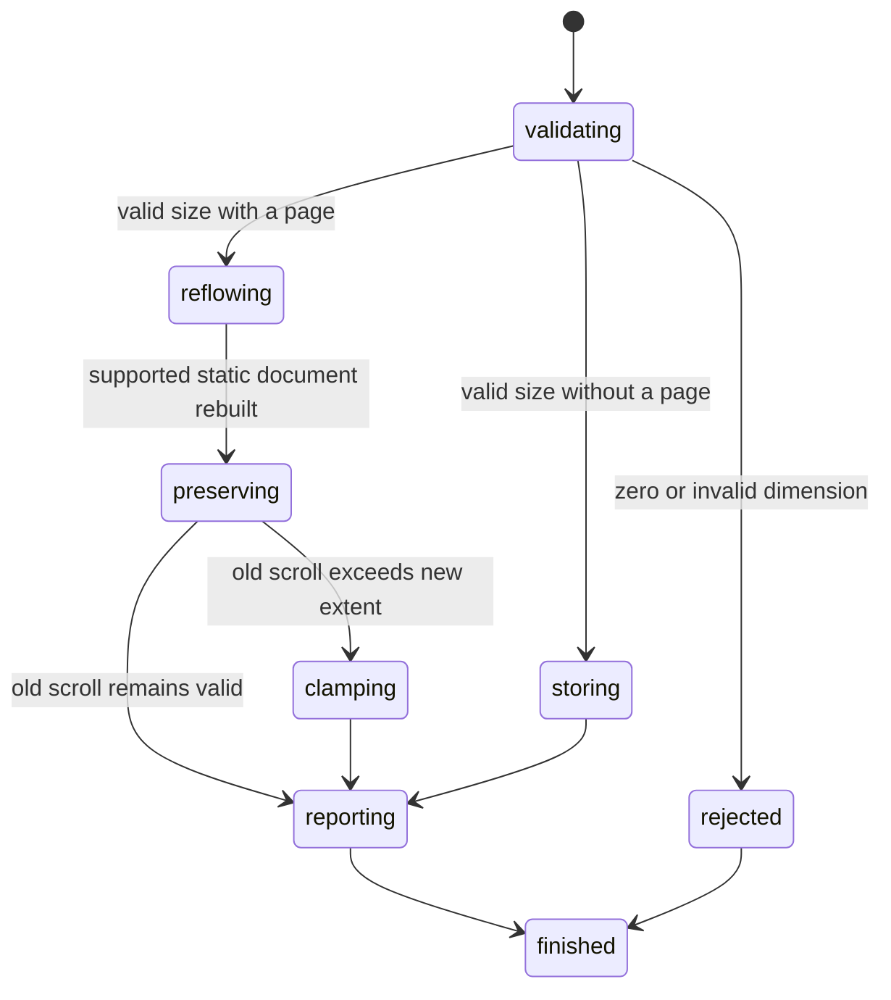

# Set the viewport size

## Summary

Package callers submit `SetViewportSize` or `GetViewportSize`.

Session callers send `set viewport <width> <height>` or `get viewport`.

The default viewport is 1280 by 720 CSS pixels.

A valid size configures later pages and reflows the current static page.

## The simple case

The caller sends `set viewport 640 480` before `open`.

browser.jr stores the size. The next page uses 640 CSS pixels for supported layout.

The caller later sends `set viewport 800 600`.

browser.jr reflows supported geometry without replacing the document or current references.

## The interaction, event by event

### Invoke

`SetViewportSize` contains unsigned `width` and `height` values.

Both dimensions must be positive.

`GetViewportSize` returns the configured size without requiring an open page.

Session values use base-10 CSS pixels.

### Exit immediately

Zero dimensions return `SessionError::InvalidViewportSize`.

Malformed, negative, missing, or extra session values use status two.

Invalid input preserves the configured size, current page, state, references, and offsets.

### Begin running

A size set before `open` changes the session's next page viewport.

A size set after `open` recomputes supported static geometry from the retained HTML.

Viewport width changes containing blocks and supported document width.

Viewport height changes the visible area and vertical scroll limit.

### While running

Current text values, checked state, selections, focus, and pointer target survive reflow.

The document epoch and current interactive references also survive.

The locator index keeps the same source identity and receives new box evidence.

Current page offsets clamp when the larger viewport reduces their maximum.

The resize does not fetch, navigate, run scripts, or dispatch resize events.

Repeated equal sizes are idempotent and report `resized=false`.

### Finish

`ViewportSize` contains the committed `width` and `height`.

`ViewportResize` adds `resized` and the resulting `PageScroll`.

Session set output reports size, resize state, offsets, and whether clamping moved them.

Session get output reports the current width and height.

## Variants

| Modifier | Set at invocation | Changed while running |
| --- | --- | --- |
| Flags and options | Set accepts two positive dimensions. Get accepts none. | No device scale, screen, orientation, or mobile option exists. |
| Project configuration | The session starts at 1280 by 720 CSS pixels. | A valid set replaces both dimensions. |
| Target matrix | One session supplies one viewport to its current page. | Later navigation keeps the size and resets page offsets. |
| Output channel | Package requests return typed values. Session mode uses flushed text. | Output reports committed state only. |

## Cancel and interrupt

| Event | Before running | While running |
| --- | --- | --- |
| Ctrl+C once | The host or CLI process may exit. | Reflow has no asynchronous phase. |
| Ctrl+C again before the evaluation stops | The process may already be gone. | No second-stage handler exists. |
| The process receives SIGTERM | The process may exit first. | In-memory viewport state disappears. |
| The terminal closes | Package behavior is unchanged. | Session output may fail after reflow. |
| stdin or stdout closes | Closed stdin ends session mode. | Closed stdout can hide the committed result. |
| The network fails or a request times out | Viewport sizing uses no network. | The current page already exists. |
| The inspected page changes | Successful navigation installs a fresh document at this size. | Static pages do not mutate themselves. |
| Another lint run targets the same page | It owns another session and viewport. | It cannot observe this size. |
| The process exits outright | No request runs. | No viewport state survives. |

## Interactions with other systems

**Configuration precedence.** The latest valid session size supplies current and later page layout.

**Output and exit status.** Invalid dimensions use status two. Reflow itself has no blocked result.

**Resource limits.** Dimensions use unsigned 64-bit CSS pixel values.

**Network and storage.** Reflow uses retained HTML and writes no persistent storage.

**Rendering compatibility.** Playwright supports per-page viewport size and recommends sizing before navigation.

Playwright also changes screen size. browser.jr does not model screen properties yet.

`agent-browser` accepts `set viewport` before and after `open`.

**Isolation.** Viewport state belongs to one session and its current page.

**Accessibility inspection.** Reflow preserves semantic source identity and current references.

## Edge cases

- `set viewport 0 600` is invalid.
- The default size is 1280 by 720 CSS pixels.
- Setting a size before open affects the first loaded page.
- Setting the same size reports `resized=false`.
- A wider viewport recomputes supported normal-flow widths.
- A taller viewport can clamp existing vertical scroll.
- A narrower viewport can increase horizontal scroll extent.
- Current control values and focus survive reflow.
- Current references remain usable after reflow.
- Navigation keeps viewport size but starts new page offsets at zero.
- Embedded and linked stylesheets remain unsupported after reflow.

## Open questions and verification

- Add screen size, device scale, orientation, touch, and mobile emulation.
- Apply media queries after stylesheet support exists.
- Dispatch resize events after JavaScript exists.
- Define practical upper dimension limits before accepting remote wire inputs.

Drafted from Rust package tests, compiled-process tests, Playwright documentation, and controlled `agent-browser` evidence on 2026-08-31.
