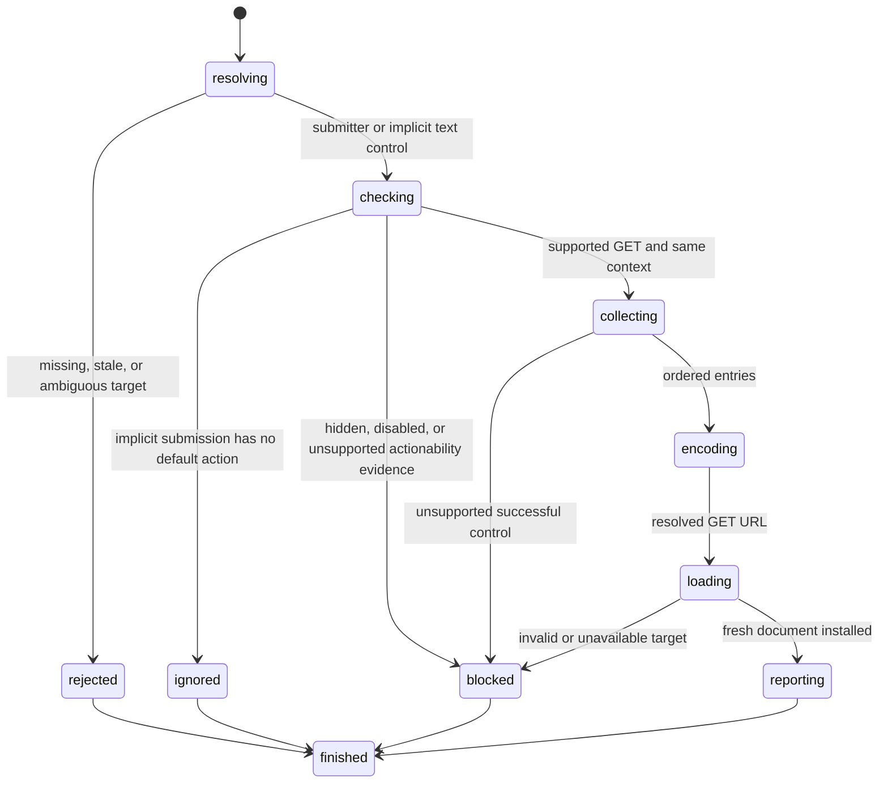

# Submit a form

## Summary

browser.jr supports bounded native GET form submission.

A visible enabled submit button can navigate its same-context form.

Click, `Enter`, and `Space` can activate that submitter.

`Enter` on a supported single-line text control can submit its form implicitly.

The engine serializes supported successful controls from current page state.

POST, reset, validation, events, files, and image coordinates remain unsupported.

## The simple case

The caller fills a named text input and clicks its form's submit button.

browser.jr builds the GET query, loads the action URL, and installs the returned document.

The navigation result reports the submitter and opened page.

## The interaction, event by event

### Invoke

Reference clicks use `ClickElement` with a current submit-button reference.

Locator clicks use `ClickByLocator` or `ClickByRole`.

`PressKey` activates a focused submit button with `Enter` or `Space`.

`PressByLocator` focuses one submit button before applying that activation key.

`PressKey` also accepts `Enter` after fill or focus selects a supported single-line input.

`PressByLocator` can resolve that text input and apply the same implicit path.

### Exit immediately

Stale references and strict locator failures reject before form processing.

Hidden and disabled submitters fail their existing click or focus boundary.

A disabled default submitter makes implicit `Enter` succeed without navigation.

Reset buttons and image submitters report unsupported native behavior.

POST, dialog methods, and non-self targets report unsupported submission.

### Begin running

The submitter's `form` attribute can select a form by exact ID.

Otherwise, the nearest ancestor form owns the submitter.

`formaction`, `formmethod`, and `formtarget` override the owning form's values.

Missing and invalid method values use GET. Explicit POST and dialog methods block.

Missing or empty action values use the current page URL.

Missing, empty, and `_self` targets use the current browsing context.

Other targets block before collection or loading.

Implicit submission first finds the form's first submit button in document order.

An enabled default submitter contributes its value and overrides.

A disabled default submitter ends the press without choosing a later button.

Without a submit button, more than one blocking input ends the press without navigation.

Zero or one blocking input submits from the form without a submitter entry.

### While running

browser.jr scans form controls in current document order.

An exact `form` attribute can include controls outside the form subtree.

Controls need a non-empty `name` and the same form owner.

Disabled controls and disabled-fieldset descendants do not produce entries.

The first-legend exception for disabled fieldsets is not implemented.

Supported text inputs and textareas use their current stored values.

Password and hidden inputs use their static source values.

Checked native checkboxes and radios produce entries. Missing values become `on`.

Native selects produce each selected enabled option value.

Only the activated named submitter contributes its value.

Direct implicit submission has no activated submitter entry.

Unchecked controls, unnamed controls, other buttons, and disabled options produce no entry.

File inputs and unsupported input types block the complete submission.

Names and values use UTF-8 form URL encoding.

Spaces become `+`. Line endings become CRLF before percent encoding.

Existing action-query fields remain first. Form entries follow in document order.

The loader applies the existing loopback, status, media-type, and body limits.

### Finish

Successful submission uses the existing `Navigated` click or press effect.

An implicit no-op uses `PressEffect::Ignored` and preserves the document.

The reported URL includes the complete encoded query.

Success installs a fresh document and history entry.

It clears previous references, focus, hover, control state, and layout evidence.

Collection, encoding, URL, or load failure preserves the current document.

It also preserves history position and current references.

## Variants

| Modifier | Set at invocation | Changed while running |
| --- | --- | --- |
| Flags and options | The submitter supplies action, method, and target overrides. | No force, trial, timeout, or validation option exists. |
| Project configuration | No form configuration exists. | Nothing reloads. |
| Target matrix | The current page supplies form and control state. | Success replaces the current document. |
| Output channel | Package requests return typed navigation results. Session mode uses flushed text. | Output does not expose control values separately. |

## Cancel and interrupt

| Event | Before running | While running |
| --- | --- | --- |
| Ctrl+C once | The host or CLI process may exit. | No package cancellation contract exists. |
| Ctrl+C again before the evaluation stops | The process may already be gone. | No second-stage handler exists. |
| The process receives SIGTERM | The process may exit first. | No partial document commits. |
| The terminal closes | Package behavior is unchanged. | Session output may fail. |
| stdin or stdout closes | Package behavior is unchanged. | Closed stdin ends session mode. |
| The network fails or a request times out | Collection still uses current state. | Failed loading preserves the current page. |
| The inspected page changes | Static pages do not mutate themselves. | Another successful navigation replaces form state. |
| Another lint run targets the same page | It owns another session. | It cannot observe this submission. |
| The process exits outright | No submission starts. | No in-memory state survives. |

## Interactions with other systems

**Configuration precedence.** Submitter overrides win over form attributes. Defaults apply after both.

**Output and exit status.** Invalid targets use status two. Unsupported or unavailable submission uses status three.

**Resource limits.** The page body limit remains one MiB. Query length has no separate limit.

**Network and storage.** Supported submission sends one loopback HTTP GET. It writes no persistent storage.

**Rendering compatibility.** HTML defines form owners, entry construction, submitter overrides, activation, and implicit submission.

See the HTML [form submission](https://html.spec.whatwg.org/multipage/form-control-infrastructure.html#form-submission-algorithm) and [entry construction](https://html.spec.whatwg.org/multipage/form-control-infrastructure.html#constructing-entry-list) rules.

The HTML [implicit submission](https://html.spec.whatwg.org/multipage/form-control-infrastructure.html#implicit-submission) rule defines default-button and blocker behavior.

Playwright documents fill followed by `Enter` as a form workflow.

See Playwright's [text input](https://playwright.dev/docs/input#text-input) and [`locator.press()`](https://playwright.dev/docs/api/class-locator#locator-press) behavior.

Encoding follows the URL Standard's [form URL-encoded serializer](https://url.spec.whatwg.org/#application-x-www-form-urlencoded).

A controlled `agent-browser` 0.32.4 Chromium run matched supported query order and encoding.

That run also preserved existing action-query fields before form entries.

An `agent-browser` 0.32.4 Lightpanda run submitted forms but diverged from the HTML implicit rule.

It skipped default-submitter overrides and submitted cases that HTML leaves unchanged.

browser.jr follows the HTML and Playwright behavior for these cases.

browser.jr does not claim validation, event, or complete successful-control parity.

**Isolation.** Form state belongs to one session and document.

**Accessibility inspection.** Semantic submit-button locators use the implemented accessible-name subset.

## Edge cases

- A submit button without a form activates without navigation.
- A `type="button"` inside a form activates without submission.
- A default `button` inside a form submits through GET.
- An invalid button type follows the default submit behavior.
- A submitter with another form ID uses that exact owner.
- A missing form ID leaves the button without a form owner.
- Multiple entries with one name preserve document order.
- A selected disabled option produces no entry.
- An empty successful-control set preserves the action query only.
- A failed remote target preserves the current page and references.
- A failed `PressByLocator` submission keeps its newly focused submitter.
- Direct click failure preserves the previous focus.
- Fill stores focus, so a following `press Enter` can submit implicitly.
- The first form-owned submit button is the default, including an earlier external submitter.
- A disabled default button does not fall through to a later enabled submitter.
- Multiple blocking inputs without a submit button produce `Ignored`.
- Zero or one blocking input without a submit button submits without a submitter entry.
- A single-line input outside a form reports `Ignored`.

## Open questions and verification

- Implement constraint validation, `novalidate`, and `formnovalidate`.
- Implement submit, formdata, input, change, keyboard, and pointer events.
- Implement POST, multipart, text/plain, files, and image coordinates.
- Implement the disabled-fieldset first-legend exception.
- Expand implicit submission beyond the supported text-control subset.
- Model command buttons and buttons inside native selects.
- Expand input-type value sanitization and successful-control coverage.
- Define fragments, redirects, timeouts, and request cancellation.

Drafted from package tests, compiled-process tests, living standards, and controlled Chromium evidence on 2026-08-31.
