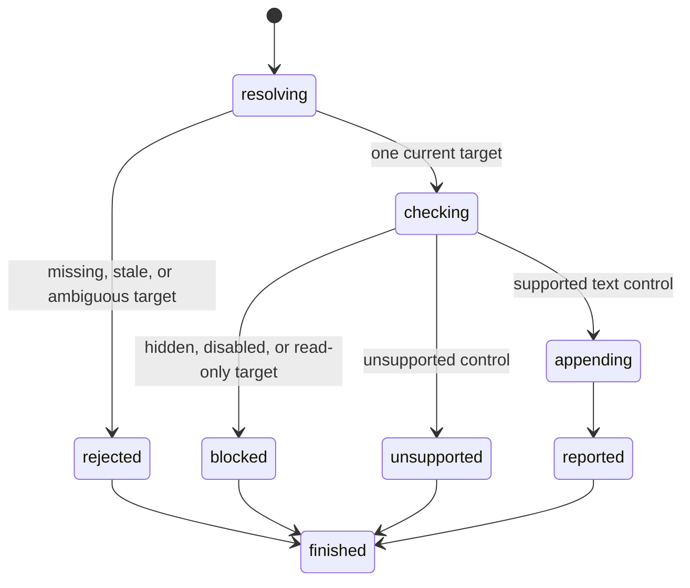

# Type text

## Summary

Package callers submit `TypeElement` with a current interactive reference and appended text.

`TypeByLocator` gives package callers a snapshot-free locator path.

Session-mode callers send `type <ref|selector> <text>`.

Type appends to the supported current text-control value. It preserves focus and the control's existing selection.

It does not dispatch browser events.

## The simple case

The caller opens a page with a text input whose current value is `hello`.

It types ` world` through a current reference or direct selector. browser.jr stores `hello world` and reports success.

A value read or later snapshot reports the complete current value.

## The interaction, event by event

### Invoke

The package request contains a typed reference or `Locator` and one string.

Session mode reads a reference or direct selector. It treats the remaining line as appended text.

### Exit immediately

A stale package reference returns `SessionError::StaleElementReference`.

Unknown or stale session labels report invalid input. Invalid or ambiguous direct selectors report locator errors.

None of these paths changes the document.

### Begin running

browser.jr checks the target's supported text-control capability.

[Value inspection](../inspection/read-value.md) defines the supported input and textarea subset.

Direct locators also require supported visible evidence. Disabled and read-only controls reject type.

### While running

Type appends the request text exactly once to the end of the stored value.

It keeps the current reference usable. An empty string succeeds without changing the value.

The implementation does not focus the control or dispatch keyboard, `beforeinput`, `input`, or `change` events.

It does not use the selection for insertion. It does not model typing delay, native validation, scripts, or submission.

Focused selection-based text belongs to [`keyboard type` and `keyboard inserttext`](press-key.md).

### Finish

`TypeResult` returns the reference and complete current value.

`TypeByLocatorResult` returns the resolved match and complete current value.

Session mode reports target identity and the Unicode scalar-value count of appended text. It does not echo the text.

A later value read or snapshot reports the complete current value. A new snapshot makes the earlier reference stale.

## Variants

| Modifier | Set at invocation | Changed while running |
| --- | --- | --- |
| Flags and options | The package takes a string. Session mode takes the rest of one line. | Type has no flags or delay option. |
| Project configuration | No type configuration exists. | Nothing reloads. |
| Target matrix | The current page supplies one reference or locator target. | Type does not navigate or create a page. |
| Output channel | Package requests return typed values. Session mode uses flushed text. | A later read or snapshot exposes the stored value. |

## Cancel and interrupt

| Event | Before running | While running |
| --- | --- | --- |
| Ctrl+C once | The host or CLI process may exit. | Type has no asynchronous phase or graceful handler. |
| Ctrl+C again before the evaluation stops | The process may already be gone. | No second-stage handler exists. |
| The process receives SIGTERM | The process may exit before the request. | In-memory state disappears with the process. |
| The terminal closes | Package behavior is unchanged. | Session-mode output may fail. |
| stdin or stdout closes | Package behavior is unchanged. | Closed session stdin ends the process. Closed stdout causes status three. |
| The network fails or a request times out | Type uses no network. | The stored page already exists in memory. |
| The inspected page changes | Navigation or capture can stale a reference. | Type changes only the supported current value. |
| Another lint run targets the same page | It owns another session. | It cannot observe this in-memory value. |
| The process exits outright | No append occurs. | No appended value survives. |

## Interactions with other systems

**Configuration precedence.** The request string is the only appended text source.

**Output and exit status.** Package callers receive a typed result or error. Session mode uses status two or three for failures.

**Resource limits.** No value-length limit exists. Session mode limits appended text to one input line.

**Network and storage.** Type uses no network and writes no persistent storage.

**Rendering compatibility.** The command matches `agent-browser type` append behavior for supported text controls.

Playwright [`locator.pressSequentially()`](https://playwright.dev/docs/api/class-locator#locator-press-sequentially) focuses and sends one key event sequence per character.

The targeted browser.jr type action does neither.

browser.jr exposes Playwright-style focused selection changes through the separate keyboard text requests.

A controlled `agent-browser` 0.32.4 Lightpanda run also changed disabled and read-only values. browser.jr rejects those targets to preserve its editable boundary.

**Isolation.** Values belong to one session and document. A successful open or navigation replaces them.

**Accessibility inspection.** The accessible name stays separate from the current value.

## Edge cases

- An empty package or session append succeeds without changing the value.
- Package strings may contain line breaks. Session-mode strings may not.
- Session mode removes delimiter whitespace before appended text.
- Session mode preserves trailing whitespace.
- Session output counts Unicode scalar values in the appended text.
- Disabled and read-only controls reject type.
- Password, number, checkbox, radio, range, select, and contenteditable controls reject type.
- Explicit ARIA roles do not make a non-editable element typeable.
- A rejected type preserves the current value and reference.
- Repeated type requests append in request order.
- Type does not invalidate the current reference. A later snapshot does.

## Open questions and verification

- Define keyboard and input event order.
- Define per-character delay behavior.
- Add vertical movement and broader keys to the separate key-press action.
- Define password input handling without exposing secrets.
- Define maximum value size.

Drafted from the Rust implementation, package tests, compiled-process tests, and controlled agent-browser comparison on 2026-08-31.
