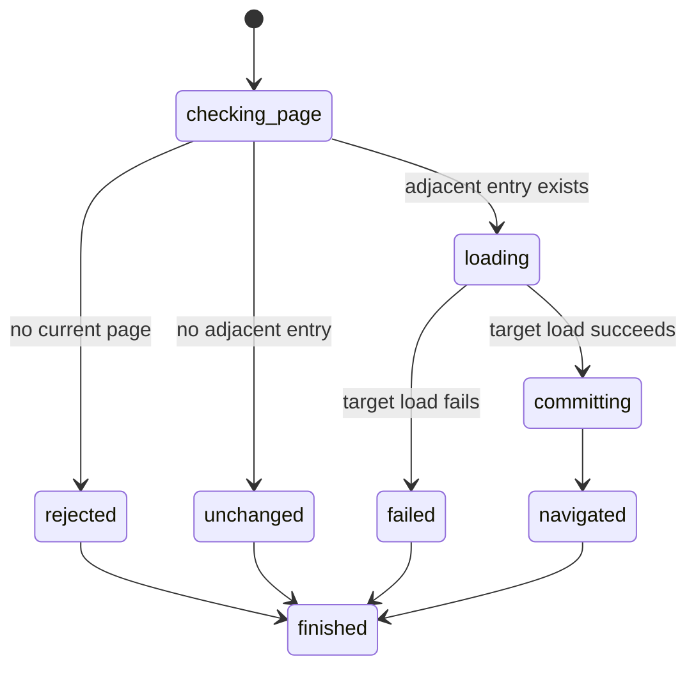

# Navigate page history

## Summary

Package callers submit `GoBack` or `GoForward` to one `Session`.

Session-mode callers send `back` or `forward`.

A successful request loads the adjacent history URL. A request at a history bound succeeds without changing page state.

## The simple case

The caller opens one page, then follows a same-context link to another page.

`GoBack` loads the first URL again. `GoForward` then loads the second URL again.

Each successful move installs a fresh document and invalidates prior snapshot references.

## The interaction, event by event

### Invoke

The package request is the zero-sized `GoBack` or `GoForward` type.

Session mode accepts `back` and `forward` without arguments.

### Exit immediately

A request without a current page returns `SessionError::NoPage`.

A request without an adjacent entry returns `HistoryNavigationResult::NoEntry`. It performs no network request.

Extra session arguments report invalid input.

### Begin running

Each successful `OpenPage` adds one entry.

Successful same-context link and supported GET form navigation also add entries.

`ReloadPage` replaces the current document without adding an entry.

A new open, link, or form navigation after a back move removes every forward entry.

### While running

browser.jr loads the selected URL through the same bounded network loader as `OpenPage`.

History movement refetches and reparses the URL. It does not restore a cached document.

The history position changes only after the new document loads successfully.

The current page, layout evidence, snapshot references, and focus remain usable until that commit.

### Finish

A successful move returns `HistoryNavigationResult::Navigated(OpenedPage)`.

The new page receives a fresh document epoch. Old layout and snapshot evidence become stale.

A successful move also clears the previous page's stored [focus](../interaction/focus-element.md).

The loaded history page starts [page scroll](../interaction/scroll-page.md) at zero on both axes.

It keeps the configured [viewport size](../interaction/set-viewport.md).

A bound returns `HistoryNavigationResult::NoEntry { current_url }`. Current evidence and focus stay usable.

Session output reports the command, URL, and `navigated` state. Successful moves also report the interactive-element count.

## Variants

| Modifier | Set at invocation | Changed while running |
| --- | --- | --- |
| Flags and options | Back and forward accept no options. | No wait or cache option exists. |
| Project configuration | No history configuration exists. | Nothing reloads configuration. |
| Target matrix | One session owns one ordered history. | Success changes its current position. |
| Output channel | Package requests return a typed enum. Session mode uses flushed text. | Errors use the normal session error channel. |

## Cancel and interrupt

| Event | Before running | While running |
| --- | --- | --- |
| Ctrl+C once | The host or CLI process may exit. | No graceful navigation cancellation exists. |
| Ctrl+C again before the evaluation stops | The process may already be gone. | No second-stage handler exists. |
| The process receives SIGTERM | The process may exit before the request. | In-memory page and history disappear. |
| The terminal closes | Package behavior is unchanged. | Session-mode output may fail. |
| stdin or stdout closes | Package behavior is unchanged. | Closed stdin ends session mode. Closed stdout causes status three. |
| The network fails or a request times out | No target load begins. | The current page and history position remain installed. |
| The inspected page changes | A successful navigation can add an entry. | The selected history target remains fixed for this request. |
| Another lint run targets the same page | It owns another session. | It cannot change this history. |
| The process exits outright | No history survives. | No partial navigation survives. |

## Interactions with other systems

**Configuration precedence.** The current history position selects the only target URL.

**Output and exit status.** A history bound is a successful result. Missing pages and failed loads report normal errors.

**Resource limits.** Each move uses the one MiB body limit and the shared 15-second navigation deadline.

**Network and storage.** Every successful move loads through the session network policy. History remains in memory.

**Rendering compatibility.** Playwright [`page.goBack()`](https://playwright.dev/docs/api/class-page#page-go-back) and [`page.goForward()`](https://playwright.dev/docs/api/class-page#page-go-forward) return `null` at a bound.

browser.jr returns typed `NoEntry` evidence. It also follows Playwright's documented no-BFCache model by refetching the target.

A controlled `agent-browser` 0.32.4 Lightpanda run printed the current URL at a bound. browser.jr reports that URL with `navigated=false`.

**Isolation.** Each session owns its page and history. No entry crosses a process boundary.

**Accessibility inspection.** A successful move clears references and focus. A bound or failed load preserves them.

## Edge cases

- Repeated back at the first entry returns `NoEntry`.
- Repeated forward at the last entry returns `NoEntry`.
- Successful open, link, and supported GET form navigation add entries.
- Reload never adds an entry.
- A new navigation after back truncates forward entries.
- A failed target load preserves the page, history position, references, and focus.
- History bounds and failed loads preserve current page scroll offsets.
- A successful move refetches static HTML and loses in-memory form mutations.
- Navigating to the same URL can add another history entry.
- Fragment-only navigation remains unsupported.

## Open questions and verification

- Define redirect entries and response commit boundaries.
- Define same-document fragment entries.
- Define cached document restoration.
- Add timeouts and cancellation.
- Define machine-readable session results.

Drafted from the Rust implementation, package tests, compiled-process tests, Playwright documentation, and controlled agent-browser comparison on 2026-08-31.
