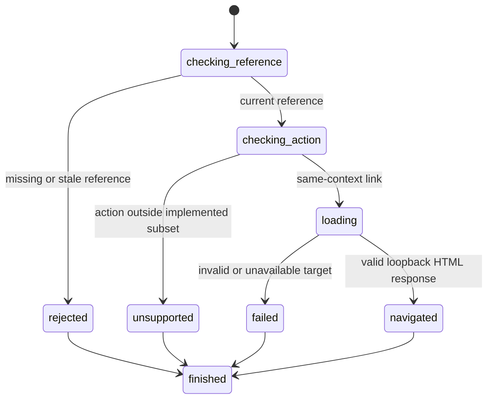

# Navigate by clicking a link

## Summary

Package callers use `ClickElement` with a reference from the latest interactive snapshot.

Session-mode callers send `click <ref>` after `snapshot --interactive` in the same process.

The implemented action follows one same-context HTML link. Other click behavior returns a typed unsupported result.

The one-shot CLI has no `click` command. [`browser.jr session`](../automation/ai-session.md) preserves the required state over stdin.

## The simple case

The caller opens a loopback page through `OpenPage`. It captures `CaptureInteractiveSnapshot` and selects one link reference.

The caller submits `ClickElement`. browser.jr resolves the link against the current URL and loads the next document.

The result returns `ClickResult::Navigated` with the clicked reference and opened page summary.

## The interaction, event by event

### Invoke

The package caller submits `ClickElement` to the session that produced the reference.

The session-mode caller sends the displayed reference to the process that produced it.

### Exit immediately

A missing page, stale reference, or unsupported click returns without network access.

### Begin running

A supported link click resolves its `href` against the current page URL.

The loader then applies the same target, response, and body rules as [`OpenPage`](open-page.md).

### While running

The current page and reference remain usable until the replacement document loads successfully.

Links with `download` are unsupported. Links targeting another browsing context are unsupported.

Buttons, form controls, and explicit interactive ARIA roles have no click execution yet.

### Finish

Successful navigation installs a new document epoch. It invalidates the previous snapshot references and layout evidence.

Session mode also clears its displayed-reference set.

`GetPageUrl` and session-mode `get url` then report the resolved navigation target.

Failed navigation preserves the current page and latest snapshot reference.

The caller must capture another interactive snapshot before the next reference action.

A [role locator action](../inspection/query-elements.md) resolves the replacement document directly.

## Variants

| Modifier | Set at invocation | Changed while running |
| --- | --- | --- |
| Flags and options | The package request contains one typed reference. Session mode accepts `click <ref>`. | The reference cannot change. |
| Project configuration | No navigation configuration exists. | Nothing reloads. |
| Target matrix | The current session page supplies the base URL. | Success replaces that page document. |
| Output channel | The package returns typed values. Session mode writes line-oriented text. | Session mode flushes after each command. |

## Cancel and interrupt

| Event | Before running | While running |
| --- | --- | --- |
| Ctrl+C once | The host process controls cancellation. | No package cancellation contract exists. |
| Ctrl+C again before the evaluation stops | The host process controls termination. | No second-stage package handler exists. |
| The process receives SIGTERM | The host process may exit. | Partial work does not commit a document. |
| The terminal closes | Package behavior does not depend on a terminal. | The host may continue. |
| stdin or stdout closes | Package behavior does not depend on either stream. | The request may continue. |
| The network fails or a request times out | No replacement occurs. | The current page remains installed. |
| The inspected page changes | No script mutation exists. | Another successful open makes the reference stale. |
| Another lint run targets the same page | Another session stays independent. | This session keeps its own page. |
| The process exits outright | In-memory state disappears. | No persistent partial navigation exists. |

## Interactions with other systems

**Configuration precedence.** The current page URL and clicked `href` determine the target.

**Output and exit status.** The package returns `ClickResult` or `SessionError`. Session mode reports results and accumulates its final exit status.

**Resource limits.** The body limit is one MiB. A wall-clock request timeout is not implemented yet.

**Network and storage.** The resolved target must remain loopback HTTP. Navigation writes no persistent state.

**Rendering compatibility.** Navigation parses static HTML. JavaScript and browser event dispatch remain unsupported.

**Isolation.** A failed target cannot replace the current page. Separate sessions do not share page state.

**Accessibility inspection.** The click uses a snapshot reference. It does not yet check visibility or event reception.

## Edge cases

- A fresh snapshot makes references from the previous snapshot stale.
- A successful navigation makes its clicked reference stale.
- A relative `href` resolves against the current page URL.
- A non-loopback resolved URL fails without replacing the page.
- A button returns an unsupported-click error.
- A `_blank` target does not silently navigate the current page.
- A download link does not silently navigate the current page.
- A session-mode click requires a reference from that process's latest snapshot.

## Open questions and verification

- Define same-document fragment navigation.
- Define redirects and response commit boundaries.
- Define forms, buttons, event dispatch, and JavaScript navigation.
- Define actionability checks before expanding click coverage.
- Define whether a later one-shot client uses a daemon, socket, or another retained-session transport.

Drafted from Rust implementation and package boundary tests on 2026-08-31.
