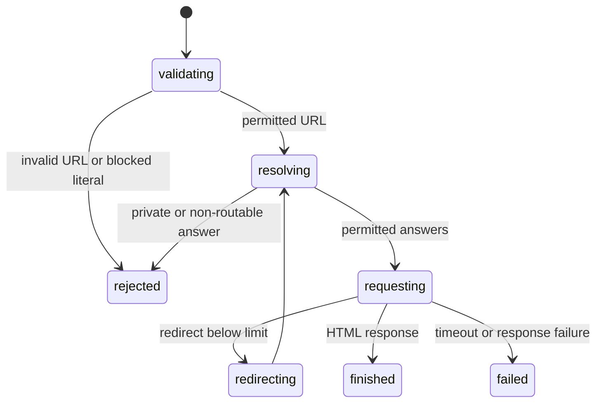

# Control network loading

## Summary

browser.jr loads public HTTP and HTTPS pages. `localhost` and loopback-IP targets require explicit session access for local development. Other private and non-routable targets are blocked.

## The simple case

The caller opens a public URL. browser.jr resolves the host, rejects unsafe address results, disables environment proxies, and reads a bounded HTML response.

## The interaction, event by event

### Invoke

The caller supplies an HTTP or HTTPS URL without credentials. CLI callers add `--allow-loopback` for local targets. Package callers create the session with `NetworkAccess::PublicAndLoopback`.

### Exit immediately

Unsupported schemes, credentials, and blocked literal addresses fail before a request.

### Begin running

The loader resolves the target through its own resolver. It passes only the approved socket addresses to its Hyper transport and does not use an environment proxy.

### While running

Every resolved address must be public unless the initial URL explicitly names `localhost` or a loopback IP. The transport verifies the connected peer before sending HTTP bytes. One 15-second deadline covers DNS, connections, TLS, redirects, and body reads. The body limit is one MiB and the redirect limit is five. Redirect destinations pass through the same resolver policy.

### Finish

A successful open installs the final response URL. Failures preserve the previously installed page.

## Variants

| Modifier | Set at invocation | Changed while running |
| --- | --- | --- |
| Flags and options | `--allow-loopback` grants loopback access to the CLI session. | The access stays fixed. |
| Project configuration | Package callers select `NetworkAccess` when they create a session. | The access stays fixed. |
| Target matrix | One URL is loaded. | Redirects may replace the target URL. |
| Output channel | Load failures use the command's normal error channel. | The channel stays fixed. |

## Cancel and interrupt

| Event | Before running | While running |
| --- | --- | --- |
| Ctrl+C once | The process exits. | The operating system stops the request. |
| Ctrl+C again before the evaluation stops | The process already exits. | No second-stage handler exists. |
| The process receives SIGTERM | The process exits. | The operating system stops the process. |
| The terminal closes | The process may exit. | Output may fail. |
| stdin or stdout closes | One-shot loading is unchanged. | A session may close. |
| The network fails or times out | No page is installed. | The load fails. |
| The inspected page changes | No effect. | The fetched response may differ. |
| Another load targets the same page | Both may start. | Sessions remain separate. |
| The process exits outright | No page is installed. | Partial data is discarded. |

## Interactions with other systems

**Configuration precedence.** No network override exists.

**Output and exit status.** Invalid targets are input failures. Runtime network failures are unavailable failures.

**Resource limits.** Responses are limited to one MiB, 64 headers, 64 KiB of header buffering, 16 DNS answers, five redirects, and 15 seconds per load operation. Compressed response bodies are rejected.

**Network and storage.** Proxies are absent from the direct Hyper transport. DNS results are checked before their socket addresses are passed to the connector. The transport connects to an approved address, verifies the peer, and uses the original hostname for TLS. No page data is persisted by the loader.

**Rendering compatibility.** Only HTML and XHTML response media types are accepted when a content type is present.

**Isolation.** Public hosts cannot resolve to a mixture containing private or non-routable addresses.

**Accessibility inspection.** Network policy does not change the supported static semantic subset.

## Edge cases

- Credentials are rejected.
- IPv4-mapped IPv6 addresses use the IPv4 policy.
- The public policy blocks the IANA IPv4 and IPv6 special-purpose ranges, including carrier-grade NAT, translation, tunneling, link-local, multicast, documentation, benchmarking, and reserved ranges.
- Explicit loopback URLs remain supported for local fixtures only when loopback access is enabled.
- Redirects receive the same DNS and address checks as the initial request.
- TLS certificates must chain to a trusted root and match the original URL hostname.

## Open questions and verification

Drafted from the Rust implementation and focused tests on 2026-09-01.
