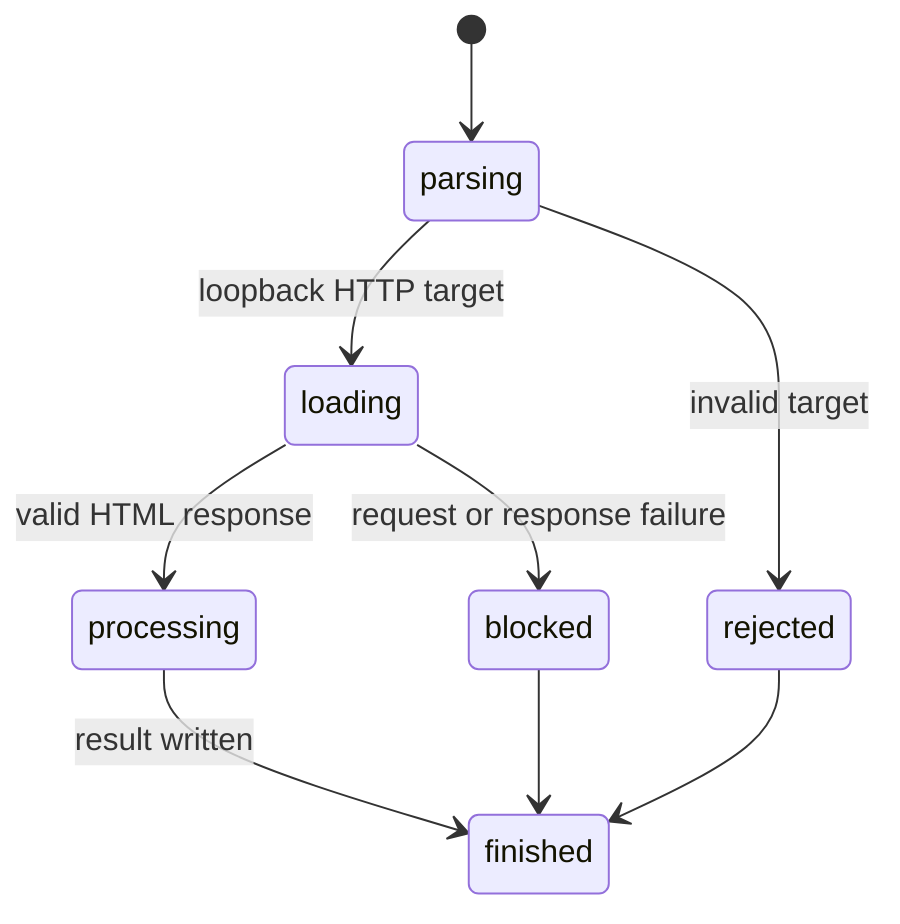

# Open a page

## Summary

`browser.jr lint <url>` and `browser.jr snapshot <url> --interactive` load one loopback HTTP page. The first slice reads static HTML only.

## The simple case

The developer starts a local server. They run a supported command with its URL.

browser.jr reads bounded HTML. It then starts lint or interactive snapshot work.

## The interaction, event by event

### Invoke

The CLI parses the URL before network access. It rejects credentials, HTTPS, and non-loopback hosts.

### Exit immediately

Invalid targets exit with status two. No request starts.

### Begin running

The loader starts one HTTP GET. It does not follow redirects.

### While running

The whole request has a five-second timeout. The HTML body limit is one MiB.

### Finish

A 2xx HTML response enters the requested operation. Other responses exit with status three.

## Variants

| Modifier | Set at invocation | Changed while running |
| --- | --- | --- |
| Flags and options | Lint accepts a viewport. Snapshot requires interactive mode. | Flags stay fixed. |
| Project configuration | No loading configuration exists. | Nothing reloads. |
| Target matrix | One URL and viewport run. | The target stays fixed. |
| Output channel | Results use stdout. Failures use stderr. | A write failure stops delivery. |

## Cancel and interrupt

| Event | Before running | While running |
| --- | --- | --- |
| Ctrl+C once | The process exits. | The operating system stops the process. |
| Ctrl+C again before the evaluation stops | The process already exits. | No graceful second-stage handler exists. |
| The process receives SIGTERM | The process exits. | The operating system stops the process. |
| The terminal closes | The process may exit. | Output may fail. |
| stdin or stdout closes | Closed stdin has no effect. | Closed stdout stops complete output. |
| The network fails or a request times out | No result exists. | The run exits with status three. |
| The inspected page changes | No effect. | The response already read may differ. |
| Another lint run targets the same page | Both runs may start. | Sessions remain separate. |
| The process exits outright | No result exists. | Partial output is not a final result. |

## Interactions with other systems

**Configuration precedence.** Explicit `--viewport` overrides the 1280 CSS pixel default.

**Output and exit status.** Load failures use stderr and status three.

**Resource limits.** The request timeout is five seconds. The body limit is one MiB.

**Network and storage.** The loader permits loopback HTTP only. It writes no page data to storage.

**Rendering compatibility.** The loader accepts HTML. The current layout subset remains separate.

**Isolation.** browser.jr does not execute page scripts in this slice.

**Accessibility inspection.** Interactive snapshot extracts the documented static semantic subset after loading.

## Edge cases

- Missing content type is accepted as HTML.
- Non-HTML content types fail.
- Redirect responses fail.
- Invalid UTF-8 fails.
- HTTP errors fail.
- URL credentials fail.

## Open questions and verification

- Decide when HTTPS local pages become necessary.
- Define DNS and proxy policy before remote loading.
- Define redirects before navigation work begins.
- Decide whether current limits remain product defaults.

Drafted from the Rust implementation and compiled-process tests on 2026-08-31.
