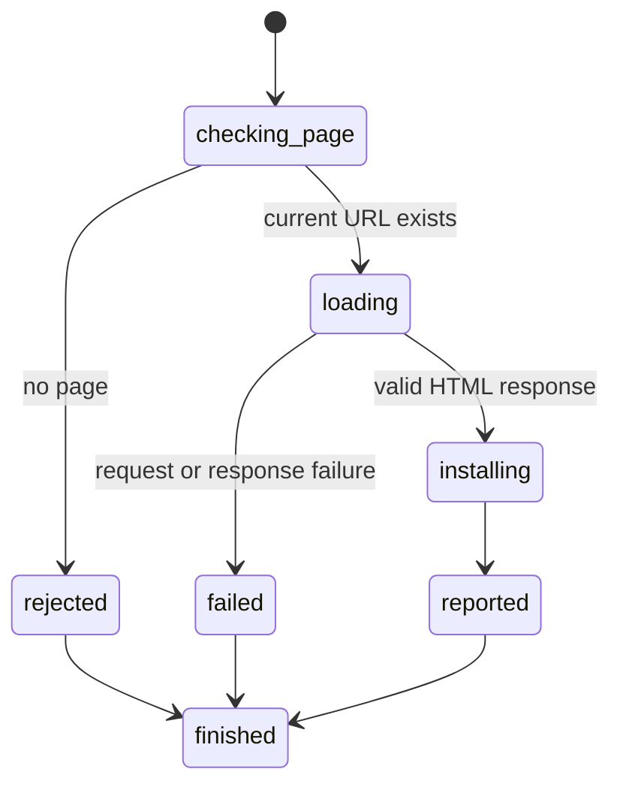

# Reload the current page

## Summary

Package callers submit `ReloadPage` after opening a page.

Session-mode callers send `reload` in the same process.

Reload fetches the current URL again and installs a fresh document after success.

## The simple case

The caller opens a HTTP or HTTPS page. The server later returns changed HTML for the same URL.

Reload fetches that URL again. The new title, semantics, control state, and references replace the previous document.

## The interaction, event by event

### Invoke

The package request takes no fields. Session mode reads `reload` without arguments.

The current installed URL is the only reload target.

### Exit immediately

Reload without an open page returns `SessionError::NoPage`.

Extra session command tokens report invalid input before network access.

### Begin running

browser.jr loads the current URL through the bounded network loader.

It applies the same target, response, content-type, body, and transfer limits as `OpenPage`.

### While running

The current page remains installed while loading proceeds.

A load failure returns `SessionError::Load`. It preserves the document, latest reference set, and focus.

### Finish

A successful reload installs a fresh document epoch. It clears snapshots, layout evidence, and reported references.

It also clears the previous page's stored [focus](../interaction/focus-element.md).

The fresh page starts [page scroll](../interaction/scroll-page.md) at zero on both axes.

It keeps the configured [viewport size](../interaction/set-viewport.md).

Reload preserves the current [navigation history](history-navigation.md) position and adds no entry.

The package returns `OpenedPage`. Session mode reports the URL and interactive element count.

The caller must capture again before another reference action or observation.

## Variants

| Modifier | Set at invocation | Changed while running |
| --- | --- | --- |
| Flags and options | Reload takes no arguments or flags. | Nothing changes. |
| Project configuration | No reload configuration exists. | Nothing reloads except page content. |
| Target matrix | The current page supplies one URL. | A successful response replaces one document. |
| Output channel | The package returns a typed page. Session mode uses flushed text. | Errors use the existing load channel. |

## Cancel and interrupt

| Event | Before running | While running |
| --- | --- | --- |
| Ctrl+C once | The host or CLI process may exit. | No graceful cancellation handler exists. |
| Ctrl+C again before the evaluation stops | The process may already be gone. | No second-stage handler exists. |
| The process receives SIGTERM | The process may exit before the request. | In-memory state disappears. |
| The terminal closes | Package behavior is unchanged. | Session output may fail. |
| stdin or stdout closes | Package behavior is unchanged. | Closed stdin ends session mode. |
| The network fails or times out | Reload returns a load error. | The previous document remains installed. |
| The inspected page changes | The next response may differ. | A successful response becomes the new document. |
| Another lint run targets the page | It owns another session. | Reload cannot change that run. |
| The process exits outright | No reload occurs. | No session state survives. |

## Interactions with other systems

**Configuration precedence.** The installed URL is the only target source.

**Output and exit status.** Package callers receive `OpenedPage` or `SessionError`. Session failures use status two or three.

**Resource limits.** The body limit is one MiB. The request limit is 15 seconds.

**Network and storage.** Reload permits public HTTP and HTTPS plus explicit loopback targets. It writes no persistent storage.

**Rendering compatibility.** The new response uses the same static HTML and rendering subsets as open.

**Isolation.** Reload changes one session's current page only.

**Accessibility inspection.** A successful reload requires a new snapshot for fresh semantic references.

## Edge cases

- Reload before open returns `NoPage`.
- Reload uses the exact installed URL, including its query.
- A successful reload may return identical content but still creates a fresh document epoch.
- A successful reload invalidates old interactive references.
- A successful reload invalidates old layout evidence.
- A failed reload preserves the current title and document.
- A failed reload preserves the latest interactive references.
- A failed reload preserves the current focus.
- A failed reload preserves current page scroll offsets.
- Redirects and unsupported content remain load failures.

## Open questions and verification

- Define cache and conditional-request behavior.
- Define reload with cached document restoration.
- Define graceful cancellation while preserving the prior document.
- Define machine-readable response encoding.

Drafted from Rust package and compiled-process tests on 2026-08-31.
