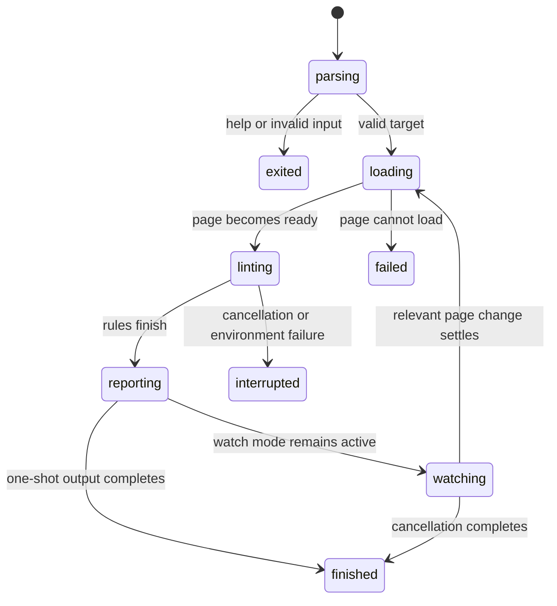

# Design lint

Status: drafted.

One-shot loopback lint and `max-element-width` have implementation evidence dated 29 August 2026.

Watch mode, target matrices, user-agent profiles, project configuration, and machine-readable output are decided but unimplemented.

## Summary

Design lint compares rendered evidence with built-in and project rules. Each finding reports the measured value, expectation, and supporting snapshot.

The implemented entry point is one-shot `browser.jr lint <url>`. Watch mode and machine-readable output remain unimplemented.

Design lint does not judge taste. The built-in rule reports a rendered box that crosses the viewport. The project width rule checks a limit supplied by the caller.

The current CLI supports one project rule. `--max-width <element> <css-px>` compares one semantic element with an explicit caller-owned limit. browser.jr does not invent a readability width.

## The simple case

The developer starts the web application's normal development server. They run `browser.jr lint` with the local page URL.

browser.jr loads the page at each requested viewport and user-agent profile. It waits for the page to become ready, reads rendered evidence, and applies every enabled rule.

The terminal groups findings by target matrix entry. Each finding names the rule and affected element. It shows the expected value, observed value, and evidence that produced the result.

The invocation finishes after every target matrix entry reaches a result. A clean run prints a short success result. A run with findings preserves every completed result.

## The interaction, event by event

### Invoke

The shell starts browser.jr with a target URL and optional flags. The invocation resolves project configuration before it loads the page.

The target matrix combines the requested viewports and user-agent profiles. The invocation fixes this matrix before the first page load.

Human-readable output may announce the target and progress. Machine-readable output emits only data that follows its output contract.

### Exit immediately

Help and version requests finish without loading a page. Invalid arguments and invalid project configuration also finish before page loading.

An immediate exit does not create a snapshot or finding. It reports whether the invocation completed locally or rejected its input.

The current one-shot slice uses stdout for pass and findings. It uses stderr for invalid, blocked, and load failures.

### Begin running

The invocation begins running when browser.jr starts loading the first target matrix entry. Network access and page execution now belong to the active run.

browser.jr must distinguish a page-load failure from a lint finding. A page that never loads cannot produce a valid design result.

The engine captures the viewport and user-agent profile with every observation. Later findings cannot lose that context.

### While running

browser.jr loads one target matrix entry, waits for its readiness condition, computes rendered state, and applies rules to that state.

Built-in objective rules may check overflow, clipping, overlap, tap-target size, contrast, focus visibility, grid structure, and layout movement. Each rule must state the evidence it needs.

Project rules may compare observations with design tokens or component-specific expectations. A project rule cannot alter the evidence produced for another rule.

The current `max-element-width` rule uses geometry from the same snapshot as horizontal overflow. It passes at or below the limit and fails above it. A missing or unsupported target blocks only that comparison.

The terminal may stream progress. It must not report a final pass before all enabled rules and target matrix entries finish.

Watch mode keeps the invocation active. After a relevant page change settles, browser.jr starts a new run and replaces the displayed current result. Previous results remain distinguishable in machine-readable output.

Incremental layout must produce the same rendered evidence as a clean layout of the changed document.

> Technical note: Watch mode uses Spineless Traversal. A clean full layout remains the correctness oracle and recovery path.

### Finish

A one-shot invocation finishes after every target matrix entry produces findings, passes, or becomes blocked. The final summary counts each result category.

Every finding includes its rule, severity, affected element, target matrix entry, expectation, observed value, and evidence. Missing required evidence blocks the rule instead of producing a false pass.

A clean result exits zero. Findings exit one. Invalid input exits two. Blocked and tool failures exit three.

Watch mode finishes after graceful cancellation. It preserves the last complete result and discards an incomplete replacement run.

## Modifiers

| Modifier | Set at invocation | Changed while running |
| --- | --- | --- |
| Flags and options | Select watch mode, rules, or explicit targets. Invalid combinations exit immediately. | CLI flags cannot change. A new invocation is required. |
| Project configuration | Supplies enabled rules, project expectations, and default targets. | A configuration change requests a fresh run after the current run reaches a safe boundary. Exact reload behavior remains open. |
| Target matrix | Fixes the page, viewport, and user-agent combinations for the run. | A page change may refresh evidence. Viewports and profiles stay fixed until a new run. |
| Output channel | Selects human-readable or machine-readable output and whether stdout is a terminal. | The output contract stays fixed. A closed output channel interrupts the invocation. |

Changing a supported input during watch mode starts a fresh run. It never rewrites the meaning of a completed result.

## Cancel and interrupt

| Event | Before running | While running |
| --- | --- | --- |
| Ctrl+C once | The invocation exits without loading a page. | browser.jr requests graceful cancellation and stops before publishing incomplete results. |
| Ctrl+C again before the invocation stops | The process exits at once. Nothing has run. | The process exits at once. The current result may remain incomplete and must not appear as final. |
| The process receives SIGTERM | The invocation exits without loading a page. | browser.jr requests graceful cancellation when the platform permits it. |
| The terminal closes | The invocation stops. | The invocation stops. A complete machine-readable result may already exist. |
| stdin or stdout closes | Closed stdin has no effect without an input prompt. Closed stdout stops report delivery. | Closed stdin has no effect. Closed stdout interrupts output and the invocation. |
| The network fails or a request times out | No effect before loading begins. | The affected target becomes blocked. Other independent targets may continue. |
| The inspected page changes | No effect before loading begins. | One-shot behavior remains open. Watch mode schedules a fresh run after the change settles. |
| Another lint run targets the same page | Both invocations may start if they own separate sessions. | Results stay isolated. Shared-cache and resource-limit behavior remains open. |
| The process exits outright | No page result exists. | The current result is incomplete and must not appear as final. |

After graceful cancellation, the developer returns to the shell. Watch mode keeps only its last complete result as trustworthy evidence.

## Interactions with other systems

**Configuration precedence.** Explicit flags override project configuration. Defaults apply only when neither supplies a value. Exact file format and discovery remain open.

**Output and exit status.** Current human output uses statuses zero through three. Machine-readable output remains open.

**Resource limits.** Each run needs bounds for page count, time, memory, and document complexity. Hitting a bound blocks the affected result.

**Network and storage.** The target may use a local development server. Cache, proxy, fixture, and offline behavior remain open.

**Rendering compatibility.** browser.jr reports unsupported behavior. It cannot treat missing layout support as a design pass.

**Isolation.** Page scripts and project rules cannot read arbitrary host files or corrupt another session without explicit access.

**Accessibility inspection.** Rules may use contrast, focus, name, role, and tap-target evidence when the engine supports it. Unsupported evidence blocks the rule.

## Edge cases

- The target URL returns an HTTP error page.
- The page redirects before or after its readiness condition.
- The development server reloads the page while rules are running.
- A web font changes layout after the first rendered state.
- An animation never reaches a stable state.
- A selector identifies many elements with the same accessible name.
- One rule throws while other rules can still finish.
- Two findings point to the same root layout defect.
- A grid uses unsupported CSS and would otherwise appear valid.
- The target matrix contains duplicate combinations.
- Human-readable output goes to a pipe without explicit machine-readable mode.
- Watch mode receives changes faster than runs finish.
- The page is empty but valid.
- Every rule is disabled.
- A project width limit names an element that the page does not contain.
- A project width limit is zero.

## Open questions and verification

- Define the page-readiness and change-settling conditions.
- Decide whether 1280 CSS pixels remains the default viewport.
- Define configuration discovery, format, and reload behavior.
- Define rule severities, suppression, and deduplication.
- Define user-agent profiles and target matrices.
- Define one-shot behavior when the document changes during a run.
- Define resource budgets before claiming that browser.jr is small or fast.
- Verify each unimplemented behavior when its runnable slice lands.

Specified from product decisions on 2026-08-27. The loopback static-HTML and explicit width-limit slices passed compiled-process checks on 2026-08-29.
